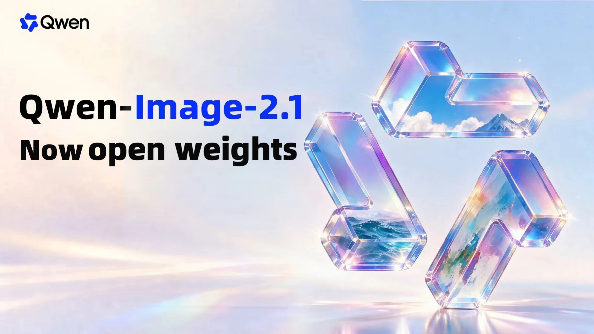
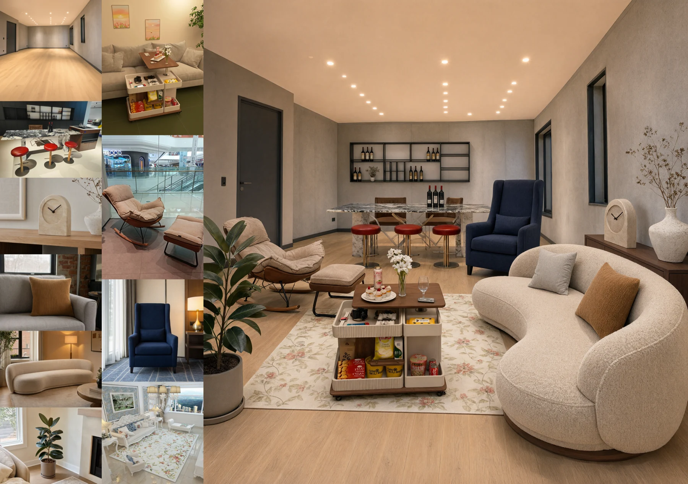
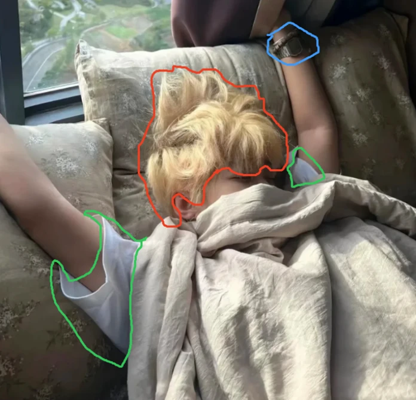
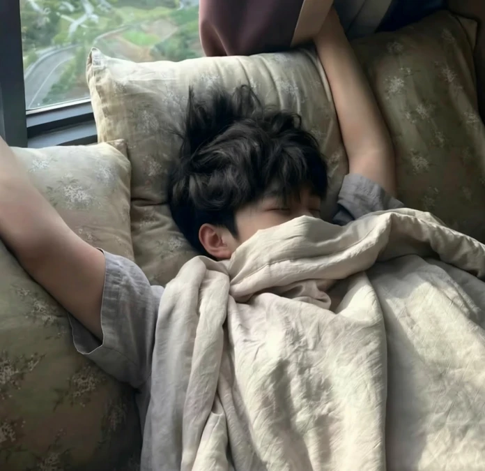
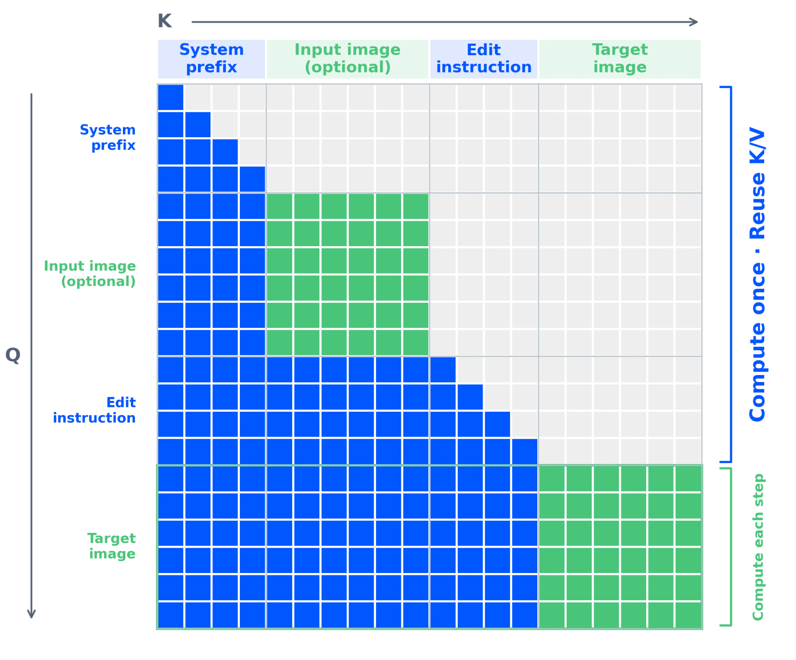
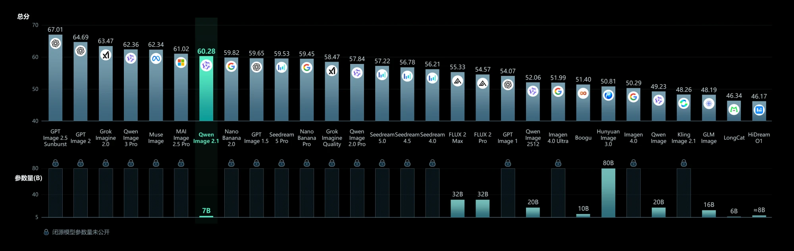
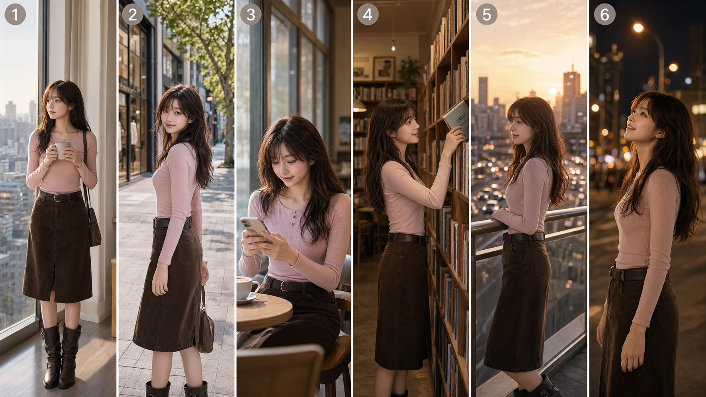

# Qwen-Image-2.1 深度拆解：7B 不是重点，原生 RGBA 与多图编辑正在把模型变成设计工作台

> **TL;DR:** Qwen-Image-2.1 的视觉生成器只有 7B 参数，但这不是它最重要的变化。更值得关注的是，Qwen 把文生图、最多 10 张参考图编辑、圈选/涂抹/Mask 局部修改、原生 RGBA 生成与主体提取，塞进了同一条 2K 推理管线；再用 mixed-granularity attention 和跨去噪步骤的 prefix KV cache，避免反复计算不变的条件图与指令。它开始接近一个可编排的图像资产处理层，而不只是“输入 Prompt，得到一张平面图”。但“7B 轻量”不能按字面理解：完整 BF16 权重约 33.13 GB，视觉生成器之外还有 Qwen3-VL 8B 文本编码器和 RGBA VAE；权重采用仅限非商业用途的 Qwen Research License，商业部署需要另行授权。

- **发布方:** [Qwen Team](https://qwen.ai/)
- **发布日期:** 2026-09-20
- **官方文章:** [Qwen-Image-2.1: Compact, Efficient, and Unified Image Creation](https://qwen.ai/blog?id=qwen-image-2.1)
- **代码:** [QwenLM/Qwen-Image-2.1](https://github.com/QwenLM/Qwen-Image-2.1)
- **权重:** [Hugging Face](https://huggingface.co/Qwen/Qwen-Image-2.1) / [ModelScope](https://modelscope.cn/models/Qwen/Qwen-Image-2.1)
- **许可证:** Qwen Research License Agreement，仅限非商业研究或评估；商业使用需单独申请
- **核验日期:** 2026-09-21

## 一句话判断

Qwen-Image-2.1 的核心产品信号不是“用更少参数追上更大模型”，而是**一个模型开始同时处理图像的生成、组合、修改和透明资产输出**。

传统文生图模型交付的是一张合成完成的 RGB 图片。设计工作却常常还需要抠图、分层、替换局部、保持人物或商品一致，再把素材送进 Photoshop、Figma、Canva、视频编辑器或电商模板。Qwen-Image-2.1 把其中几步往模型内部收：它可以直接生成 RGBA，能从照片中提取透明主体，也能让透明图层继续参与编辑。

这不等于它已经成为 Photoshop。它没有图层树、矢量对象、字体对象或可逆编辑历史。但输出从“只能观看的结果图”向“能继续使用的资产”移动了一步。

## 一个模型，覆盖四种原本分散的工作

| 能力 | 官方范围 | 对工作流的价值 | 当前证据边界 |
|---|---|---|---|
| 文生图 | 原生 2K，多种长宽比，默认 40 步 | 海报、概念图、商品视觉 | 发布样例与官方自评，未独立复测 |
| 多参考图编辑 | 最多 10 张参考图 | 拼人物、服装、商品与空间元素 | 参考数量明确，复杂遮挡和细节保持率未知 |
| 局部编辑 | 圈选、涂抹标注或独立 Mask | 用自然语言指定修改区域 | 样例有效，尚无公开大规模成功率 |
| 原生 RGBA | 透明图生成、透明层编辑、主体提取 | 贴纸、商品 Cutout、合成素材 | 输出确有 Alpha 通道，边缘质量仍需逐类验证 |

RGBA 尤其值得单独看。普通模型即使画出“白底商品图”，仍需要分割模型或后处理把背景删掉；而 2.1 的 VAE 输入、输出均为四通道，潜空间为 64 通道，空间压缩倍率为 16 倍。透明度不是输出后再猜出的附加 Mask，而是生成表示的一部分。

官方推荐的透明图 Prompt 也很直接：明确写出这是 RGBA 图像、有 Alpha 通道、背景透明。这说明能力虽然原生存在，触发方式仍依赖提示词约束，并非每次提到“贴纸”都会自动返回干净透明层。

## 十张参考图把编辑变成“组装”问题

多参考图的价值不只是多放几张人物照片。官方展示了六张人像合成合照、五张参考图组装完整穿搭，以及十张室内元素拼成统一空间。下面的案例同时引用空房间、家具、时钟、地毯、植物和陈设，再生成完整室内图。

这类任务改变了 Prompt 的角色：文字不再承担全部视觉描述，而是负责声明参考图之间的关系。对于电商、角色设定和分镜，输入可以逐渐变成一组有身份的资产：人物来自图 1，服装来自图 2，商品来自图 3，空间风格来自图 4。

但“支持 10 张”不等于“10 张都能像数据库 Join 一样准确”。引用越多，模型越容易混淆局部纹理、比例、左右关系与遮挡。上线前应该按具体品类测三件事：每个参考对象是否出现、关键身份特征是否保持、未要求修改的区域是否漂移。

## 圈选和 Mask 让自然语言获得坐标

纯文字编辑常见的问题是：模型理解了“换头发颜色”，却顺手重画脸、衣服和背景。Qwen-Image-2.1 允许直接在图上画圈或涂抹，也接受原图加独立 Mask。空间提示与文字指令一起进入模型，把“改什么”和“在哪里改”拆开。

这对 Agent 工作流很实用。上游视觉模型或用户界面可以生成 Mask，Qwen-Image-2.1 负责语义修改；下游程序再检查未编辑区域的像素差、主体相似度和 Alpha 边缘。模型不必自己猜编辑范围，验收也有明确区域。

## 7B 只代表视觉生成器，不代表完整系统

官方把 2.1 称为 compact，依据是视觉生成组件由 32 层 Single-Stream DiT 构成，共 7B 参数。完整管线还包括：

- **Qwen3-VL 8B 文本编码器:** 同时编码文字指令和条件图像；
- **7B 图像 Transformer:** 64 通道输入/输出、32 个注意力头、32 层；
- **RGBA VAE:** 四通道图像与 64 通道潜变量之间转换，16 倍空间压缩；
- **Flow Matching 调度器:** 使用 Euler discrete scheduling 和 dynamic shifting。

Hugging Face 当前文件清单中，BF16 Transformer 权重约 13.25 GiB，文本编码器约 16.33 GiB，VAE 约 1.26 GiB；全部仓库文件合计约 33.13 GB（30.86 GiB）。这还没计算激活、KV cache、2K latent 和框架开销。因此，7B 的确降低了核心 DiT 的规模，却不能推导出完整管线能直接装进 16 GB 或 24 GB 显存。

官方提供 `enable_model_cpu_offload()`，vLLM-Omni 支持 FP8、并行和 CPU offload，SGLang 也提供 component offload。它们让本地或服务化部署成为可能，但速度、显存和画质要按所选精度与硬件实测。

## Mixed-granularity attention 为什么适合多图编辑

Qwen-Image-2.1 把 system prefix、条件图、编辑指令和正在生成的目标图放进一条序列。文字使用 token 级因果 Mask，图像块内部则可以双向注意；不同图像块之间仍按顺序建立依赖。

这个结构最实际的收益是跨去噪步骤复用 prefix KV cache。扩散模型通常要重复几十步去噪，但条件图和编辑指令在每一步都不变。2.1 在第一步计算并缓存这些前缀，后续步骤只更新目标图部分。参考图越多，不重复计算条件上下文的收益越明显。

这也是为什么 Day-0 推理支持很重要。Diffusers 提供统一的 `QwenImage21Pipeline`；ComfyUI 已有文生图与编辑工作流；vLLM-Omni、SGLang 和 LightX2V 则把 KV cache、CUDA Graph、多卡并行、连续批处理和 offload 带到服务层。一个模型要进入生产，不只要会生成，还要能被调度、批处理和监控。

## 官方基准图能说明什么，不能说明什么

官方图表给 Qwen-Image-2.1 的总分是 60.28，在图中列出的系统里排第 7，低于 GPT Image 2.5、GPT Image 2、Grok Imagine 2.0、Qwen Image 3 Pro、Muse Image 和 MAI Image 2.5 Pro；高于图中列出的 Nano Banana 2.0、GPT Image 1.5、Seedream 5 Pro 等系统。

这张图更适合说明“7B 视觉生成器没有让官方综合分数掉到队尾”，不适合推出它是同规模最佳或已超过闭源模型。发布页没有随图给出测试集、Prompt、评分者、置信区间、各子项权重和可复现脚本；而且闭源模型参数未知，底部的参数柱无法形成严格的效率比较。现阶段应把 60.28 视为发布方自报结果。

## 分镜一致性是能力展示，不是长序列证明

官方用三视图角色参考生成六个不同场景的分镜，人物服装、发型和整体身份保持得相当统一。这对短视频前期、美术预演和漫画草图很有吸引力。

但它仍是一张同时生成的六格拼图，不是六次独立调用之后的跨镜头状态保持，也没有证明角色经过几十个镜头、不同景别和多轮编辑后仍然稳定。生产测试应把每格拆开独立生成，再检查面部 embedding、服装细节、道具连续性和镜头间色彩漂移。

## “开放权重”不等于可直接商用

Qwen 在主视觉中写的是 “open weights”，仓库 README 使用 “open-source”。实际许可证是 **Qwen Research License Agreement**，其中授权范围明确限定为非商业研究或评估。商业使用需要联系 Qwen 申请单独许可。

此外，若使用这些材料或输出去创建、训练、微调或改进一个对外分发的 AI 模型，许可证要求在相关产品文档中显著标注 “Built with Qwen” 或 “Improved using Qwen”。再分发权重或衍生材料也要保留协议、修改说明和 attribution notice。

因此，更准确的表述是：**权重和推理代码公开可得，但不是 Apache-2.0、MIT 或允许默认商业使用的开放许可证。** 对企业而言，技术验证可以立即开始，产品上线要先走授权审查。

## 最适合先落地的三类工作流

1. **透明素材生产:** 贴纸、商品 Cutout、UI 装饰、视频叠加元素，重点验收 Alpha 边缘与半透明材质。
2. **多资产合成:** 电商模特换装、角色与道具组装、室内陈设，重点验收引用绑定和未指定区域漂移。
3. **受控局部编辑:** 用户画圈或上游分割模型给 Mask，生成模型只修改指定区域，程序再做区域差异检查。

相反，如果只需要批量文生图，2.1 的 RGBA、多参考和局部编辑能力未必值得完整 33 GB 权重与更复杂服务栈。如果需要真正可逆的设计文件、文字图层或矢量路径，它也仍要与传统设计工具配合。

## 本次没有验证的部分

本次检查了官方发布页、GitHub 仓库、许可证、Hugging Face 文件清单与配置，并核对了官方图片的 Alpha 通道；没有下载约 33.13 GB 的完整权重，也没有在 GPU 上运行 2K、10 参考图或透明图推理。因此尚未独立确认：

- 不同 GPU、FP8 与 offload 配置下的延迟、峰值显存和画质损失；
- 10 张参考图在人物、商品、文字和复杂遮挡中的平均保持率；
- RGBA 在头发、玻璃、薄纱、运动模糊和阴影上的边缘质量；
- 圈选、涂抹和 Mask 三种局部编辑方式的稳定性差异；
- 官方 60.28 分的完整评测方法与可复现性；
- prompt rewriting 使用的两个 Qwen3.5-VL 9B 模型带来的额外成本。

## 结论

Qwen-Image-2.1 最值得记住的不是“一个 7B 图像模型”，而是它把图像生成从一次性结果推进到可组合工作流：参考图提供资产，文字定义关系，圈选和 Mask 提供空间约束，RGBA 负责把结果交给下一环节，KV cache 则让多图条件不必在每个去噪步骤重算。

它还没有变成完整设计软件，也没有用公开评测证明所有官方示例都能稳定复现。完整权重并不小，许可证也挡住了默认商业化。但对于正在搭建电商图、角色资产、分镜或 Agent 图像编辑管线的团队，2.1 提供了一个很具体的方向：评价图像模型时，除了看一张图是否好看，还要看它能否接收结构化视觉上下文、输出可继续加工的资产，并被推理系统高效编排。

## Sources

1. Qwen Team, “Qwen-Image-2.1: Compact, Efficient, and Unified Image Creation”
   https://qwen.ai/blog?id=qwen-image-2.1

2. QwenLM/Qwen-Image-2.1 repository and README
   https://github.com/QwenLM/Qwen-Image-2.1

3. Qwen-Image-2.1 model card and weight files
   https://huggingface.co/Qwen/Qwen-Image-2.1

4. Qwen Research License Agreement
   https://github.com/QwenLM/Qwen-Image-2.1/blob/main/LICENSE

5. Diffusers Qwen-Image-2.1 integration, PR #14804
   https://github.com/huggingface/diffusers/pull/14804

6. ComfyUI Qwen-Image-2.1 workflow templates
   https://github.com/Comfy-Org/workflow_templates/tree/main/templates
