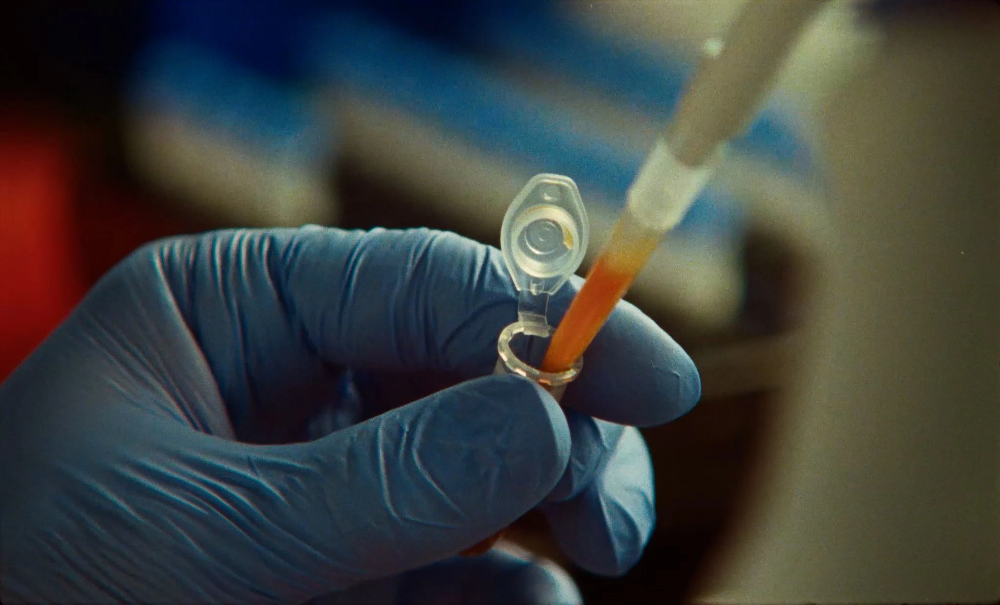
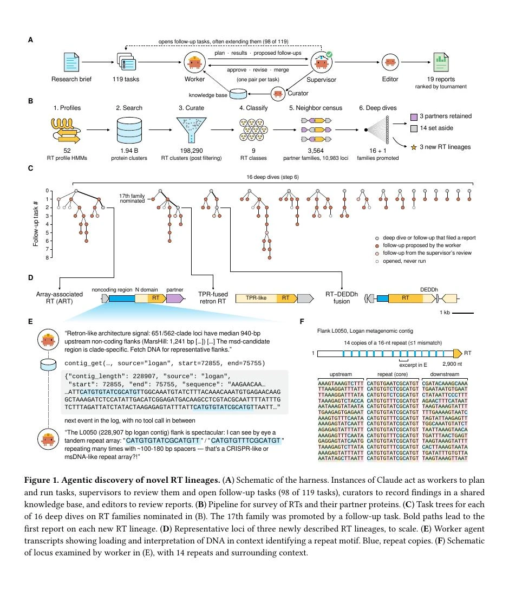
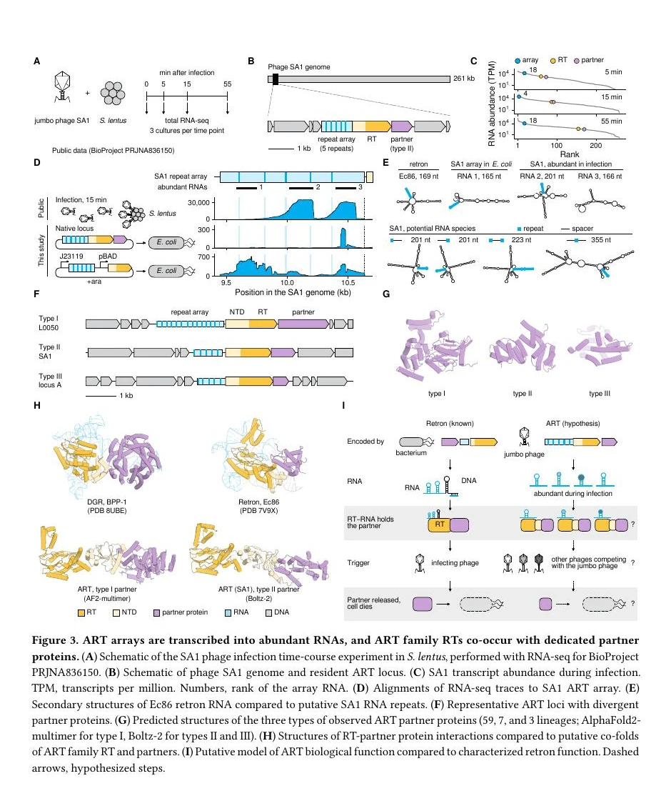
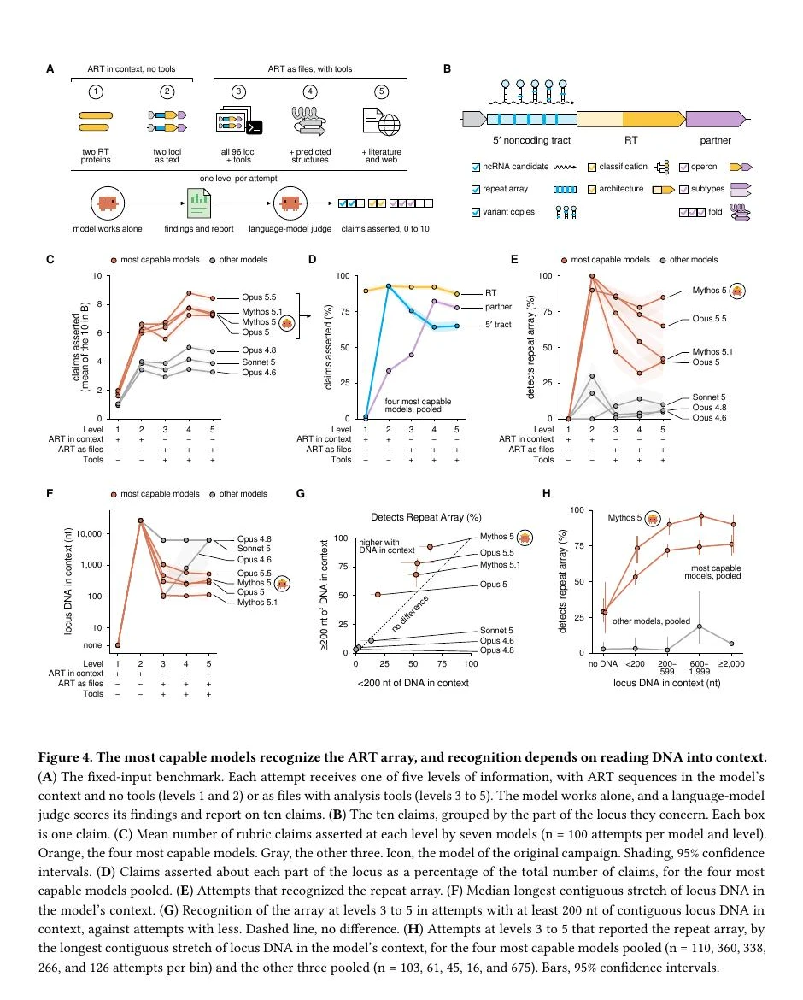

# Anthropic ART 发现拆解：Claude 没发现“CRISPR 2.0”，真正突破是从原始 DNA 中识别异常

> **TL;DR:** Anthropic 新建的分子生物学实验室公布了首个结果：一个由 Claude Mythos 5 驱动的多 Agent 系统，在 19.4 亿个蛋白质簇中寻找逆转录酶时，意外识别出一类此前未被描述的系统。研究团队将它命名为 array-associated reverse transcriptase，简称 ART。它由重复 DNA 阵列、逆转录酶和伙伴蛋白组成，阵列会在噬菌体感染期间产生大量短 RNA。但这不是“Claude 发现 CRISPR 2.0”：研究尚未证明 ART 的逆转录酶有活性、这些 RNA 是它的底物、伙伴蛋白与它交互，也不知道整个系统对噬菌体有什么作用。真正的新信号是，通用模型不只会执行预先定义的分析流程，还能直接读取原始 DNA、察觉任务之外的异常，并通过共享记录把偶然线索升级成可供人类验证的研究候选。

- **X 来源:** [Anthropic announcement](https://x.com/AnthropicAI/status/2102824959827742916?s=20)
- **官方文章:** [Claude discovers a novel enzyme system with CRISPR-like repeats](https://www.anthropic.com/news/claude-discovers-novel-enzyme-system)
- **技术预印本:** [Autonomous AI agents discover reverse transcriptases with tandem repeat arrays](https://www-cdn.anthropic.com/22573675ada52a8ca8a97a1a4b4326b2f208a071.pdf)
- **发布日期:** 2026-09-23
- **研究状态:** Anthropic 团队预印本，尚非同行评审结论
- **核验日期:** 2026-09-24

## 一句话判断

这项工作的价值不是“AI 找到了下一代基因编辑器”，而是展示了一种更接近真实科学发现起点的能力：**模型在没有被要求寻找重复阵列的情况下，自己注意到原始数据里有东西不对劲。**

传统自动化管线擅长寻找人类提前定义好的特征。科学发现却经常从异常开始：一个模式不符合已有分类，一段序列不该出现在这里，一个候选与原假设冲突。ART 的线索正是这样产生的。Agent 原本受命寻找新的逆转录酶伙伴基因，却在推翻一个错误关联后，继续检查上游非编码 DNA，并认出一串此前没人标注的重复结构。

这比“模型按步骤跑了 19.4 亿条数据”更重要。规模可以靠计算堆出来；决定哪一个异常值得追下去，才是专家注意力长期无法扩展的部分。

## ART 到底是什么

ART 全称 **array-associated reverse transcriptase**。逆转录酶，RT，是把 RNA 复制成 DNA 的酶。研究团队在大型噬菌体，也就是感染细菌的病毒，及预测病毒序列中识别出一个反复出现的三部分结构：

1. 上游是一段非编码 DNA 阵列；
2. 中间是带有较长 N 端区域的逆转录酶；
3. 下游是一个专属伙伴蛋白基因。

后续分析找到了 95 个 ART RT 簇，其中 28 个在 RT 上游带有可检测的重复阵列。阵列长约 0.3 到 4.1 kb，包含 3 到 21 个重复单元；重复序列长 15 到 49 nt，间隔序列长 120 到 220 nt。研究者还识别出三类彼此不相关的伙伴蛋白家族。

这个结构“像 CRISPR”，因为两者都有重复与间隔交替的阵列。但相似不能直接等同：

| 特征 | CRISPR 阵列 | ART 阵列 |
|---|---|---|
| 基本结构 | 重复 + 间隔 | 重复 + 间隔 |
| 间隔长度 | 通常约 30 nt | 约 120 到 220 nt |
| 相关基因 | Cas 基因 | RT + 伙伴蛋白，无邻近 Cas 基因 |
| 相关株系中的变化 | 间隔经常获得或丢失 | 间隔顺序在相关噬菌体中相对保守 |
| 已知功能 | 适应性免疫与可编程核酸靶向 | 未知 |

因此，更准确的说法是：ART 有一种让人想到 CRISPR 的阵列架构，但它不是已证明的 CRISPR 系统，更不是已证明的基因编辑工具。

## 949 个会话如何组成一个研究系统

官方 X 帖写“约 950 个 agents”。技术报告给出的精确口径是 **949 个 Agent sessions**，包括一个启动会话、414 个 worker 会话、375 个 supervisor 会话、107 个 curator 会话和 52 个 editor 会话。它们不是 949 个同时运行、身份固定的数字科学家。

整个 campaign 的结构更像一间有工作流的计算实验室：

| 角色 | 职责 |
|---|---|
| Worker | 提计划、写代码、调用数据库和工具、提交结果 |
| Supervisor | 审查计划和结果，要求修改或创建后续任务 |
| Curator | 把完成任务的发现写入共享知识库 |
| Editor | 审阅最终研究报告 |

所有计划、结果、审查、脚本和知识库记录进入同一个版本化记录。后来的 Agent 可以读取前面的发现，不必每次从零开始。这一点决定了系统能否把一个 worker 的偶然观察变成后续任务，而不是让它消失在单次对话里。

报告中的运行规模是：

| 指标 | 技术报告数据 |
|---|---:|
| 搜索空间 | 1,939,242,578 个蛋白质簇 |
| 筛选后的 RT 簇 | 198,290 |
| RT 类别 | 9 |
| 采样 loci | 10,983 |
| 邻近伙伴蛋白家族 | 3,564 |
| 总任务 | 119 |
| 完成 / 拒绝 / 停滞 | 107 / 10 / 2 |
| 后续任务 | 98 |
| Agent sessions | 949 |
| 累计 Agent 时间 | 76.9 小时 |
| 实际墙钟时间 | 21.5 小时 |
| 计入成本的 tokens | 215.6 million |
| 最终报告 | 19 |

215.6 million tokens 包含 11.3 million 未缓存输入、14.9 million 输出，以及 189.5 million 写入 prompt cache 的 tokens，不包含从 cache 读取的 tokens。这里的“77 小时”是并行会话时间之和，不是项目只用了 77 小时；21.5 小时也只代表自动搜索 campaign，不包括后续人类分析与湿实验。

## 发现不是沿着原任务直线走出来的

最初任务要求 Agent 寻找新的 RT 伙伴蛋白。一个 worker 先注意到某些 RT 与噬菌体 RNA polymerase 亚基相邻，随后又判断这个关联可能只是基因顺序造成的假象。到这里，一个传统 pipeline 可能把候选删除并结束。

Claude 的 supervisor 却保留了另一个问题：这些 RT 很像 retron，而 retron 往往在上游带非编码 RNA，是否应该检查 5' flank？新的 worker 把上游 DNA 直接读进上下文后，立刻指出能“用眼睛看到”tandem repeat array，并主动提出 CRISPR-like、msDNA-like 与 DGR-like 等可能解释。

然后它做了两件很重要的事：

1. 写脚本计算重复次数，找到一个含 14 个 16-nt repeat 的 locus；
2. 主动进行 novelty kill-test，检查这是否只是自己忘记的已知系统。

技术报告检查了这段 session log：在 Agent 识别阵列前，没有调用 repeat finder，也没有在任务 brief 中提到 repeat 或 array。刚刚被读取的原始序列包含它指出的模式。这不能证明模型像人一样“看见”DNA，却能排除最简单的“工具先算出来、模型只负责复述”解释。

## 湿实验确认了结构线索，但没有确认功能

Anthropic 团队从已发表的 Staphylococcus phage SA1 感染数据中发现，ART 阵列在感染后 5、15、55 分钟都有高表达；15 分钟时，阵列来源 RNA 最多占噬菌体 RNA 的约 8%。这些转录本还会形成边界可复现的短 RNA。

研究者随后把 SA1 ART 系统放进大肠杆菌表达，并用 small-RNA sequencing 观察到相似的离散 RNA。结合 RT、重复阵列和伙伴蛋白的共现，这支持“一个 ART 阵列产生多种短 RNA”的判断。

但论文图中的功能模型明确标着 hypothesis，关键箭头后面仍是问号。作者在 Discussion 中直接列出尚未证明的部分：

- 没有证明 ART RT 本身具有逆转录活性；
- 没有证明阵列产生的 RNA 是 RT 的底物；
- 没有证明 RT 与伙伴蛋白发生交互；
- 不知道该系统为噬菌体做什么；
- 不知道它是否可编程，更没有证明基因编辑能力。

所以“发现了新分子系统”可以成立，“发现了新基因编辑工具”目前不成立。

## 最反直觉的结果：工具更多，反而更容易漏掉阵列

研究者把 ART 数据做成固定输入 benchmark，让七个 Claude 模型各自在五个信息级别上运行 100 次，总计 3,500 次。级别 1 和 2 直接把蛋白或 loci 文本放进上下文；级别 3 到 5 则把 96 个 loci 放进文件系统，并逐步增加生物信息工具、预测结构、文献和网页访问。

按常识，更多文件和工具应该帮助模型。但对 repeat array 的识别恰好相反：最强模型在 loci 直接放入上下文时，识别率至少 90%；在带工具的文件环境里，Opus 5 某一设置低至 32%。

原因不是工具破坏了模型能力，而是 Agent 没有真正读取数据。文件环境下，39% 的尝试没有把任何连续 200 nt 以上的 DNA 放进上下文，因此根本看不到一个以上的重复单元。当上下文里出现至少 200 nt 连续 DNA 后，各强模型的识别率提高 16 到 32 个百分点；随读入序列增加，四个强模型的合并识别率从 29% 升到最高 76%，Mythos 5 最高达到 96%。

这对所有 Agent 产品都有直接意义：**“文件已经挂载”不等于“模型已经观察”。** 给 Agent 更多工具、数据库和目录，如果 harness 不强制取样、预览、核验输入，信息只是在可访问空间里，并没有进入决策空间。

## 内部信号提供了机制线索，但不是完整解释

团队还对原始发现 session 重新运行保存的 Mythos 5 checkpoint，用 sparse dictionary 分解某一层的内部活动。他们预先从合成重复序列上选出 12 个候选信号，再在 ART 序列上观察到两个会随重复出现而增强的 signal。把每个 repeat 的核苷酸原地打乱后，一个信号在 12/14 个 repeat 上沉默，另一个在 14/14 上沉默。

这支持“模型内部确实对重复模式产生响应”，而不是自然语言回答碰巧说到 repeat。但边界同样重要：这两个信号对普通字符重复也会响应，并不专属于 DNA；研究只分析一个层、一次保存 checkpoint 的重放；从 signal 到最终科学判断之间仍有很长链路。

所以这里更适合叫机制证据，而不是对 Claude 如何发现 ART 的完整因果解释。

## 最大警告：同一 campaign 重跑 10 次，全部漏掉 ART

为了测试可复现性，团队用相同 harness 和 brief 又运行了 10 次。几乎每次完成 census 的 campaign 都采样到了 ART loci，两个 campaign 甚至把该谱系作为 follow-up 研究，但没有一个 worker 去读取 RT 上游 DNA，最终 10 次全部漏掉 repeat array。

这个结果非常关键。它说明第一次发现不是预先写好的演示，也说明当前系统仍高度依赖非确定性的研究路径。模型具备“读到以后能认出”的能力，却不稳定地做出“应该去读”的元决策。

这把下一阶段的工程问题说得很清楚：

1. 如何保证每个高价值候选都有最低限度的原始数据检查；
2. 如何在探索广度和深挖预算之间分配资源；
3. 如何让 supervisor 识别被提前关闭、但仍包含异常的分支；
4. 如何用多次独立 campaign、不同模型或不同工具交叉确认发现路径；
5. 如何把“未观察”与“观察后未发现”分开记录。

自动科研系统不能只报告最后找到了什么，还要报告它在哪些地方根本没看。

## 这和 8 月的 Claude 生物化学结果有什么不同

仓库此前分析过 Claude 的蛋白 binder 设计与 NMR / LC-MS 工作流。那组结果证明模型能编排已有工具、生成候选并处理实验数据。这次 ART 工作更进一步，也更窄：目标不是优化一个明确的设计任务，而是从巨大的未知空间里发现任务定义之外的异常。

两者对应 AI for Science 的两个不同层次：

| 层次 | 8 月结果 | ART 结果 |
|---|---|---|
| 主要任务 | 设计候选、处理仪器数据 | 在原始序列中寻找未知系统 |
| 成功标准 | binder hit、分析结果接近实验室报告 | 新结构线索经后续计算和实验支持 |
| Agent 价值 | 工具编排与长流程执行 | 异常识别与研究分支扩展 |
| 主要风险 | 候选不可靠、分析误差 | 偶然性高、过度解释未知功能 |

ART 没有让湿实验变得不重要。相反，它把人类科学家的工作向实验设计、机制验证和证据边界推得更集中。

## 对科研 Agent 的实际启示

如果把这项工作抽象成可复用架构，最值得保留的不是“多开 949 个会话”，而是下面六点：

1. **把任务分成角色，而不是只并发。** Worker、supervisor、curator、editor 的职责和交接物不同。
2. **所有发现进入共享、版本化记录。** 后续 Agent 必须能追溯来源、代码、数据和审查意见。
3. **允许失败假设产生新分支。** 推翻最初关联不应自动删除周边异常。
4. **强制观察原始数据。** 文件存在、工具可用和模型真正读取是三种状态。
5. **把 novelty kill-test 写进流程。** 每个“新发现”都要主动寻找已有解释与反例。
6. **让实验决定事实。** 计算线索可以排优先级，功能主张必须由实验逐项建立。

## 仍需验证的部分

这项研究目前还有明显边界：

- 论文是 Anthropic 团队发布的预印本，尚未经过同行评审；
- 模型、harness 和实验团队来自同一机构，缺少外部独立复现；
- 首次 campaign 无人中途干预，但研究 brief、工具环境和后续实验均由人类设计；
- 十次复跑没有重现 ART 发现，成功路径稳定性很低；
- 19 份报告的 tournament 由 Mythos 5 作为 judge，ART 报告排名第三，不等于专家盲审；
- 固定输入 benchmark 也由 Mythos 5 按作者选择的十项 rubric 评分；
- 内部 repeat signals 不具 DNA 特异性，不能独立证明发现机制；
- ART 的酶活、底物、伙伴关系、生物功能和可编程性仍未建立。

此外，Anthropic 表示实验室只进行 BSL-1 和 BSL-2 工作，不处理可感染人类的病原体，所有湿实验由人类科学家执行。这是当前项目的操作边界，不代表更强生物 Agent 的 dual-use 风险已经解决。

## 结论

Claude 这次没有交付一个可以编辑基因的新工具。它交付的是一个值得人类科学家继续花时间的异常：在大型噬菌体中，某类逆转录酶旁边反复出现长 DNA 阵列和伙伴蛋白，阵列还会在感染期间产生大量短 RNA。

这个发现足够新颖，也足够具体，但功能仍然未知。把它写成“CRISPR 2.0”会把最重要的进展掩盖掉：一个通用模型第一次在大规模 Agent campaign 中，直接阅读原始 DNA、偏离预设搜索目标、否定自己的早期解释，再把异常送进可验证的研究链路。

十次复跑全部错过 ART，则提醒我们离“自动科学家”还有多远。当前系统已经能在看见异常后理解它，却还不能稳定决定应该看哪里。真正可用的 AI 科研基础设施，需要同时具备发现力、观察纪律、共享记忆、可复现路径和实验否证。ART 是这个方向很有分量的一步，但仍只是第一步。

## Sources

1. Anthropic X announcement
   https://x.com/AnthropicAI/status/2102824959827742916?s=20

2. Anthropic, “Claude discovers a novel enzyme system with CRISPR-like repeats”
   https://www.anthropic.com/news/claude-discovers-novel-enzyme-system

3. Peter H. Yoon et al., “Autonomous AI agents discover reverse transcriptases with tandem repeat arrays”
   https://www-cdn.anthropic.com/22573675ada52a8ca8a97a1a4b4326b2f208a071.pdf
