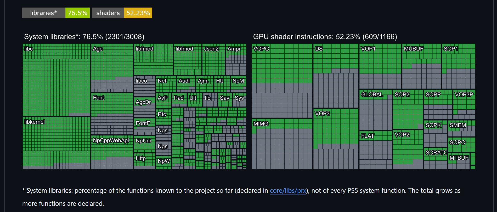
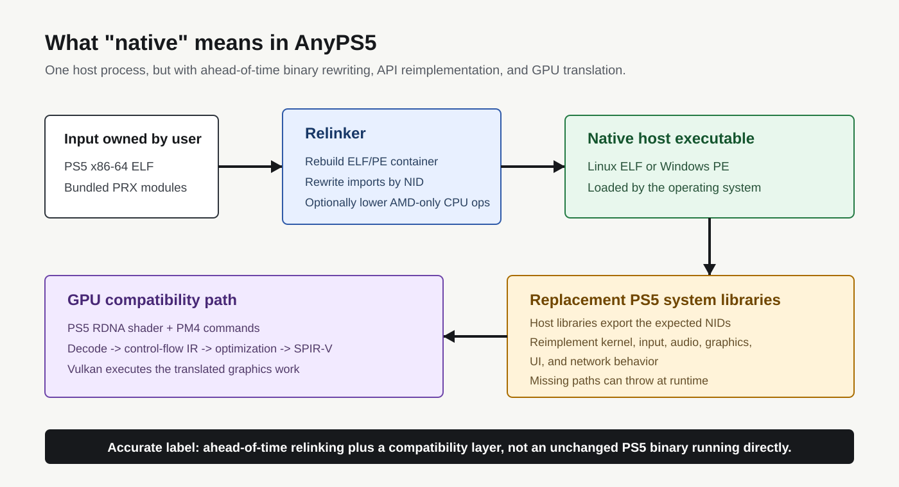
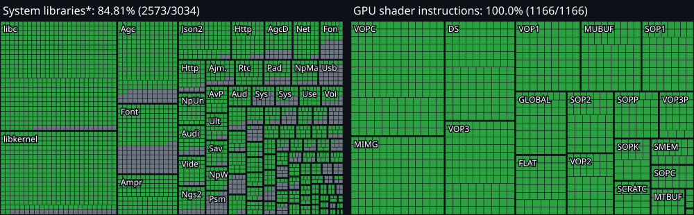

# AnyPS5 源码审计：“原生运行”不是零转换，52% 与 76% 也不是游戏完成度

> **结论先行：** RedGamingTech 的截图是真实的，帖子发布当天的 AnyPS5 源码确实能复现 `2301/3008（76.5%）` 个已声明系统库函数和 `609/1166（52.23%）` 条已识别 GPU 指令。但这两个数字不是“PS5 已经模拟完成多少”，也不是“多少游戏可以运行”。AnyPS5 的技术路线，是把同为 x86-64 的 PS5 可执行文件预先改写成 Linux ELF 或 Windows PE，再用重写的系统库承接导入，并把 RDNA Shader 重编译为 SPIR-V/Vulkan。它没有传统整机模拟器那样的独立运行时进程，却依然包含大量二进制转换、系统行为重实现与图形翻译。

2026 年 10 月 1 日，[RedGamingTech 的帖子](https://x.com/RedGamingTech/status/2105623011235934545)称，AnyPS5 已正确映射一半以上 GPU 指令，系统库完成度超过 75%，因此能让 PS5 游戏“不通过模拟器”在 PC 上“原生”运行。截至 10 月 9 日审计时，这条帖子获得约 59 万次浏览和 7,800 余次点赞。

传播数据说明这个说法很有吸引力，但真正需要回答的是三个更具体的问题：**它执行的还是不是原始 PS5 程序？“原生”发生在哪一层？进度百分比到底统计了什么？**

---

## 01 | 帖子里的两个数字可以从当天源码精确复现

我把仓库检出到帖子发布前最近的提交 [`cc3d2d2`](https://github.com/boykopovar/AnyPS5/tree/cc3d2d21efef2d06c6a2f29d2eb0bc31eb1b10b6)，运行项目自己的 `tools/progress.py`，得到：

| 指标 | 已完成 | 当前统计总数 | 比例 |
|---|---:|---:|---:|
| 已声明系统库函数 | 2301 | 3008 | 76.50% |
| RDNA GPU 指令目录 | 609 | 1166 | 52.23% |

这与截图逐项一致。因此，问题不在于图是否伪造，而在于如何解释分母。

系统库分母只包括项目当时已经在 `core/libs/prx` 中声明的函数，不包括 PS5 固件导出的全部函数。项目以后发现并声明更多函数，分母还会继续增大。GPU 分母则来自项目维护的 AMD RDNA 1 + RDNA 2 指令目录；一条指令只要被解码器识别，就会从待办计入完成。

换句话说，这是一张**源码库存看板**，不是一张**游戏兼容率看板**。

---

## 02 | AnyPS5 为什么敢说“不是模拟器”

PS5 与主流 PC 都使用 x86-64 CPU，这给 AnyPS5 留出了一条不同于传统主机模拟器的路线。项目的 relinker 会读取用户提供的干净 PS5 ELF 和随游戏附带的 PRX 模块，然后：

1. 解析 ELF、导入 NID、动态段与系统调用；
2. 把容器改造成宿主系统可以加载的 Linux ELF 或 Windows PE；
3. 必要时通过 `--to-intel` 降低部分 AMD 专用 x86 指令；
4. 把程序导入绑定到 AnyPS5 自己构建的替代 PRX 共享库；
5. 让操作系统加载并运行最终生成的宿主可执行文件。

从进程模型看，项目的说法成立：它不需要启动一台虚拟 PS5，也没有一个独立 emulator 进程逐条解释 CPU 指令。改写后的程序是正常的宿主进程，大部分 x86-64 代码可以直接由 CPU 执行。

但“原生”不能被理解成“原始 PS5 文件原封不动地双击运行”。容器、导入、动态链接和部分 CPU 指令会被预先修改；PS5 系统调用与库行为由项目重写；图形命令与 Shader 还要经过独立翻译管线。

更准确的名称是：**提前重链接（ahead-of-time relinking）加兼容层**。它不是传统整机模拟，却也不是零转换。

---

## 03 | GPU 路径尤其不能被“原生”两个字掩盖

AnyPS5 的图形路径会接收 PS5 的 AGC/PM4 命令，恢复状态、绘制与计算任务，再把 RDNA Shader 走过这样一条链路：

`RDNA 解码 -> 控制流图与结构化 -> 中间表示 -> 优化 -> SPIR-V -> Vulkan`

这正是兼容层最困难的部分之一。CPU 架构相同，并不意味着 PS5 图形接口、资源描述符、同步语义和 Vulkan 自动相同。

“GPU 指令 52.23%”只表示进度脚本在解码器里找到了对应条目。它不证明：

- 每种操作数、格式、维度和边界情况都正确；
- Shader 能完整转换成有效 SPIR-V；
- 转换结果与 PS5 硬件数值一致；
- 资源状态、同步和管线组合能在真实游戏里工作；
- 没有性能问题、图形错误或驱动差异。

项目自己的 `TechnicalDebt.md` 很诚实：即使某些指令已经能解码，部分纹理格式、过滤、间接描述符、Cube 边界、动态控制流或存储形式仍会直接抛错，另一些行为还没有在 PS5 硬件上测量。**识别 opcode 是必要条件，不是图形兼容完成。**

---

## 04 | “系统库 76.5%”也不等于行为正确 76.5%

帖子发布当日的脚本把一个 `APS5_VABI` 函数定义视为已实现，只要函数体没有直接调用 `NotImplemented_nid_no_patch`。当前脚本还会识别一部分本地 stub wrapper，并排除测试目录；除此之外的定义仍然计入完成。

这个规则适合回答“还有多少显式 throwing stub”，却回答不了 ABI 和行为是否正确。当前技术债文档仍列有大量边界：

- 部分函数签名来自其他兼容项目，尚未在主机上验证；
- 有些 UI 调用只返回“用户取消”，并不真正显示界面；
- HMD 路径只实现“设备未连接”；
- 某些联网、授权、语音和邀请接口只覆盖失败路径；
- 一些函数签名仍未知，或者只根据单个游戏的调用方式声明；
- Windows 与 Linux 的部分行为不同，个别路径只有合成测试。

所以“已实现”在仪表盘里的精确定义是：**这个已声明函数不再是进度脚本识别出的整段 throwing stub。** 它不是“与真实 PS5 ABI、返回值、副作用和所有游戏行为均已验证”。

---

## 05 | 八天后变成 84.81% 与 100%，但不要把增长直接换算成可玩游戏

我在 10 月 9 日审计提交 [`6cc0503`](https://github.com/boykopovar/AnyPS5/tree/6cc0503dacc9d9697d23001d4103780ad2e9acba) 上重新生成仪表盘：

| 快照 | 系统库 | GPU 指令 |
|---|---:|---:|
| 10 月 1 日帖子快照 | 2301/3008，76.50% | 609/1166，52.23% |
| 10 月 9 日审计快照 | 2573/3034，84.81% | 1166/1166，100.00% |

项目确实推进得非常快。不过八天间进度脚本本身也发生了变化：它增加了 opcode 别名和变体，识别 function-try-block 与 stub wrapper，排除测试源，并把共享源码库去重。项目文档明确提醒，去除重复计数就可能让百分比变化，而不增加任何可用功能。

因此，这组对比能证明的是：代码与覆盖目录在快速扩展，显式待办在快速减少。它不能单独证明 GPU 已 100% 正确，更不能证明 PS5 游戏库已 84.81% 可玩。

---

## 06 | 现在真正被公开验证的游戏仍只有一个

当前兼容性表只列出一款游戏：2D 平台游戏 **Dreaming Sarah**。Windows 状态为“进入游戏、可玩”，项目报告 GTX 1050 Ti / i5-7500 3.4 GHz 下 60 FPS，以及 Intel HD 620 / i5-7200 2.5 GHz 下 36 FPS；Linux 一栏仍是问号。

这项成果很重要，因为它证明架构不是空白 PPT：至少有一个真实商业标题完成了从重链接、动态库绑定到画面与输入的闭环。但一款相对轻量的 2D 游戏，不能外推到 3A 游戏、复杂线上服务、专用外设、PSN、视频解码、VR、重度 Shader 或反作弊系统。

用户还必须自行提供合法取得的干净 ELF 与附带模块。项目不分发游戏、固件、密钥或 Sony 专有库。Intel 主机可能需要 `--to-intel`，而文档说明仍有 AMD 专用指令无法转换；遇到不支持路径时，项目倾向于明确抛错终止，而不是悄悄伪造结果。

---

## 07 | 这是一个真实的大型工程，但当前主分支也有可见红灯

截至审计时，AnyPS5 采用 GPL-2.0，约 17,600 stars、1,400 forks，仓库包含约 275,000 行 C/C++/Python 源码和 1,500 余个源码文件。`v0.1.1` 已提供 Windows/Linux relinker 与对应 PRX 库包，说明它已经进入可以被外部用户测试的早期发布阶段。

我在 macOS 上只构建 relinker，并运行了 **34/34 项测试**，全部通过。这验证了当前提交上的文件解析、补丁和若干合成 fixture，不验证完整 PRX 库、Vulkan 图形执行或任何 PS5 游戏。

同一提交的 GitHub Actions 状态更值得保留：macOS、Windows 和 Ubuntu 的 relinker 任务通过，但完整 Linux 与 Windows 构建因测试头文件找不到 `spirv/unified1/spirv.hpp` 而失败，后续完整测试没有运行。进度发布工作流成功，不等于完整构建绿色。

这不否定项目；它说明仓库正处于高频开发阶段。阅读任何百分比时，都应该同时查看固定 commit、完整 CI、兼容性表和技术债，而不是只看 badge。

---

## 08 | 应该怎样理解这条帖子

RedGamingTech 的核心观察有一半是准确的：AnyPS5 确实利用 PS5 与 PC 共享 x86-64 架构，把游戏转换成宿主系统可直接加载的进程，避开传统 CPU 指令模拟器的主循环。这是一条有技术价值的兼容路线。

容易造成误解的是后半句。“without an emulator”会让人以为兼容工作已经消失，实际上工作只是换了位置：

| 传统模拟器常做的事 | AnyPS5 的对应做法 |
|---|---|
| 模拟 CPU/系统环境 | 大量 x86-64 直接执行，少量 AMD 专用指令预先降低 |
| 提供主机系统 API | 重写 PS5 PRX 系统库并按 NID 动态绑定 |
| 翻译图形 API/Shader | PM4/AGC 状态恢复，RDNA Shader 重编译到 SPIR-V/Vulkan |
| 维持运行时 | 把工作前移到 relinker，并让宿主 OS 装载转换后的程序 |

最终最准确的一句话是：**AnyPS5 不是传统意义上的 PS5 整机模拟器，而是一个把 PS5 x86-64 程序提前重链接到 PC、并在运行时提供系统库与 GPU 兼容层的项目。帖子里的 52% 和 76% 是工程库存进度，不是游戏完成度。**

---

## 主要来源

- [RedGamingTech 原帖](https://x.com/RedGamingTech/status/2105623011235934545)
- [AnyPS5 GitHub 仓库](https://github.com/boykopovar/AnyPS5)
- [帖子发布前源码快照 `cc3d2d2`](https://github.com/boykopovar/AnyPS5/tree/cc3d2d21efef2d06c6a2f29d2eb0bc31eb1b10b6)
- [审计源码快照 `6cc0503`](https://github.com/boykopovar/AnyPS5/tree/6cc0503dacc9d9697d23001d4103780ad2e9acba)
- [Architecture](https://github.com/boykopovar/AnyPS5/blob/6cc0503dacc9d9697d23001d4103780ad2e9acba/docs/dev/ARCHITECTURE.md)
- [Progress counting rules](https://github.com/boykopovar/AnyPS5/blob/6cc0503dacc9d9697d23001d4103780ad2e9acba/docs/dev/PROGRESS.md)
- [Compatibility table](https://github.com/boykopovar/AnyPS5/blob/6cc0503dacc9d9697d23001d4103780ad2e9acba/docs/user/COMPATIBILITY.md)
- [Technical debt](https://github.com/boykopovar/AnyPS5/blob/6cc0503dacc9d9697d23001d4103780ad2e9acba/docs/dev/TechnicalDebt.md)
- [v0.1.1 release](https://github.com/boykopovar/AnyPS5/releases/tag/v0.1.1)
- [当前审计提交的 GitHub Actions 构建](https://github.com/boykopovar/AnyPS5/actions/runs/37902713170)

*审计日期：2026 年 10 月 9 日。仓库 stars、下载量、进度数字和 CI 会继续变化；技术结论固定到文中列出的 commit。本文只讨论合法取得软件的兼容性研究，不提供游戏、密钥、固件或 DRM 绕过方法。原帖图片与项目生成的进度图已随文章本地保存；架构图依据固定源码快照重绘。*
