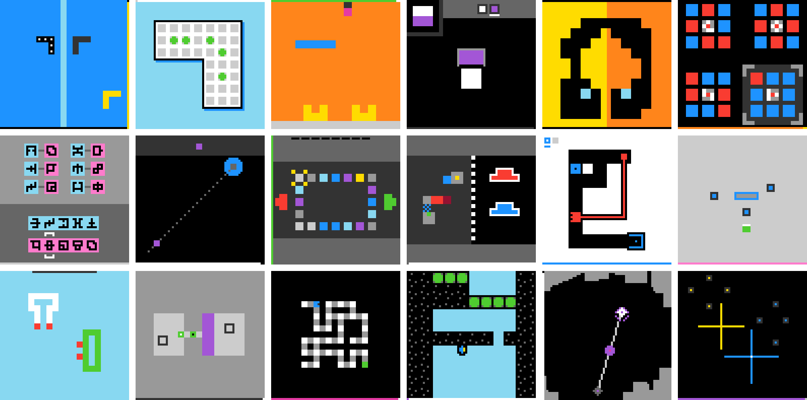
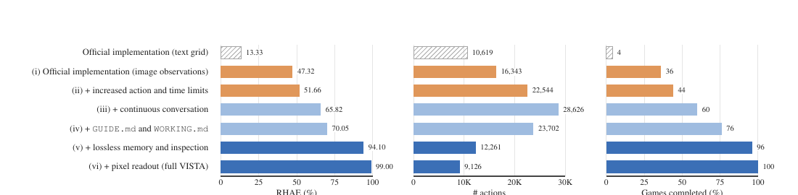
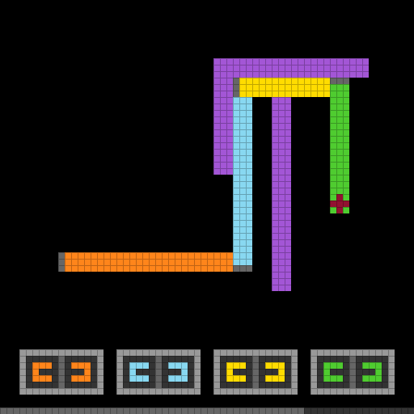
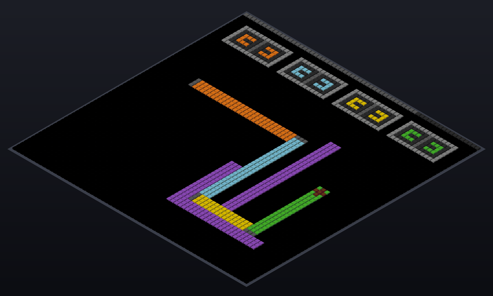

# VISTA Deep Dive: Claude's Perfect Score Is Not AGI, but a Visual Agent That Can Revisit Raw Evidence

> **TL;DR:** VISTA, from Kaiming He's team at MIT, does not train a new model or generate a custom program for every game. It wraps existing multimodal models in a visual harness: the agent sees PNG images directly, every returned frame is archived losslessly, and the model can revisit, compare, crop, magnify, or read pixels from earlier observations. `GUIDE.md` and `WORKING.md` preserve durable rules and current plans. With this setup, Claude Opus 5.0 reaches 100 RHAE on all 25 public ARC-AGI-3 games, while GPT-5.6 Sol reaches 99. The real result is not that an "AGI exam" has been defeated. It is that observation design, evidence retention, and action protocols can multiply the capability exposed by the same model. The boundary is equally important: these are public games, training exposure cannot be ruled out, the private set remains untested, and the perfect score belongs to a particular system configuration rather than the base model alone.

- **WeChat source:** [Chinese report republished by ASI启示录](https://mp.weixin.qq.com/s/K7H7-ScK20EtoL8j-HiTfg)
- **Project:** [VISTA: A Visual Harness for Reasoning in an Interactive World](https://vista-research.github.io/)
- **Paper:** [arXiv:2610.02200](https://arxiv.org/abs/2610.02200)
- **Code:** [joshhhhhan/VISTA](https://github.com/joshhhhhan/VISTA)
- **ARC-AGI-3:** [Official benchmark overview](https://arcprize.org/arc-agi/3)
- **Publication date:** October 4, 2026 for the WeChat article; arXiv v1 was submitted October 1, 2026
- **Research status:** arXiv preprint; code released under the MIT License; headline evaluations use closed frontier models
- **Verified:** October 4, 2026

## The Short Version

VISTA is not a new model. It is a **runtime that keeps a multimodal model connected to raw visual evidence throughout a long task**.

The key question is no longer just whether the model can think longer. It is whether, after revising its hypothesis, the model can return to frame 2 of turn 67 and inspect what actually happened instead of trusting a possibly incorrect sentence written much earlier.

That distinction matters more than the headline score. Claude's jump from 40.68 under the official implementation to 100 with VISTA does not mean its weights suddenly became 2.5 times more intelligent. It shows that model capability and harness design jointly determine observable system capability. Translate the environment poorly, discard old frames, and replace evidence with summaries, and even a strong model can end up reasoning while effectively blindfolded.

## What ARC-AGI-3 Measures

ARC-AGI-3 is not a one-shot question-answer benchmark. Its public set contains 25 interactive visual games with 183 levels. At the beginning, the agent does not know what the objects mean, how the game works, or what constitutes success. It must:

1. observe the current state;
2. choose an action;
3. inspect the resulting change;
4. revise its rule hypothesis;
5. carry learned mechanics into later levels.

The central metric is **Relative Human Action Efficiency (RHAE)**. Finishing a level is only the first requirement. The agent's action count is compared with the upper-median action count of first-time human players. An unfinished level receives zero. A completed but inefficient level receives partial credit. A more efficient completion can receive up to 115% at the level level, while the game score is also capped by completion progress.

A score of 100 is therefore not an IQ score or proof of AGI. It means the system completed these 25 public games and reached the maximum score under the benchmark's weighted action-efficiency rules.

## What VISTA Actually Adds

VISTA can be understood as six components:

| Component | Function |
|---|---|
| PNG observations | Renders the official 64x64 state as a 512x512 image so the model can use visual and spatial priors directly |
| Lossless visual memory | Stores every frame returned by the environment, including intermediate animation frames, addressable by turn and frame |
| `inspect` | Retrieves arbitrary historical frames, compares them, crops regions, and magnifies local details |
| `read_pixels` | Reads exact color values from a selected region to compensate for fine-grained visual errors |
| Two note files | `GUIDE.md` stores cross-level rules; `WORKING.md` stores current-level state and plans |
| Continuous conversation and handoff | Saves working state before context compaction, then resumes in a fresh context |

Only `play` advances the environment and consumes a game action. Looking at old frames, reading pixels, and updating notes are free under the benchmark action count. A host-side controller serializes tool calls, stores frames and notes, and enforces the protocol. The harness itself contains no trained model and does not infer rules for the agent.

Every ARC-AGI-3 game receives the same short prompt. It tells the model to finish with as few actions as possible, maintain a compact and revisable world model, predict what should happen before each action, record all visible changes afterward, and use the two note files. It contains no game-specific walkthroughs.

This is best understood as experimental discipline for an agent: **predict before acting, preserve raw evidence, revisit evidence when a hypothesis changes, and separate durable knowledge from temporary state.**

## The Ablation Matters More Than the Headline

The paper progressively enriches the GPT-5.6 Sol harness, revealing where the gains come from:

| Configuration | RHAE | Games completed | Total actions |
|---|---:|---:|---:|
| Official text grid | 13.33 | 4% | 10,619 |
| Replace text grids with PNG images | 47.32 | 36% | 16,343 |
| Increase action and time limits | 51.66 | 44% | 22,544 |
| Continuous conversation and native compaction | 65.82 | 60% | 28,626 |
| Add `GUIDE.md` and `WORKING.md` | 70.05 | 76% | 23,702 |
| Add lossless memory and inspection | 94.10 | 96% | 12,261 |
| Add exact pixel readout, completing VISTA | 99.00 | 100% | 9,126 |

Three signals deserve attention.

First, **the observation format is part of the capability surface**. Restoring 4,096 color integers to an image immediately raises RHAE from 13.33 to 47.32. Yet images alone remain far from a complete solution.

Second, the largest jump comes from recoverable visual evidence. Adding lossless memory and `inspect` after the two note files takes the score from 70.05 to 94.10 while nearly halving the number of actions. The agent does not merely remember more. It can re-examine old evidence after developing a new theory.

Third, this is not a perfect one-variable causal test. When visual memory is introduced, the automatic observation protocol also changes from receiving up to seven frames after an action to receiving the final frame automatically and actively requesting the rest. The 70.05-to-94.10 gain therefore supports the combined value of lossless storage, active inspection, and the revised observation protocol. It should not be attributed entirely to a single memory module.

## Images Are More Natural and Cheaper

Within the full VISTA harness, a text-grid version scores 96.75 and the image version scores 99.00; total actions fall from 10,614 to 9,126. The performance difference is modest, but the token difference is large: average usage per game falls from 71.9M to 30.7M.

The reason is straightforward. A 64x64 numerical grid costs roughly 4,000 text tokens, while the default 512x512 image costs about 308 image tokens. Two representations can be information-preserving in theory and still induce very different computation inside a model. Showing a spatial map as four thousand integers creates a substantial reasoning tax.

The paper also re-renders the same state as a perspective 3D scene. RHAE drops from 99.00 in 2D to 84.12 in 3D and total actions rise to 20,640, but the system still works. This is not evidence of general physical-world embodiment. It does show that VISTA is not tied to one exact pixel-grid appearance.

## Why More Context and Larger Images Can Hurt

One of VISTA's most useful results is that adding resources does not monotonically improve performance.

- At a 200K context limit, GPT-5.6 Sol scores 99.0 with 30.7M tokens per game.
- At 780K, the score falls to 93.9 while usage rises to 105.7M tokens per game.
- Scaling images from the default 8x to 16x raises per-frame image tokens to roughly 1,229 and lowers the score to 88.3.
- A 4x image uses about 77 image tokens and reaches 99.7.

The long-horizon problem is not simply that the context window is too small. Keeping everything in the active window consumes reasoning capacity and makes important evidence harder to locate. VISTA keeps complete history outside the window as an addressable evidence store, then lets the model retrieve the portion relevant to its current question.

This resembles retrieval-augmented generation, but the retrieval key is not a fixed embedding. The model first forms a question, such as "What changed before and after the red block was clicked?", then specifies the turns, frames, and regions it wants to compare. Retrieval itself becomes part of the reasoning process.

## Does Harness Engineering Replace Model Capability?

No. The more accurate conclusion is that VISTA recovers model capability that a poor interface would otherwise waste.

With the open-weight GLM-5.3 Flash 320B backend, the official implementation scores 1.89 and full VISTA reaches 66.93. That suggests the architecture is not unique to a single proprietary model. The remaining gap between 66.93 and 99 or 100 also shows that the underlying model still matters. A harness does not lift every model to the same ceiling.

There is a useful contrast with this repository's earlier analysis of [Prime Agent](../2026-08-05/2026-08-05-prime-intellect-prime-agent-rlm-continual-harness-en.md). Prime Agent builds executable world models through a REPL, code, and self-editable context state. VISTA avoids program synthesis and lets the model maintain rules in natural language while checking them against retrievable visual evidence. These approaches emphasize two different external cognitive structures: **executable abstraction** and **revisitable perception**.

## Five Caveats Behind "Claude 100, GPT 99"

### 1. The evaluation uses public games

The authors explicitly acknowledge that the evaluated models were released after the public ARC-AGI-3 games, so they cannot rule out training-data exposure. The private set is the stronger generalization test, and the paper reports no private-set result.

### 2. These are system scores, not raw-model scores

Claude uses Opus 5.0 at `xhigh` reasoning effort through Claude Code CLI. GPT uses GPT-5.6 Sol at `max` effort through Codex CLI. VISTA also increases the budget to as many as 2,000 actions and 48 hours per game. The result cannot be assumed to transfer unchanged to other versions, budgets, or tool protocols.

### 3. VISTA is not the only system at 100

The paper's comparison table reports Tycho at 100, Retrodict at 99.86, and Schema at 95.35 or 98.98. Those systems commonly synthesize programs or executable world models. VISTA's distinctive claim is not that it alone reached 100. It is that it is the first visual system, to the authors' knowledge, to reach perfect or near-perfect performance **without program synthesis**.

### 4. The project page and paper report different action totals

The arXiv v1 paper reports 7,302 Claude actions versus 17,135 for the human reference, or 57.4% fewer. The current project-page table reports 7,542 actions, corresponding to roughly 56.0% fewer. Both support the broad efficiency claim, but the precise figures differ. Any citation should identify which version it uses.

### 5. The cost report is incomplete

The paper reports tokens, action counts, and runtime limits, but not a full accounting of dollar cost, actual wall-clock time, retries, and parallel resources for each configuration. The 30.7M-token figure is an **average per game**, not the total for all 25 games. Reproducible source code does not imply cheap reproduction.

## What Real Visual Agents Can Learn From VISTA

The transferable result is not a collection of ARC-specific tricks. It is a runtime design discipline:

1. **Raw evidence should survive beyond one model call.** Screenshots, video frames, document pages, and tool outputs need stable addresses.
2. **Summaries and evidence should be separate layers.** `GUIDE.md` can compress rules, but it must not replace retrievable frames.
3. **Reading and acting should have different risk budgets.** Historical inspection should be cheap and read-only; state-changing actions should be constrained.
4. **Let the agent observe with a question.** Selecting frames, regions, and pixels is more efficient than replaying all history into context.
5. **Compaction needs an explicit handoff.** Durable rules, current state, unresolved hypotheses, and the next action should survive context boundaries separately.

These principles apply directly to desktop automation, web agents, video editing, robotics, and scientific instrument control. Many agents fail not because they never saw the right evidence, but because that evidence was compressed into an incomplete sentence after the first observation and could never be checked again.

## Conclusion

Calling VISTA "Kaiming He's team beating an AGI exam" makes a strong headline but obscures the engineering change worth copying.

On the public ARC-AGI-3 games, a sufficiently capable multimodal model does not necessarily need to generate thousands of lines of simulator code for every world. Give it natural visual input, a complete archive of historical frames, active inspection tools, two layers of notes, and a reliable context handoff, and it can observe, hypothesize, act, and revise itself against evidence.

The work does not yet prove robust generalization to unseen private worlds, nor does it reduce compute cost to something ordinary applications can ignore. VISTA is better read as a clear systems blueprint: the next competition in visual agents is not only about stronger models. It is also about helping models **see the right thing, preserve the original evidence, and look again when their understanding changes**.

## Sources

1. WeChat, “Claude满分、GPT 99分！何恺明团队把AGI考试打穿了”
   https://mp.weixin.qq.com/s/K7H7-ScK20EtoL8j-HiTfg

2. Qiushi Han, Keya Hu, Linlu Qiu, Cathy Wu, Kaiming He, “VISTA: A Visual Harness for Reasoning in an Interactive World”
   https://arxiv.org/abs/2610.02200

3. VISTA project page
   https://vista-research.github.io/

4. VISTA source code
   https://github.com/joshhhhhan/VISTA

5. ARC Prize, “ARC-AGI-3”
   https://arcprize.org/arc-agi/3
