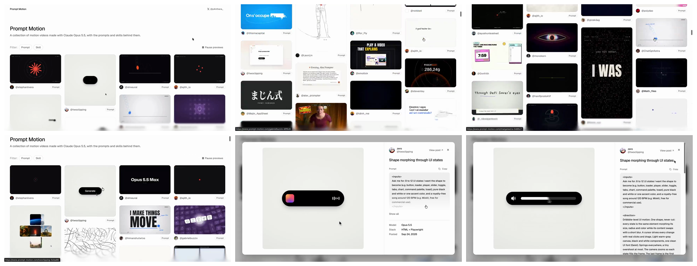
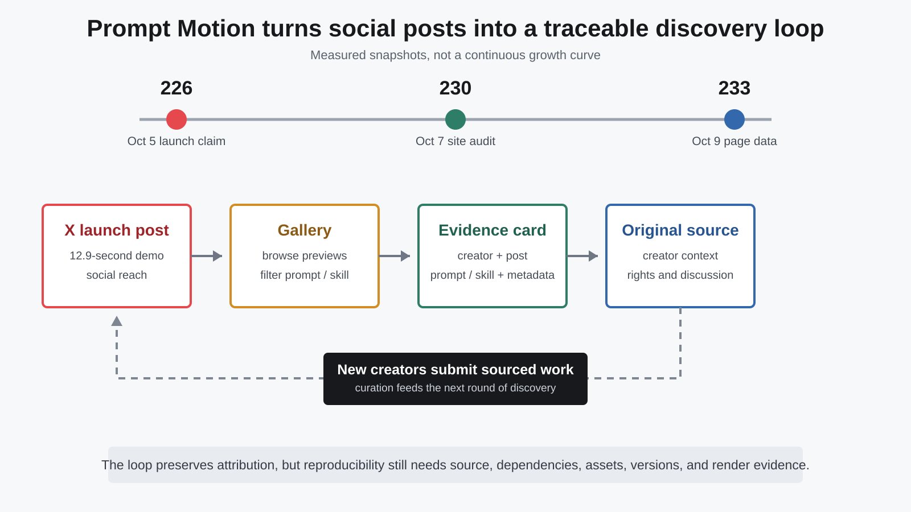

# Prompt Motion 首发帖拆解：百万曝光背后，真正被产品化的是可追溯的灵感

> **一句话结论：** 这条首发帖传播的表面是 226 个 Claude Opus 5.5 动效案例，真正被产品化的却是一个更稀缺的东西：从成片回到创作者、原帖、Prompt 或 Skill 的最短路径。13 秒演示把“刷到好作品”变成“打开证据卡、复制起始指令、回到原作者”；但它仍是来源索引，不是可复现项目包，热度也不能证明一条 Prompt 可以稳定复刻成片。

2026 年 10 月 5 日，创意与设计工程师 [`@p4nthera_`](https://x.com/p4nthera_) 发布 [Prompt Motion 首发帖](https://x.com/p4nthera_/status/2107175720086589633)：一个持续增长的 Claude Opus 5.5 motion graphics 画廊，每个作品旁边放置生成它的 Prompt 或 Skill，首发时共 226 个，全部来自 X 帖子并标注原作者。

截至 2026 年 10 月 9 日抓取快照，这条帖子显示约 **116 万次浏览、9,793 个喜欢、1,318 次转发和 22,621 个书签**。这些数字会继续变化；书签数明显高于喜欢数，只能说明它具有很强的“以后回来查”的倾向，不能证明有多少人真正复现了作品。



本文是 [10 月 7 日 Prompt Motion 产品深度拆解](../2026-10-07/2026-10-07-prompt-motion-claude-motion-prompt-skill-gallery.md) 的补充，不再重复 Remotion、HyperFrames、Cinetic 与具体 Skill 的实现，而是只回答一个问题：**为什么这条短帖能把一个画廊变成传播基础设施？**

---

## 01｜13 秒视频没有讲技术栈，却完整演示了产品价值

首发视频长 12.9 秒，1290×720、60fps，包含音轨。画面几乎只是一次屏幕录制：

1. 首页先显示一句定位：Claude Opus 5.5 动效作品，以及背后的 Prompts 和 Skills；
2. 用户向下浏览自动预览的作品网格；
3. 点击一个“Shape morphing through UI states”案例；
4. 详情卡显示创作者头像与账号、`View post`、完整 Prompt、Copy 按钮；
5. 页面继续列出模型、技术栈和发布日期。

这个剪辑没有演示“输入一句话，等待生成 MP4”。它演示的是**检索与回溯**：先被视觉结果吸引，再立刻查看作品从哪里来、作者公开了什么。

这是首发传播最聪明的部分。很多 AI 作品集把成片做成终点；Prompt Motion 把成片做成入口。视频不需要解释 provenance 这个抽象概念，只需在最后几秒让用户看到 `View post` 和 Prompt 卡片，产品区别就成立了。

---

## 02｜226 不是一次性库存，而是增长循环的起点

对三个时间点的可见数据进行核对：

| 快照 | 作品数 | 证据 |
|---|---:|---|
| 2026-10-05 | 226 | 首发帖正文中的公开数字 |
| 2026-10-07 | 230 | 此前对首页逐项去重后的审计结果 |
| 2026-10-09 | 233 | 当前首页 Next.js 数据中 233 个唯一 `slug` |

10 月 9 日的 233 项中，229 项仅标记 Prompt，3 项仅标记 Skill，1 项同时标记 Prompt 与 Skill；发布日期覆盖 9 月 23 日至 10 月 8 日。这个统计是页面数据快照，不是站方提供的历史 API，也不应被画成连续增长曲线。



真正的增长机制可以概括为：

```text
创作者在 X 发布成片 + Prompt / Skill
                ↓
Prompt Motion 审核并建立作品卡
                ↓
画廊把多个创作者聚合成可浏览入口
                ↓
用户回到原帖、关注作者或尝试方法
                ↓
更多创作者提交新作品
```

它与普通“搬运合集”的区别，在于每次聚合仍保留返回原来源的通道。社交平台负责产生新鲜作品和讨论，独立网站负责整理、筛选与长期查找；两者互相供给，而不是谁完全替代谁。

---

## 03｜为什么它获得的书签比喜欢更多

喜欢通常确认“这个视频不错”，书签更接近“这以后可能有用”。首发帖把三种用途压缩在同一个链接里：

- **灵感发现：** 一页浏览大量视觉语言，不必逐个搜索账号；
- **方法回溯：** 从结果进入 Prompt、Skill、模型与 stack；
- **作者发现：** 每条卡片保留账号与原帖，而不是抹掉来源只留下素材。

因此，Prompt Motion 更像面向动效的参考数据库，而不是一次看完就结束的宣传页。超过 2.2 万个书签与这种使用方式相符，但它仍然只是行为信号：我们不知道多少书签后来被打开，也不知道复制 Prompt 后的成功率。

更重要的是，热门排序不能被当成作品质量或模型能力 benchmark。传播量受到作者粉丝、发布时间、题材、封面和平台算法影响；网站没有统一 brief、固定 token 预算、盲评或失败样本。

---

## 04｜它建立的是“最小来源卡”，不是完整复现包

一张信息较完整的 Prompt Motion 卡片可以回答：

- 谁发布了作品；
- 原始 X 帖子在哪里；
- 作者公开了什么 Prompt 或 Skill；
- 声明使用哪个模型、effort 或技术栈；
- 作品何时发布。

这已经比只有视频文件的灵感库强很多。但要真正复现一支代码动效，还缺少：

- 项目源码与精确 commit；
- package lock、浏览器、FFmpeg 与字体版本；
- 输入 Logo、图片、音频及各自许可证；
- Agent 会话、人工修改和失败迭代；
- 渲染参数、最终 MP4 哈希与 QA 记录。

所以 Prompt 是**意图证据**，Skill 是**方法证据**，原帖是**来源证据**，成片是**结果证据**。只有把环境和产物也固定下来，才接近可重复的工程证据。

---

## 05｜归属设计是优势，也带来新的托管责任

网站页脚写明，视频和 Prompt 归各自创作者所有，并在每个条目链接原作者。首页媒体则从 `media.prompt-motion.com` 提供 poster、preview 和 video，这让浏览速度与展示一致性不再完全依赖 X。

这种设计改善了发现体验，也意味着策展者承担更多责任：

- 原帖删除或账号变化后，镜像媒体与 attribution 怎样同步；
- 创作者要求删除或修正时，是否有清晰流程；
- Prompt、视频、音乐、字体和品牌素材的权利是否分别处理；
- 卡片内容更新后，旧版本是否可追踪。

本轮没有发现公开 sitemap、版本化数据导出或不可变 manifest。网站是人工策展产品，不是去中心化来源协议。它的可信度主要来自清晰链接、持续维护和纠错，而不是加密证明。

---

## 06｜对创意工具和 Agent 产品最值得借鉴的三件事

### 1. 用结果吸引，用来源留住

首屏先展示作品，不先解释工作流；用户产生兴趣后，详情卡才展开 Prompt、Skill 与 stack。信息顺序符合真实探索行为。

### 2. 把 Attribution 做成核心交互

作者名与 `View post` 不是藏在版权页，而是和 Copy Prompt 同层。溯源不是合规尾注，而是产品功能。

### 3. 区分“可复制文字”和“可复现工程”

Copy 按钮解决的是低摩擦试验，不应暗示确定性复现。更成熟的下一步，是让 Skill、源码、commit、依赖、素材与渲染报告拥有不同的证据标签。

对团队而言，最值得复制的不是做另一个 Prompt 瀑布流，而是建立这条最短路径：**成片 → 作者 → 原始上下文 → 可执行方法 → 验证结果。**

---

## 结语：Prompt Motion 的产品不是 Prompt，而是上下文

首发帖用 221 个字符和 13 秒视频，准确展示了一个小而清楚的产品：把散落在 X 上的 Claude 动效作品，重新组织成可浏览、可回溯、可继续增长的资料库。

百万级曝光来自漂亮成片，但两万多个书签更接近它的长期价值：用户想把这个入口留着。Prompt Motion 没有证明“一句话稳定生成专业视频”，也没有替代 Remotion、HyperFrames 或制作 Skill；它做的是把作品和产生作品的上下文重新连起来。

这就是它真正被产品化的部分：**不是把 Prompt 当魔法咒语出售，而是让灵感拥有来源，让来源能够继续回到创作者。**

---

## 主要来源

1. [Prompt Motion 首发帖](https://x.com/p4nthera_/status/2107175720086589633)
2. [Prompt Motion 官网](https://prompt-motion.com/)
3. [Prompt Motion 产品深度拆解：Prompt 与 Skill 证据库](../2026-10-07/2026-10-07-prompt-motion-claude-motion-prompt-skill-gallery.md)

*来源帖发布于 2026 年 10 月 5 日；核验日期为 2026 年 10 月 9 日。互动数据和画廊数量会继续变化。首发视频用于提取联络表，没有将原始 MP4 提交到仓库；视频和 Prompt 权利归原作者及相关权利人。*
