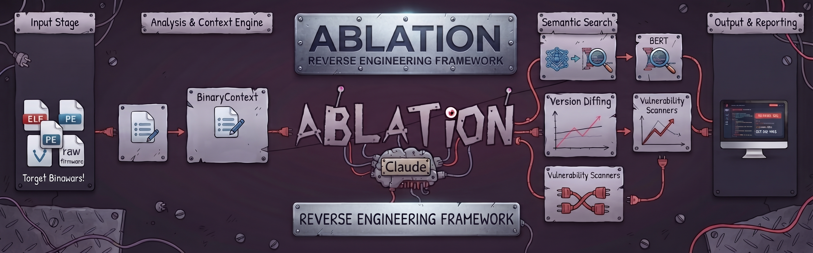
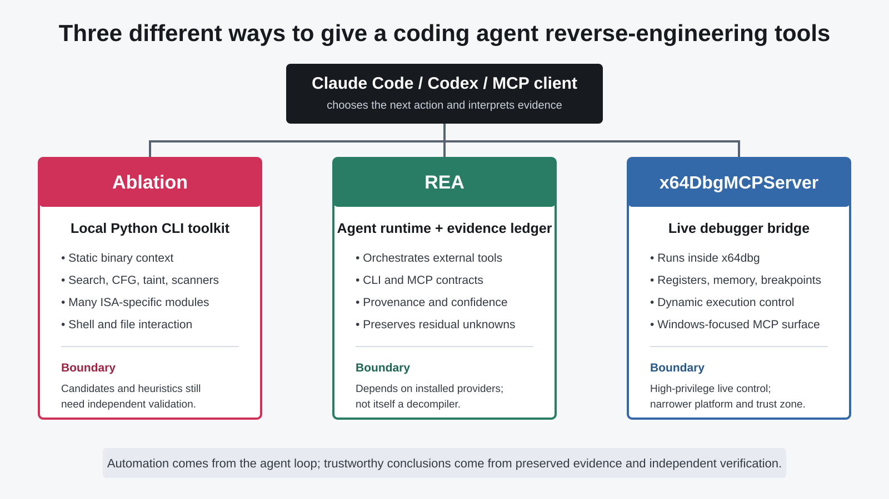

# Ablation Source Audit: Not Fully Autonomous Reverse Engineering, but a Multi-Architecture Static-Analysis Toolkit for Coding Agents

> **Bottom line:** Ablation is a real and unusually broad Python reverse-engineering framework. It builds binary context for ELF, PE, firmware, and multiple ISAs; exposes semantic retrieval, CFG, taint, version-comparison, and targeted vulnerability scanners; and can be driven from ordinary shell commands by Claude Code or Codex. But an agent chaining commands is not the same as a closed, fully autonomous reverse-engineering process. Ablation's own technical documentation requires manual validation of candidate paths and explicitly says the toolkit is not a complete replacement for Ghidra, IDA, or Binary Ninja.



On October 6, 2026, reverse-engineering researcher Nicholas Michael Kloster recommended [`Ablation-Tool/ablation`](https://github.com/Ablation-Tool/ablation) in an [X post](https://x.com/showxlate/status/2107376525427261483), saying that Claude Code or Codex could use it to “fully automate the whole reverse engineering process.” That captures the intended experience, but overstates the demonstrated boundary.

This audit is fixed to commit [`6d3ae61`](https://github.com/Ablation-Tool/ablation/tree/6d3ae61b29b5d16210fcf967a6d56920a07b89de) and was performed on October 9, 2026. The snapshot contains 271 Python files, roughly 193,600 lines of Python, 191 analyzer files, 24 test files, and 645 commits. Git author metadata attributes 644 commits to `Claude Sonnet 4.6` and one to the project author. This is a rapidly expanding, heavily AI-assisted codebase built in 16 days. Neither code volume nor commit count establishes analytical correctness.

---

## 01 | What It Actually Does: Build Context, Then Reduce the Human Search Space

Ablation does not primarily reconstruct original source code. It decomposes an investigation into callable operations:

1. `BinaryContext` uses LIEF, Capstone, and NumPy to collect format, architecture, segments, imports, strings, probable function starts, calls, and cross-references. Results are cached under `~/.ablation/cache` using the binary SHA-256.
2. `CorpusBuilder` turns names, callees, strings, and analyst notes into textual function descriptions stored in local SQLite.
3. `SemanticSearcher` embeds those descriptions with `sentence-transformers/all-mpnet-base-v2`.
4. `window`, `profile`, `cfg`, `taint`, and architecture-specific commands inspect selected functions in more detail.
5. Local registries preserve names, function identities, patterns, and findings for later sessions.

That sequence is well suited to a coding agent. Instead of ingesting a complete disassembly, the agent can ask whether network input influences a length, review ranked candidates, then request the call graph, CFG, or taint path around a specific address.

The semantic search, however, is not BERT directly understanding machine code. It searches **text descriptions** assembled from names, strings, callees, and notes. A high score shows similarity between descriptions; it does not prove that the function performs the queried behavior. The repository's own [`Understanding Ablation`](https://github.com/Ablation-Tool/ablation/blob/6d3ae61b29b5d16210fcf967a6d56920a07b89de/docs/understanding-ablation.md#finding-candidate-functions) document is much more precise about this than the README.

---

## 02 | The Codex Integration Is Ordinary Shell Orchestration


The current repository contains neither a Codex-specific plugin nor an MCP server. The documented workflow is straightforward: Codex must be able to see the target and the installed environment, then it runs commands such as `ablation analyze`, `search`, `profile`, `cfg`, and `taint`, reads the output, and chooses the next step.

```text
Research question + target binary
              ↓
Codex / Claude Code selects a command
              ↓
Ablation produces context, candidates, graphs, or scan results
              ↓
The agent interprets the output and narrows the investigation
              ↓
A human checks instructions, callers, sources, guards, and runtime behavior
```

Automation therefore lives in the **orchestration layer**. The agent can run a sequence that an analyst previously entered by hand and can preserve a coherent investigation. Ablation itself does not provide a demonstrated closed loop that defines the research objective, validates every intermediate assumption, performs dynamic confirmation, and takes responsibility for the final vulnerability claim.

The repository does contain an optional Anthropic-backed `llm_analyst` package, but that is a separate API integration. Codex operating the CLI through a shell does not silently activate it. Conflating the two paths turns “a model is reasoning over tool output” into the much stronger and unsupported claim that the framework contains one unified autonomous analyst.

---

## 03 | Broad Coverage Does Not Mean Equivalent Coverage Everywhere

The locally installed `ablation --help` exposed roughly 30 top-level commands. Beyond `analyze`, `search`, `cfg`, and `taint`, the CLI includes:

- Windows driver and BYOVD risk analysis;
- format-string, heap, integer-overflow, and crypto scanners;
- dedicated MIPS32/64, nanoMIPS, PPC32/64, RISC-V 32/64, ARC, V850, and LoongArch64 commands;
- corpus, signature, finding, and pattern stores;
- JSON or SARIF output on selected paths.

That breadth is unusual and potentially valuable for firmware, legacy architectures, and security triage. Yet each module models a different instruction subset, ABI, source/sink set, CFG recovery strategy, and path boundary. The documentation says that the main `BinaryContext` and much of the workflow remain ELF-oriented. “Supports architecture X” therefore means that specific components support it, not that every feature has equal fidelity on every format and ISA.

Running `ablation analyze /bin/ls` on macOS produced the correct warning that the file was a Mach-O fat binary rather than ELF, followed by an empty context with zero functions, strings, and call edges. Nothing crashed, but the result cleanly demonstrates that the presence of Mach-O-related code in the repository does not make the primary analysis path format-general.

---

## 04 | Why It Is Not a Drop-In Ghidra, IDA, or Binary Ninja Replacement

The README opens by claiming the “exact same core disassembly, decompilation, and binary analysis capabilities” as Ghidra, IDA Pro, and Binary Ninja. The internal documentation in the same repository says the opposite more carefully: Ablation is a binary-analysis toolkit, **not** a general source-level decompiler equivalent to a complete interactive commercial or open-source reverse-engineering suite.

This is a meaningful product boundary:

| Capability | Ablation's current strength | A full RE suite usually adds |
|---|---|---|
| Entry point | CLI, batch analysis, targeted scanners, agent-friendly output | A durable interactive project database and GUI |
| Code understanding | Disassembly, structural context, bounded CFG/taint, pattern matching | Mature decompiler IR, type recovery, propagated renaming, interactive correction |
| Architecture support | Many specialized ISA modules with uneven coverage | More unified loaders, processors, calling conventions, and plugin ecosystems |
| Validation | Ranked candidates and static approximations | Workflows combining static analysis with debugging, patching, traces, and shared databases |

Ablation's distinct value is not reproducing every feature of traditional tools. It packages many security-research operations as narrow interfaces that an agent can call. Claiming full equivalence obscures the genuinely interesting part of the design.

---

## 05 | The Real-World Evidence Is Genuine, but It Does Not Prove Full Autonomy

The Cisco disclosures listed by the project are independently verifiable:

- Cisco's [FMC advisory](https://sec.cloudapps.cisco.com/security/center/content/CiscoSecurityAdvisory/cisco-sa-fmc2-multivulns-HXgcqRG) confirms CVE-2026-76420, CVE-2026-76412, and CVE-2026-76413, credits Nicholas Michael Kloster, and assigns a maximum CVSS score of 9.0.
- Cisco's [ISE advisory](https://sec.cloudapps.cisco.com/security/center/content/CiscoSecurityAdvisory/cisco-sa-ise-multiauth-bypass-sgD2HbL4) also credits Nicholas Kloster for CVE-2026-76447.

Those acknowledgments establish serious, real-world reverse-engineering and vulnerability-research results. They also show that Ablation was at least part of work on production products. They do not independently confirm the README's stronger statement that Cisco PSIRT has “adopted Ablation for internal vulnerability triage.” Cisco's public advisories confirm the findings and reporter, not an internal tool-adoption decision.

Nor does a discovered vulnerability reveal how much work came from the framework, the researcher's experience, manual disassembly, dynamic experiments, vendor coordination, or other tools. The defensible conclusion is: **Ablation has credible cases supporting its value for triage, but those cases are not a reproducible benchmark of a fully autonomous loop.**

---

## 06 | Independent Execution and CI: Runnable Code, Incomplete Test Evidence

I installed the audited checkout and its full dependencies in a fresh Python 3.11 virtual environment:

- `ablation --help`: succeeded and enumerated the CLI;
- installed package metadata: `2.40.0`;
- `ablation.__version__`: `1.8.0`;
- the architecture document still says package metadata is `2.5.0`;
- `python -m pytest tests/ -q`: **509 passed, 23 failed, 4 skipped, and 13 errors**.

The test result needs context. Many failures and errors come from Linux assumptions: tests hard-code `/usr/bin/ls`, which is absent on macOS, while others compile a Mach-O host binary and still expect an ELF `.plt.sec` section. It would be misleading to count all 36 non-passing cases as algorithm defects. The 509 passes show substantial runnable unit coverage; the failures reveal that test fixtures are not isolated from the host platform.

The more consequential issue is in the official [CI workflow](https://github.com/Ablation-Tool/ablation/blob/6d3ae61b29b5d16210fcf967a6d56920a07b89de/.github/workflows/ci.yml#L62-L63):

```bash
python -m pytest tests/ -x -q 2>/dev/null || true
```

`|| true` prevents any pytest failure from failing CI, while `2>/dev/null` suppresses error output. The latest Ubuntu job did successfully import the package, enumerate the CLI, and run an ELF smoke test on `/usr/bin/ls`, finding 188 functions and building an XRefGraph. The pytest step, however, emitted no pass count and ended after roughly 0.03 seconds. A green badge therefore establishes installation and a narrow smoke path, not a passing test suite.

The three conflicting version values, platform-dependent fixtures, and swallowed pytest exit code are the clearest engineering risks in a repository expanding this quickly.

---

## 07 | Ablation, REA, and x64DbgMCPServer Are Different Products



Recent “AI reverse engineering” projects are often grouped together as Skills or MCP servers, but these three solve different problems:

| Project | Core role | Agent interface | Strongest boundary |
|---|---|---|---|
| Ablation | Python toolkit with its own static analyzers | Ordinary shell and files | Produces candidates and bounded models that still need validation |
| [REA](../2026-10-09/2026-10-09-rea-evidence-ledger-agentic-reverse-engineering-runtime-en.md) | Agent runtime that orchestrates external decompilers and records Evidence | CLI + MCP | Not itself a decompiler; capability depends on providers |
| [x64DbgMCPServer](../2026-10-07/2026-10-07-x64dbg-mcpserver-ai-debugger-source-audit-en.md) | Live bridge embedded inside x64dbg | MCP | Can read and modify a live process, with a narrower platform and higher privilege |

Ablation is therefore not simply a Remotion-style Skill or a bundle of instructions. A Skill teaches the model a method; Ablation implements binary parsing, disassembly, dataflow, and scanners. The accurate description is **a collection of local analysis engines designed to be orchestrated by a coding agent**.

---

## 08 | A Workflow That Keeps Candidates Separate From Conclusions

A defensible Ablation investigation should preserve:

1. The target SHA-256, exact Ablation commit, and Python/dependency versions.
2. Every agent command, parameter, and raw output.
3. Candidate lists and rankings from scanners or semantic search, not only the final narrative.
4. Manual checks of function boundaries, callers, input control, guards, sink semantics, and reachability.
5. Independent validation with a decompiler, debugger, or controlled execution when needed.
6. False positives, unvisited paths, and residual unknowns.

Unknown binaries should still be handled in an isolated VM or host, under a low-privilege account, with controlled networking and a disposable workspace. Ablation is an analysis framework, not a malware sandbox. Running locally does not remove the attack surface of binary parsers and dependencies.

---

## Conclusion: The Advance Is Making RE Operations Composable by an Agent

Ablation matters because it turns binary context, semantic candidate retrieval, specialized scanners, multi-architecture dataflow, and local analyst knowledge into composable commands. A coding agent can search, iterate, and preserve an investigation quickly, leaving the hardest boundary judgments to the analyst.

It remains clearly short of fully autonomous reverse engineering. Semantic retrieval operates on descriptions, static analysis is bounded by instruction models and CFG recovery, architecture coverage is uneven, pytest failures cannot fail CI, and every consequential vulnerability claim still needs validation. The project's technical documentation already offers the most honest positioning: **Ablation reduces the search space and makes evidence easier to inspect. Its outputs are leads for an investigation, not conclusions that become true automatically.**

---

## Primary Sources

- [Original X post by Nicholas Michael Kloster](https://x.com/showxlate/status/2107376525427261483)
- [Ablation GitHub repository](https://github.com/Ablation-Tool/ablation)
- [Audited commit `6d3ae61`](https://github.com/Ablation-Tool/ablation/tree/6d3ae61b29b5d16210fcf967a6d56920a07b89de)
- [README autonomy claim](https://github.com/Ablation-Tool/ablation/blob/6d3ae61b29b5d16210fcf967a6d56920a07b89de/README.md#L6-L8)
- [Understanding Ablation: architecture and limitations](https://github.com/Ablation-Tool/ablation/blob/6d3ae61b29b5d16210fcf967a6d56920a07b89de/docs/understanding-ablation.md)
- [CI workflow](https://github.com/Ablation-Tool/ablation/blob/6d3ae61b29b5d16210fcf967a6d56920a07b89de/.github/workflows/ci.yml)
- [Latest CI run](https://github.com/Ablation-Tool/ablation/actions/runs/37851846989)
- [Cisco FMC security advisory](https://sec.cloudapps.cisco.com/security/center/content/CiscoSecurityAdvisory/cisco-sa-fmc2-multivulns-HXgcqRG)
- [Cisco ISE security advisory](https://sec.cloudapps.cisco.com/security/center/content/CiscoSecurityAdvisory/cisco-sa-ise-multiauth-bypass-sgD2HbL4)
- [GNU GPL v3 License](https://github.com/Ablation-Tool/ablation/blob/6d3ae61b29b5d16210fcf967a6d56920a07b89de/LICENSE)

*The source post was published on October 6, 2026; the audit was performed on October 9, 2026. The repository is moving quickly, so the code counts, versions, tests, and behavior in this article apply only to commit `6d3ae61b29b5d16210fcf967a6d56920a07b89de`. This article concerns lawful, authorized software analysis and security research only. The official framework image and demo GIF have been preserved locally with the article.*
