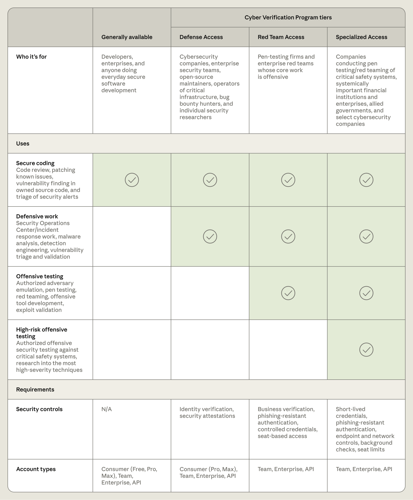
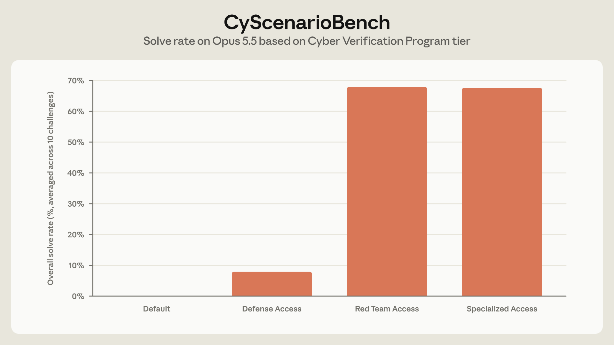
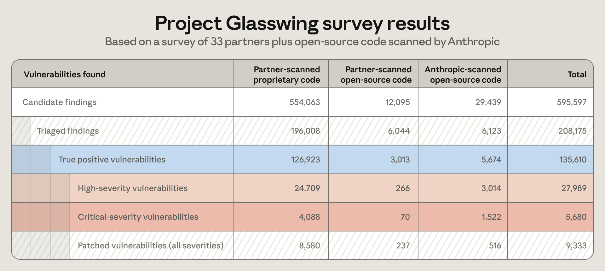

# Anthropic 网络安全验证计划拆解：不是取消安全限制，而是把前沿能力做成分级许可

> **一句话结论：** Anthropic 没有简单地“放开 Claude 的黑客能力”，而是把同一组前沿模型拆成 Defense、Red Team 与 Specialized 三档许可：工作越接近真实攻击，身份、凭证、设备、网络出口、数据留存和持续审查要求就越高。真正的新东西不是更少拒绝，而是把模型能力变成了一套可撤销、可归因的访问制度。

- **原帖：** [Anthropic：扩展 Cyber Verification Program](https://x.com/AnthropicAI/status/2107546569654636883)
- **官方公告：** [Expanding the Cyber Verification Program](https://www.anthropic.com/news/cyber-verification-program)
- **发布时间：** 2026 年 10 月 6 日
- **检查时间：** 2026 年 10 月 9 日

2026 年 4 月，Anthropic 通过 Project Glasswing 把尚未公开的 Claude Mythos Preview 交给一小批关键基础设施与软件组织使用。当时的核心策略是“模型能力先不普及，让防守方先跑”。我在[上一篇 Mythos / Glasswing 分析](../2026-04-08/claude-mythos-non-release-project-glasswing-analysis.md)中讨论过这个阶段。

半年后，Anthropic 开始把这套小范围合作改造成可以申请、分层和运营的产品制度。新版 Cyber Verification Program（CVP）覆盖 Claude Opus 5.5、Sonnet 5.5、Mythos 5.1 以及未来模型，并把原有 CVP 与 Project Glasswing 合并进三个权限层级。

这次变化的重点，不是“安全限制取消了”，而是 **安全边界从所有人共用的一条模型拦截线，变成模型内拦截、客户身份、组织控制和持续监测共同组成的多层系统。**

## 01｜四种使用状态，不是三种模型

官方表格把普通公开使用与三档 CVP 并列：

| 使用状态 | 允许的核心工作 | 谁可以申请 | 仍然保留的边界 |
|---|---|---|---|
| 普通公开使用 | 安全代码审查、修补已知问题、在自有源码中找漏洞、告警分流 | 所有用户 | 更深入的恶意软件分析与利用验证可能被拦截 |
| Defense Access | SOC、事件响应、恶意软件逆向、检测工程、漏洞分析与验证 | 企业、大学、政府、开源维护者、漏洞赏金研究者与个人研究者 | 多阶段攻击任务仍会大量触发拦截 |
| Red Team Access | 在授权系统上进行渗透测试、红队、对抗模拟、攻击工具开发与 exploit 验证 | 仅组织 | 勒索软件、物理伤害、大规模破坏和高风险安全系统仍被实时阻止 |
| Specialized Access | 对电网、航空、通信、银行清算等高风险安全系统做经授权的攻击测试 | 少量经深度审查的组织 | 使用政策仍适用；资格与控制最严格 |

这四列不是四个独立模型。公开层使用带保守网络安全 safeguards 的通用模型；三档 CVP 则共同覆盖 Opus 5.5、Sonnet 5.5 与 Mythos 5.1。随着层级上升，变化的不只是 classifier 配置和允许的任务范围，也包括能否访问 Mythos，以及组织必须承担的控制责任。

因此，CVP 不是“给好人一个安全开关”。Anthropic 不能直接知道一个 Prompt 背后的真实意图，它只能把风险判断拆成多层：先验证申请者，再限定被授权的工作，要求请求能够归因到具体身份，并保留运行时拦截和事后撤销能力。

## 02｜同一个模型，为什么会出现完全不同的通过率

Anthropic 用 CyScenarioBench 测试 Opus 5.5 在多阶段、可交互网络行动中的表现。每一档运行 10 个挑战，每个挑战尝试 5 次，共 50 次：

- 普通公开版本：50 次都在第一个 Prompt 被阻止；
- Defense Access：46 次在挑战过程中被阻止，4 次完成；
- Red Team Access：没有一次被 classifier 阻止，完成 34 次；
- 无 safeguards 的对照：成功率 67.6%，与 Red Team 的 34/50 基本相当。

这个结果说明两件不同的事。

第一，权限层确实能明显改变模型可执行的任务。Defense 不是“低配 Red Team”，它有意让复杂攻击链在中途停下；Red Team 则把模型恢复到接近无拦截时的能力上限。

第二，**没有被拦截不等于一定成功。** Red Team 的 50 次运行全部没有触发 block，但只完成 34 次。剩下的失败来自模型能力、规划、工具使用或环境，而不是安全 classifier。把“拒绝率”和“任务成功率”分开，是理解这组数据最重要的地方。

但这也只是一个由 Anthropic 运行、只有 10 个场景的校准测试。它没有证明身份审查能够阻止内部滥用，也没有测量长期 Agent 在真实企业网络中的越权概率，更没有给出普通防守工作的误拦截率。它证明的是 **三套 classifier 的行为确实不同**，不是整套治理体系已经被端到端验证。

## 03｜越接近真实攻击，门槛越像企业安全架构

如果只看 X 帖，会觉得 CVP 的关键动作是“验证专业人士”。帮助中心公开的要求要具体得多。

所有层级都必须有明确安全联系人，请求能够归因到具体用户或 workload identity；发生相关安全事件时，组织要在 24 小时内报告，并在 Anthropic 指出滥用后 48 小时内启动调查。

Defense Access 从 2026 年 12 月 15 日起要求抗钓鱼 MFA，并禁止长期 API Key；个人也只能获得这一档，而且流量必须留存和监控，不能使用零数据留存。

Red Team Access 进一步要求：

- 只允许组织域账号，默认最多 25 名获批用户；
- 使用短期凭证，不允许长期静态密钥；
- Agent 的网络出口必须由宿主机外的 allow-list 限制并记录；
- 只能使用组织管理的设备；
- 用户需要身份审查，并在当地法律允许时接受背景调查；
- 组织必须能在 24 小时内撤销被盗身份或凭证；
- 离职或换岗人员须在三个工作日内移除。

Specialized Access 再增加 SSO、终端恶意软件防护，以及更严格的设备和组织审查。涉及电网、航空、通信和金融基础设施的申请，目前还要与美国政府合作逐家深入审核。

这说明 Anthropic 的安全单位已经不只是 Prompt classifier，而是 **身份、最小权限、短期凭证、受控终端、网络隔离、日志、事件响应和供应商审查的组合**。模型能力越高，客户自己的安全成熟度越成为访问条件。

## 04｜数据留存是这套制度最现实的代价

CVP 默认要求保留数据，因为 Anthropic 需要监测网络滥用并调查异常。对安全团队而言，这个要求并不轻：送入模型的可能是未公开漏洞、恶意软件样本、内部拓扑、源代码和事件日志。

Anthropic 的过渡方案是 Enterprise Frontier Safeguards（EFS）。官方称 EFS 上线后，符合条件的组织可以把数据保存在自己控制的云基础设施中，同时保留更强的安全监测。现阶段，已经拥有 Fable 5.1 或 Mythos 5.1 零数据留存豁免的组织，可以在 CVP 中继续使用 ZDR；个人 Defense Access 明确不支持 ZDR。

这不是一个已经完全解决的隐私问题，而是一项交换：**想获得更少拦截，就必须接受更强的身份绑定和可观测性。** 对拥有敏感客户数据或受监管材料的安全公司，是否加入 CVP，取决于数据驻留、合同责任与监控范围，而不只是模型能力。

## 05｜Project Glasswing 的结果很大，但统计口径不能省略

Anthropic 用前六个月的 Project Glasswing 数据证明为什么要扩大计划。官方图表汇总了 33 份合作伙伴报告与 Anthropic 对开源代码的扫描：

| 阶段 | 数量 |
|---|---:|
| 候选发现 | 595,597 |
| 已分流检查 | 208,175 |
| 确认 true positive | 135,610 |
| 其中高危 | 27,989 |
| 其中关键级 | 5,680 |
| 已报告修补 | 9,333 |

公告正文把它概括为：合作伙伴在 2026 年 4–7 月发现至少 129,000 个已验证漏洞，Anthropic 在 4–10 月对开源项目另发现约 5,500 个；高危或关键漏洞超过 33,000 个。

这些数字足以说明前沿模型已经能大规模扩展漏洞发现。但它们不等于 135,610 个独立 CVE，也不等于全部已经修复。官方明确承认数据来自部分合作伙伴自报、各组织的 triage 方法不同，而且不到一半参与者披露了修补数。图中的 9,333 只是已报告下限，不能直接拿来计算真实 patch rate；反过来，“真实影响至少高五倍”也仍是 Anthropic 的估计，不是独立审计结果。

更稳妥的结论是：**扫描瓶颈已经从发现候选，转向人工分流、去重、披露和修补。** 当模型一次制造数十万条 findings，安全团队最缺的可能不再是扫描器，而是验证与修复吞吐量。

## 06｜申请通过，也不等于可以把权限包装成产品

CVP grant 默认只覆盖组织自己的代码、产品和基础设施。把高权限模型跑在客户代码上、让客户通过自己的产品直接访问，或把 CVP 能力做成对外服务，都需要另行申请 productization approval。

这条边界很重要。否则一家获批的红队公司可以把自己的权限变成所有客户共享的中转层，身份审查和 25 人席位限制就会失去意义。

第三方平台目前也只能支持 Defense 与 Red Team，不能提供 Specialized Access。CVP 可在 Anthropic 一方产品、Claude Platform、Google Cloud Vertex AI 和 Microsoft Foundry 使用；Amazon Bedrock 目前只向符合 EFS 条件的客户开放。这些差异说明“获批”并不是一个可随处携带的账号标签，而是绑定到 workspace、云账号、平台能力和管理员配置的 grant。

## 07｜这套制度真正改变了什么

过去讨论模型安全，往往只有两种发布状态：公开，或不公开。CVP 增加了中间层：模型可以相同，但不同用户看到不同的能力边界；更高能力不靠一句免责声明解锁，而由资格、技术控制和持续审查共同决定。

这让前沿模型越来越像受控基础设施，而不是普通软件订阅：

- **模型权重之外，entitlement 成为产品的一部分。** 能否执行某项工作取决于 grant，而不只是选了哪个模型。
- **安全从输出过滤扩展到客户环境。** Anthropic 把 MFA、凭证寿命、设备管理、网络出口和事件响应写进访问条件。
- **责任从平台单方转为共享。** Anthropic 调整 classifier，客户则必须保证授权范围、用户身份和运行环境。
- **可撤销性成为核心能力。** grant 可以被缩小或收回，管理员也必须能迅速撤销内部凭证。

这套结构未必只属于网络安全。生命科学验证计划已经采用类似思路。随着模型在高风险领域变强，“同一个模型、不同权限、不同审计要求”可能会成为前沿能力的常见交付方式。

## 08｜安全团队真正要问的七个问题

对准备申请 CVP 的组织，比“Claude 会不会少拒绝”更重要的是：

1. 工作属于日常安全开发、Defense、Red Team，还是高风险 Specialized 范围？
2. 每一次测试是否都能证明资产所有权或明确授权？
3. 能否在 12 月截止前淘汰长期 API Key，改用短期身份凭证？
4. Agent 的网络出口能否在宿主机之外强制 allow-list 并完整记录？
5. 谁负责 24 小时事件报告、48 小时调查和 24 小时凭证撤销？
6. 漏洞数据是否允许被保留和监测，还是必须等待 EFS / ZDR 条件？
7. 发现速度提升后，triage、去重、披露和修补团队能否跟上？

如果这些问题没有答案，更少的模型拦截只会把瓶颈从 Claude 转移到组织自身。

## 结语：不是“解禁”，而是把能力装进制度

Anthropic 扩展 CVP 的真正信号，是前沿网络能力正在脱离“一款模型对所有人同样工作”的产品假设。

普通用户仍然能做代码审查、修补和自有代码漏洞分析；防守者可以通过验证减少误拦截；专业红队可以在授权范围内恢复接近无 safeguards 的任务能力；涉及关键安全系统的最高权限，则要进入更深的组织与政府审查。

CyScenarioBench 说明这些权限档位确实改变了模型行为，Glasswing 数据则说明能力值得部署。但两者都没有证明治理已经万无一失。身份审查是否有效、数据监测如何平衡隐私、内部人员是否会滥用、几十万条发现能否被及时修复，仍是必须在真实运行中回答的问题。

所以，这不是 Anthropic 放弃安全限制，而是把“谁能使用什么能力、在什么环境中使用、出了问题怎样追责”本身做成了产品。模型只是引擎，真正的新发布是一套许可系统。

## 主要来源

- [Anthropic X 公告](https://x.com/AnthropicAI/status/2107546569654636883)
- [Expanding the Cyber Verification Program](https://www.anthropic.com/news/cyber-verification-program)
- [Cyber Verification Program Help Center](https://support.claude.com/en/articles/14604842-cyber-verification-program)
- [CVP Security Requirements](https://support.claude.com/en/articles/17202708-cyber-verification-program-security-requirements)
- [Project Glasswing](https://www.anthropic.com/glasswing)
- [Developing Enterprise Frontier Safeguards](https://www.anthropic.com/news/enterprise-frontier-safeguards)

*本文基于 2026 年 10 月 9 日可见的官方公告与帮助中心内容。申请条件、支持平台、模型和数据留存规则可能继续调整。*
