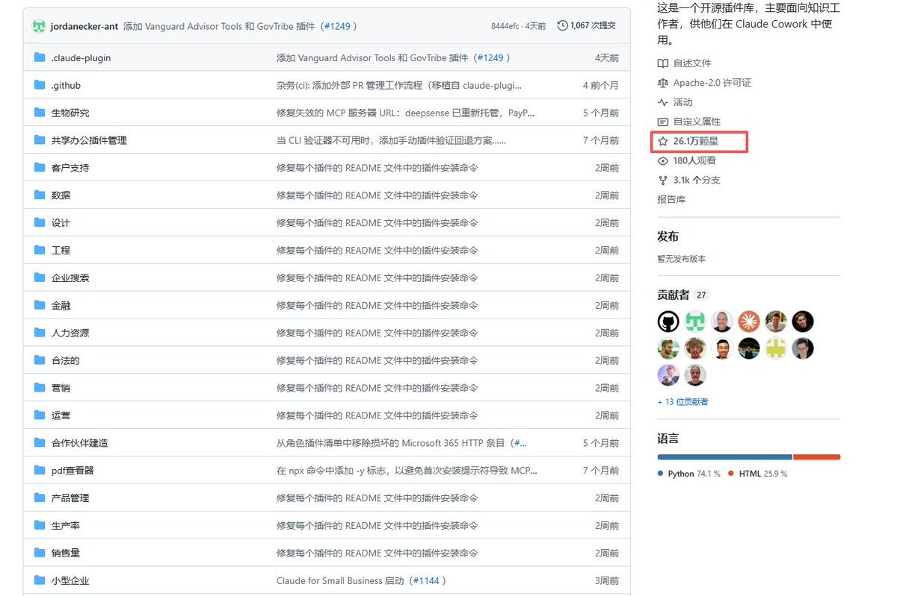
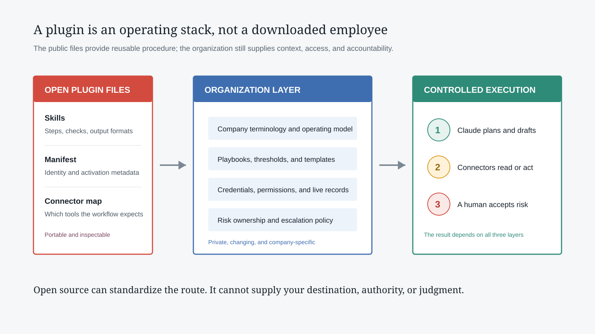
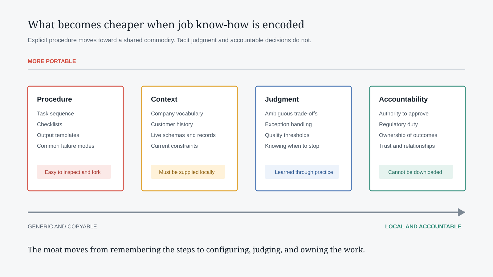

# Job Experience in Markdown: What Anthropic's Knowledge Work Plugins Open Source, and What They Do Not

> **In one sentence:** Denzii's X post identifies a real shift: explicit procedures once trapped in personal notes, apprenticeship, and team habits are becoming executable Agent Skills. But saying that complete job experience has been open-sourced goes too far. Anthropic published generic workflows, checklists, output templates, and connector declarations. It did not publish a company's private data, permissions, exception handling, professional judgment, or accountability. The programmable part of a role is becoming public infrastructure; the whole role is not downloadable.

- **Original post:** [Denzii: In 2026, "job experience" was officially open-sourced](https://x.com/denziideng/status/2107252757698908360)
- **Published:** October 6, 2026
- **Official repository:** [anthropics/knowledge-work-plugins](https://github.com/anthropics/knowledge-work-plugins)
- **Audit snapshot:** [`8444efc`](https://github.com/anthropics/knowledge-work-plugins/tree/8444efcd48f7012f09797778a36a33e73d0861f4), the latest repository commit before the post
- **Checked:** October 9, 2026



## 01 | The Post Gets the Direction Right, but Compresses the Conclusion

The post frames the conflict neatly. One reader sees plugins for sales, legal, finance, product, marketing, support, and data and thinks that years of avoidable mistakes have been packaged into a shortcut. Another sees their most valuable know-how reduced to Markdown that Claude can read at any hour.

The concern is not imaginary. Job knowledge traditionally moves through training, shadowing, templates, and repeated review. A `SKILL.md` file can now encode triggers, steps, tool selection, output formats, exception branches, and acceptance criteria. A model does not need to relive a company's decade of mistakes before inheriting an organized starting method.

There is still a large gap between following a procedure and being an expert in the role. The former fits in a repository. The latter also depends on organizational context, live data, judgment under ambiguity, and a person who owns the result.

## 02 | First Fix the Numbers: 11, 17, and 123 Measure Different Things

The post cites "11 role plugins." That number has an official basis. Anthropic's retrospective on the January 2026 Cowork launch says it included 11 open-source plugins. The repository README still names the same launch set: productivity, sales, customer support, product management, marketing, legal, finance, data, enterprise search, bio research, and Cowork plugin management.

The repository shown in the post was already larger. Pinning the audit to `8444efc`, its latest commit at posting time, produces three different counts:

| Counting boundary | Count | What it means |
|---|---:|---|
| Official launch list | 11 | The initial Anthropic plugins described in the README |
| Local first-party plugin directories | 17 | The launch set plus design, engineering, human resources, operations, PDF viewer, and small business |
| `SKILL.md` files inside those directories | 181 | Concrete workflows, including 36 under sales and 44 under small business |
| Marketplace manifest entries | 123 | A mixed catalog of first-party, partner, and remote Git sources, not 123 Anthropic job roles |

Eleven is the launch count, not the repository's full scope at the time of the post. Meanwhile, 123 is a marketplace count and should not be relabeled as 123 official role plugins. Numbers need their counting boundaries.

The screenshot's 26.1K stars supports the post's "26K+" description. The repository had crossed 27K by this review, but stars measure attention, not complete coverage of a profession.

## 03 | What Is Actually Inside a Role Plugin

The README describes a small basic structure:

```text
plugin-name/
├── .claude-plugin/plugin.json   # Plugin identity and metadata
├── .mcp.json                    # External tool declarations
├── commands/                    # Explicit user-invoked commands
└── skills/                      # Role workflows loaded by task
```

These layers answer four different questions: what the package is, which systems it expects, how a user invokes it explicitly, and how the work should be performed. For most general-purpose role plugins, the knowledge layer is primarily Markdown and JSON. The repository also includes a smaller amount of Python, HTML, and other supporting material, especially in bio-research and data-packaging workflows. "The role was written in Markdown" is a useful shorthand, not a literal inventory of every file.



A plugin is not a new model. It does not retrain Claude. It loads a specialized process when a matching task appears and declares the connectors that process may need. The model still interprets and generates, the Skill constrains the sequence, and MCP connects the sequence to live systems.

## 04 | The Markdown Is an Executable SOP, Not a Generic Prompt

The important part is the level of operational detail.

The sales `call-prep` Skill does not merely say "prepare me for a customer meeting." It checks the available calendar and CRM scope, then gathers the account, opportunity stage, contacts, call transcripts, email, and internal chat. Every value should cite its source, and a genuinely blank field must remain distinct from a field that was never queried. The output becomes a meeting objective, discovery questions, likely objections, and outstanding commitments.

The legal `review-contract` Skill first establishes which side the user represents, the deadline, and the areas of concern. It then looks for the organization's negotiation playbook. If none exists, it must disclose that it can only use generic commercial standards. It examines liability, indemnification, IP, data protection, termination, and dispute-resolution clauses, then classifies deviations by severity. It also states that qualified legal professionals must review the result.

Finance separates reconciliation, journal entries, close management, SOX testing, and variance analysis. Data separates SQL, exploration, statistical analysis, visualization, and validation, with explicit warnings about averages of averages, timezone mismatches, selection bias, Simpson's paradox, and presenting correlation as causation.

This is more substantial than a universal prompt. It resembles a role manual that can be executed by a machine, forked by a team, and reviewed like code.

## 05 | A Connector Catalog Is Not a Connected Company

The post says the plugins come with a complete set of tool connectors. That needs a qualification.

Across the 17 first-party plugin directories in the fixed snapshot, `.mcp.json` files declare 174 connector references covering 86 unique names. Many appear repeatedly across roles, and 31 entries have blank URLs, including some Google Calendar, Gmail, Google Drive, Snowflake, and Databricks configurations. Even when an MCP endpoint is present, the workflow still needs the corresponding service account, OAuth grant, organizational approval, admin policy, and data permissions.

The repository provides a **tool map**, not access to your company's tools. Installing the sales plugin does not reveal customer records in Salesforce. Installing legal does not grant access to a Box contract library or permission to send a DocuSign envelope.

Anthropic's current product documentation also says plugins are available on paid Claude plans. The repository is licensed under Apache-2.0, but the Claude runtime, third-party SaaS accounts, and external data are not thereby free.

## 06 | Four Layers Were Not Open-Sourced



**First, company standards.** A generic contract review can name the relevant clauses, but it does not know your liability cap, fallback positions, or escalation threshold. A generic PRD template does not know the real product strategy or technical debt.

**Second, live context.** The repository does not contain the customer's latest objection, this quarter's remaining budget, the warehouse schema, or a candidate's current hiring stage. Without that context, a plugin may produce a structurally correct but commercially hollow answer.

**Third, exception judgment.** SOPs handle common paths. Expensive expertise often appears when conditions conflict: whether to relax a term for a strategic customer, whether anomalous data is an error or a signal, and when automation should stop and escalate to a person.

**Fourth, accountability.** A model can draft a journal entry, contract redline, or customer response. It cannot assume the organization's audit, regulatory, reputational, and relationship consequences. Authority and responsibility do not transfer merely because procedure files are public.

## 07 | The Compressed Asset Is Explicit Procedure, Not the Entire Job

A worker could once build an information advantage by remembering every step, template location, and system entry point. Once plugins place those explicit procedures in public files, that advantage declines quickly. Teams no longer need to re-explain how to prepare a sales call, structure a PRD, or assemble evidence for monthly close.

The value of every worker does not fall to zero. It moves toward different work:

- adapting a generic Skill to the company's real process;
- detecting material omissions in an output;
- designing permissions, audit trails, and approval boundaries;
- resolving exceptions the documents do not cover;
- owning decisions and relationship outcomes;
- writing new lessons back into a reusable team asset.

The most mechanical research and first-draft tasks in junior roles will be compressed first. Mid-level professionals will spend less time performing every step and more time configuring, reviewing, and handling exceptions. Senior tacit judgment will not disappear automatically, but it can remain an organizational bottleneck when it is never converted into a teachable system.

## 08 | The Deeper Change Is the Medium of Organizational Knowledge

Traditional SOPs are static. A person reads one, remembers it, and then executes across several systems. Knowledge Work Plugins make the instructions part of the runtime. When a task matches, an agent can gather data, create intermediate artifacts, detect gaps, and act within its permissions.

Organizational knowledge starts to resemble executable configuration:

| Previous medium | Plugin-based medium |
|---|---|
| Instructions on a wiki | A Skill loaded when the task matches |
| Tool links in a document | Connector declarations in `.mcp.json` |
| Verbal warnings from experienced staff | Missing-value, citation, and escalation rules |
| Quality checked through manager sampling | Output contracts, evidence requirements, and approval points |
| Training followed by individual interpretation | Versioned standards that can be forked, diffed, and rolled back |

That matters more than receiving 11 prompt packs. A portion of the management system has moved from training material into an agent's execution interface.

## 09 | How to Adopt the Plugins Without Installing and Hoping

A responsible rollout can follow five steps:

1. **Choose a frequent, low-risk workflow with an easy-to-review output.** Start with meeting preparation, weekly reporting, or preliminary data checks, not autonomous contract signature or journal posting.
2. **Treat the public Skill as a baseline.** Mark every field, stage name, threshold, and output format that does not match the company.
3. **Add the organizational layer.** Supply terminology, templates, playbooks, escalation rules, and approved data sources.
4. **Connect tools with minimum privilege.** Start read-only, distinguish drafts from proposed actions and executed writes, and retain logs.
5. **Run regression cases from real history.** Evaluate omissions, hallucinations, permission failures, and edge cases, then write the corrections back into the Skill.

A plugin works best as an executable version of team standards, not as a shortcut around having standards.

## 10 | Four Limits Popularity Should Not Hide

**First, repository popularity is not job coverage.** Twenty-six or twenty-seven thousand stars do not prove that a plugin contains a profession's full knowledge or that it performs well in a specific company.

**Second, high-risk work still needs qualified review.** The legal files explicitly disclaim legal advice. Finance, HR, compliance, and biological research similarly require professionals, organizational policy, and applicable regulation.

**Third, connecting live systems expands the attack surface.** Email, chat, transcripts, and external documents may contain malicious instructions. The newer sales Skills explicitly treat them as untrusted data, which is a strong design choice, but every organization still needs to test permissions, prompt-injection defenses, and write approvals.

**Fourth, open templates decay.** SaaS APIs, internal processes, regulations, and market conditions change. A role plugin left unmaintained for six months may be worse than no plugin because it repeats obsolete procedure with consistent confidence.

## Conclusion

Denzii's post resonates because it identifies a new fact about knowledge work: when experience can be stated as steps, tool calls, checks, and output contracts, it can be packaged, shared, and executed by an agent.

Anthropic did not upload a complete salesperson, lawyer, accountant, or product manager to GitHub. It published a common skeleton for those roles. The missing substance still comes from company data, institutions, relationships, professional judgment, and accountability.

The sharper career question is therefore not "how many years can my experience survive?" It is: **how much of my value comes from remembering procedure, and how much comes from configuring the procedure, judging exceptions, and owning outcomes?** The first category is becoming a commodity quickly. The second is becoming the new competitive advantage for both people and organizations.

## Primary Sources

1. [Denzii's original X post](https://x.com/denziideng/status/2107252757698908360)
2. [Anthropic Knowledge Work Plugins repository](https://github.com/anthropics/knowledge-work-plugins)
3. [Repository snapshot 8444efc at posting time](https://github.com/anthropics/knowledge-work-plugins/tree/8444efcd48f7012f09797778a36a33e73d0861f4)
4. [Official README: the launch set and plugin structure](https://github.com/anthropics/knowledge-work-plugins/blob/8444efcd48f7012f09797778a36a33e73d0861f4/README.md)
5. [Sales call-prep Skill](https://github.com/anthropics/knowledge-work-plugins/blob/8444efcd48f7012f09797778a36a33e73d0861f4/sales/skills/call-prep/SKILL.md)
6. [Legal contract-review Skill](https://github.com/anthropics/knowledge-work-plugins/blob/8444efcd48f7012f09797778a36a33e73d0861f4/legal/skills/review-contract/SKILL.md)
7. [Official guide to extending Claude Cowork with plugins](https://claude.com/resources/guides/claude-cowork-product-guide/extending-claude-cowork-with-plugins)
8. [Anthropic's official plugin customization tutorial](https://academy.claude.com/tutorials/how-to-customize-plugins-in-cowork)
9. [Claude plugin availability and safety notes](https://support.claude.com/en/articles/13837440-use-plugins-in-claude)
10. [Anthropic's retrospective confirming 11 open-source Cowork launch plugins](https://www.anthropic.com/news/anthropic-raises-30-billion-series-g-funding-380-billion-post-money-valuation)

*Note: Repository stars, marketplace size, and plugin contents are dynamic. All repository counts in this article are pinned to `8444efc`, the latest commit before the original post. Product availability and plan information reflect official documentation checked on October 9, 2026.*
