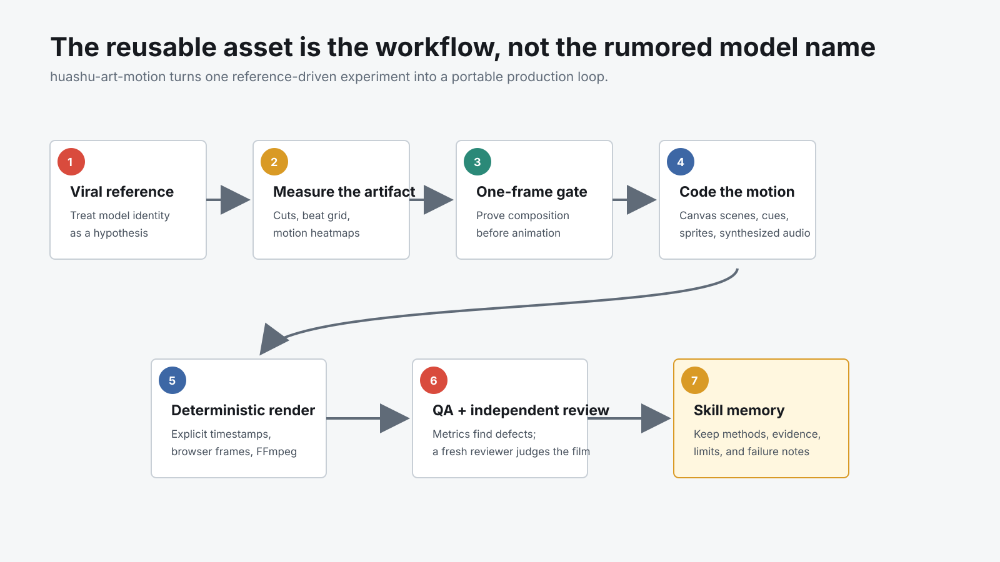
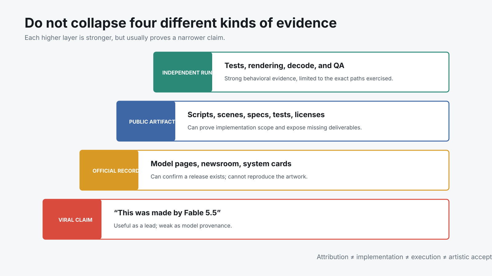

# 从“Fable 5.5”传闻到动画 Skill：huashu-art-motion 真正可复制的是生产方法

> **一句话结论：** 花叔的 X 长文表面上是在发布一个“可能最有审美的动画 Skill”，真正值得研究的却不是这句宣传，也不是未经 Anthropic 官方确认的“Fable 5.5”归因，而是一次更可迁移的转化：把爆款动画当作待测样本，量出转场、节拍与运动区域；再做一个原片没有的新题目验证方法能否迁移；最后把成功经验、失败边界、渲染代码和 QA 写进 Skill。模型名称会变，能重复执行的生产闭环才是资产。

- **原始长文：** [huashu-art-motion 发布！可能是最有审美的动画 skill](https://x.com/AlchainHust/status/2107347834668224687)
- **发布时间：** 2026-10-06
- **相关仓库：** [alchaincyf/huashu-art-motion](https://github.com/alchaincyf/huashu-art-motion)
- **配套源码审计：** [它不是文生视频模型，而是给 Coding Agent 的 Canvas 动画制作系统](../2026-10-08/2026-10-08-huashu-art-motion-coding-agent-canvas-animation-system.md)
- **证据快照：** X 长文、Anthropic 官方模型目录、仓库 `57d6760` 与本机运行结果，检查于 2026-10-09

## 01｜先把最醒目的模型名拿掉

这篇 X 长文从一批被称为“Fable 5.5”作品的动画开始：一句提示词得到三分钟短片、超人在多种画风中连续穿梭，以及 Tak 的 15 秒艺术史动画。作者很快补上了关键限定：这些作品来自声称被灰度路由到新模型的用户，判断依据是民间的 “Tibo test”，不是 Anthropic 的发布公告、模型 ID、API 回执或系统卡。

截至本文检查时，Anthropic 的官方 Fable 页面仍把 **Fable 5.1** 列为该产品线最新公开版本；官方系统卡列表包含 Fable 5.1、Opus 5.5、Sonnet 5.5 与 Haiku 5.5，但没有 Fable 5.5。换句话说，5.5 家族已经真实存在，**Fable 5.5 这个具体归因仍没有官方证据**。

“模型知道某个人是谁”也不能充当远端路由证明。模型可能从上下文、检索、缓存、隐藏提示或其他版本获得答案。Tibo test 最多是一条民间线索，不能把视频与某个未公开模型建立可审计的因果关系。

这不影响作品本身是否精彩，却会改变文章应该怎样读：把模型身份当作假说，把公开成片当作现象，把后续方法与代码当作真正可验证的部分。

## 02｜四种证据不能揉成一句“已经证实”

这类 AI 创作故事通常同时包含四层证据：

| 层级 | 能说明什么 | 不能说明什么 |
|---|---|---|
| 社交媒体传播与作者自述 | 谁声称用了什么、创作过程如何描述、作品受到多少关注 | 模型真实路由、完整成本、失败样本 |
| 官方产品页与系统卡 | 某个模型是否正式存在、发布日期与公开定位 | 某条作品是否真的由它生成 |
| 公开仓库 | 方法、代码、样例、测试、许可证与缺失物 | 私有素材和最终成片是否逐字节来自这些文件 |
| 独立运行 | 指定版本的某条测试、渲染或解码路径能否复现 | 没有运行过的全部风格、长片和云服务 |

作者说从拿到参考视频到第一版成片不到一天，场景和配乐主要由 Claude Code 中的 Opus 5.5 完成，角色帧由 gpt-image 生成。这是有价值的第一方创作记录，但时间、模型路由和完整会话没有公开审计材料，因此应标为“作者报告”，而不是独立复现事实。

仓库则提供了更窄、更硬的证据：真实存在的拆解脚本、35 个 Canvas 场景、9 张语法卡、8 个可运行的参数化 clip runtime、SpaceX 参考代码、程序化配乐、逐帧渲染和 QA。我们又在指定 commit 上跑通 61 个测试、一条七秒参数化视频和一个场景 QA。它证明系统的一部分能工作，却不反向证明长文里每一个成片细节和耗时。

## 03｜第一次关键转折：不复刻画面，先测“为什么它是活的”

作者描述的第一版问题很典型：只是把一张张风格图做转场，看上去像幻灯片；原片每个时代虽然只有约一秒，浪、文字、角色和背景母题都在持续运动。

于是工作流从“再写一版 Prompt”转向测量：

- 用低分辨率逐帧差找转场起点；
- 用允许少量离群点的网格拟合估算节拍；
- 为每个转场生成高密度接触表；
- 排除转场冲击后计算镜内运动热图；
- 把每段结束前的关键帧整理成构图参考。

仓库里的 `scripts/analyze/breakdown.py` 对应这段叙述。它没有神秘地“理解艺术史”，而是把扁平视频转换成一组可供 Agent 写代码的测量结果。这种分工很重要：便宜、确定的计算先扫描全部帧，模型再处理结构和设计问题。

真正被复用的也不是原片像素，而是五层机制：固定场景骨架、画内持续动作、下一种风格的签名转场、加速的节拍网格，以及贯穿全片的叙事锚。换题材时，这些机制还能保留。

## 04｜第二次关键转折：做一个参考里没有的题目

复刻成功只能证明“跟着答案走过一次”。作者随后提出了原片不存在的新要求：让自己的卡通形象穿过至少 20 种画风，并在每个世界中与具体元素互动。

这一步更接近迁移测试：

- 场景与艺术材质由 Canvas 代码绘制；
- 角色按不同画风生成动作帧，再由代码控制位置、大小和换帧；
- 角色还要真的完成躲浪、打水漂、顶金币等动作，而不是贴在背景上移动；
- 配乐按世界更换音色与调式，洞穴、敦煌、浮世绘和 8-bit 使用不同的合成策略。

仓库中的音频脚本没有打包 WAV、MP3 或采样文件，而是包含骨笛、手鼓、里拉琴、筝/三味线、芯片方波、噪声打击和响度处理等合成函数。这支持“仓库具备纯代码合成路径”的说法；它不能单独证明发布视频的每一个声音都来自当前公开脚本。

同样，公开长卷示范只包含埃及、莫奈与 8-bit 三个世界的骨架和角色帧，不是那支 23 种画风、2 分 08 秒成片的完整源工程。作品展示、可复用骨架和完整交付源是三件不同的事。

## 05｜第三次关键转折：从展示片转向工作片

艺术史穿越很适合展示能力，却未必是日常内容团队最常用的形态。长文接着把同一套方法移到 SpaceX 24 年解说，尝试白板、Vox、3Blue1Brown、发布会 UI、财经图表、Storytime 和动态文字等表达。

这个变化把系统从“做一支惊艳短片”推向“给长口播补五到十二秒的解释动画”。两者的验收目标完全不同：

| 展示片 | 工作片 |
|---|---|
| 追求连续风格变化和记忆点 | 追求跟随口播解释一个具体关系 |
| 可以为单个镜头写大量定制代码 | 需要可重复调用的 JSON spec 与安全区 |
| 角色与世界互动是主角 | 数据、概念、关键词和界面操作是主角 |
| 成片本身是终点 | 动画片段还要回到剪辑时间线 |

仓库确实收录了 SpaceX 的混合、白板、Vox 与讲解员四套 12 场景代码快照，但 README 明确说它们不是开箱即渲的完整工程：口播音频、部分人物帧和原始提示词不分发，白板手部素材需要自备，历史文字与数字也不能当作最新 SpaceX 事实直接复用。

这条边界反而让方法更可信。公开的是镜头组织、关键词时间锚、取景与布局机制，不是假装把所有私有素材也变成通用模板。

## 06｜Skill 的真正作用：把一次会话中的判断移出模型

长文里最重要的一句话不是“不到一天”，而是作者不断要求 Agent 记住：什么做对了、证据是什么、为什么有效、什么时候再用。

普通生成会话把经验留在上下文里。会话结束、模型更换或窗口压缩后，这些经验很容易消失。`huashu-art-motion` 把它们移到几个更稳定的载体：

- 任务路由写进 `SKILL.md`；
- 风格参数、动作母题、转场和短板写进配方卡；
- 可运行规律沉淀为 Canvas 库、场景和 clip runtime；
- 成功与失败通过 QA 报告和经验回流记录；
- 媒体权限、配置来源和素材 hash 变成显式契约。

因此，这个 Skill 的价值并不依赖所谓 Fable 5.5 是否存在。更强模型可能让第一次实现更快，但方法已经从某次模型输出中抽离出来。下一位 Agent 可以读同一套约束，旧样例也能作为回归基线。

## 07｜“模型能力”与“作者驾驭能力”在这里无法简单分开

作者自己也提出了这个问题：展示的是模型能力，还是驾驭模型的能力？答案是两者与工具链共同作用。

模型负责读图、写代码、提出动画设计和迭代；作者负责拒绝“图片轮播”的第一版、设置一帧先行与三方向门槛、要求画内持续运动、选择可迁移的新题目，并把经验写回 Skill；Canvas、Playwright、FFmpeg 和测试再把创意变成确定输出。

如果只把结果归因给模型，会漏掉任务分解、审美判断和工程验收。如果只归因给作者，又会低估模型在一天内扩写大量场景与工具代码的杠杆。更诚实的单位不是“模型”，而是 **模型 × 人类导演 × 运行时 × 验收制度**。

这也是为什么“换模型还能不能用”比“到底是不是 Fable 5.5”更有产品意义。只要方法、接口和证据留在仓库里，底层模型可以替换；如果一切只存在于一次神奇会话，即使模型名是真的，也很难复用。

## 08｜这套叙事仍有四个需要保留的警告

**第一，爆款样片是精选结果。** 长文展示成功片段，没有公开总调用次数、失败版本、人工修改量、token 成本和素材生成成本，“不到一天”不能直接换算成普通用户的平均效率。

**第二，模型归因没有远端证明。** 民间知识测试不是路由 attestation。正式发布页、API model ID、服务端日志或可验证回执才是更强证据。

**第三，公开仓库不是完整成片工程。** 长卷只收三段示范，SpaceX 是学习快照，若干角色、手部、音频和提示词需要自备。能看到代码不等于拿到了全部生产资产。

**第四，风格学习不取消权利边界。** 仓库避免收录原参考帧和音频，也为字体、笔顺数据与花叔角色写了不同许可；使用者仍需自己处理原作、艺术家风格、频道包装、商标和角色 IP 的授权问题。

## 09｜怎样把这套方法迁移到自己的 Agent 项目

可以保留七个动作，而不照搬任何画风：

1. 把社交媒体归因当线索，不当模型证明；先保存原始链接与时间。
2. 在让模型创作前，先用确定性工具量出结构、节奏、变化和关键帧。
3. 设置一个小而硬的验收门：动画先过一帧，Agent 先过一个可运行片段。
4. 用参考里没有的新题目测试迁移，避免只证明模仿。
5. 把“整片”拆成可复用的 scene、grammar、spec 和素材契约。
6. 自动 QA 负责发现异常，人或独立 Agent 负责审美与叙事接受。
7. 回写方法时同时记录证据、适用条件、失败案例和未完成范围。

这套结构同样适用于网页复刻、数据可视化、视频模板、音频制作和其他 Agent 工作流。最有价值的记忆不是“上次用哪句 Prompt 成功了”，而是“如何知道成功、失败时改哪一层、哪些结论可以迁移”。

## 结论

这条 X 长文最初靠“Fable 5.5 动画”吸引注意，但它最终讲出的故事，恰好削弱了模型神话。

一个未经确认的模型名可以制造传播，一支漂亮样片可以制造惊讶；只有把参考拆成测量，把新题目当迁移测试，把场景和语法变成代码，把结果交给 QA 和独立审片，再把边界写进公开文档，才会形成可持续的生产能力。

所以，`huashu-art-motion` 真正可复制的不是某次神秘路由，也不是 35 种画风本身，而是一条把偶然成功变成可检查、可修正、可交接资产的路径。模型会继续更新，Skill 的意义是让团队不必每次从惊叹重新开始。

## 主要来源

1. [花叔 X 长文：huashu-art-motion 发布](https://x.com/AlchainHust/status/2107347834668224687)
2. [huashu-art-motion GitHub 仓库](https://github.com/alchaincyf/huashu-art-motion)
3. [检查版本 57d6760](https://github.com/alchaincyf/huashu-art-motion/commit/57d67608ab458f57d9b153b1a2831b921e22498b)
4. [SpaceX 参考代码使用边界](https://github.com/alchaincyf/huashu-art-motion/blob/57d67608ab458f57d9b153b1a2831b921e22498b/scripts/engine/reference_films/spacex/README.md)
5. [参考视频拆解脚本](https://github.com/alchaincyf/huashu-art-motion/blob/57d67608ab458f57d9b153b1a2831b921e22498b/scripts/analyze/breakdown.py)
6. [Anthropic Claude Fable 官方产品页](https://www.anthropic.com/claude/fable)
7. [Anthropic 官方系统卡目录](https://www.anthropic.com/system-cards)
8. [Tak 的原始 Art History Speedrun 帖子](https://x.com/cherry_mx_reds/status/2106095190285144331)

*说明：本文没有把 X 长文中的示范角色图片复制进仓库，因为项目 README 明确说明相关角色与包含该形象的展示素材不随 MIT 授权。作者链接的 SpaceX 微信成片页在本次环境中未能独立读取，因此关于完整成片的描述以 X 长文和公开代码快照为限。*
