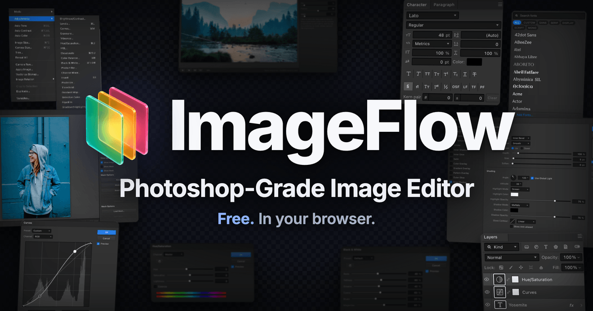
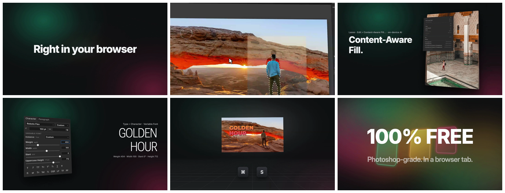
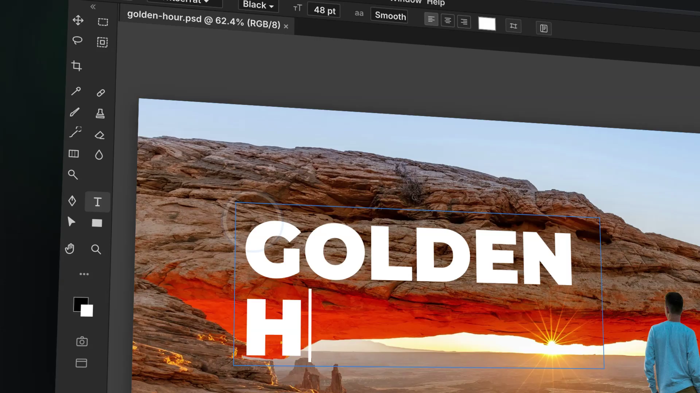
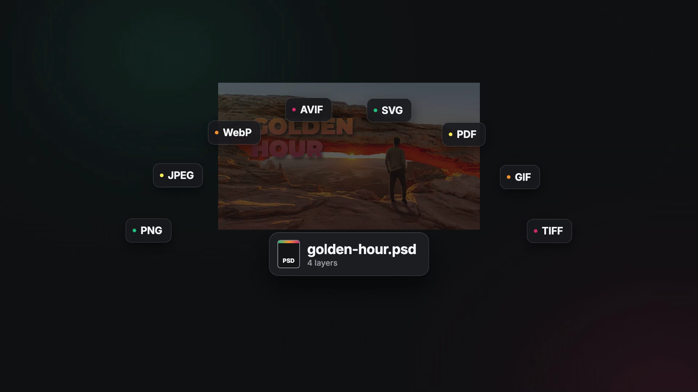

# ImageFlow 深度拆解：不是“网页版 Photoshop 已完成”，而是 WebGPU 正把专业图像编辑搬回浏览器

> **TL;DR:** Yassine Bouanane 用一句“取消 Adobe 订阅”发布了 ImageFlow：一个免费、直接运行在浏览器标签页里的 Photoshop 风格图像编辑器。它不是静态概念，也不只是套了相似界面的轻量修图工具。2026 年 10 月 7 日实测的 `0.1.0` 已能创建文档，界面提供 PSD 保存、智能对象、调整图层、图层样式、矢量蒙版、Liquify、Camera Raw、Relight、Depth Blur、内容识别填充与本地 AI 选区；当前 Mac 上的 About 面板显示渲染器为 WebGPU / Apple / Metal 3。更重要的是，ImageFlow 把 PSD/PSB、CMYK/Lab、可变字体、HarfBuzz 排版、本地模型和多格式编解码都拉进同一个浏览器运行时。但“Everything Photoshop can do”仍是营销主张，不是已经完成的兼容性结论：本文没有验证复杂 PSD/RAW/CMYK 往返一致性、长时间稳定性、插件生态或色彩打样；产品目前免费但代码专有，站点的“文件绝不上传”也尚未由独立隐私审计证明。

- **X 原帖:** [Yassine Bouanane / `@ybouane`](https://x.com/ybouane/status/2107450802612961602)
- **产品:** [ImageFlow](https://imageflow.dev/)
- **原帖日期:** 2026-10-06
- **实测版本:** ImageFlow Photo Editor `0.1.0`，build `fd1b1ae`，2026-10-07
- **当前价格:** 官方页面标记为免费 / USD 0
- **代码许可:** 专有软件；网站授予个人、非独占、不可转让的使用许可
- **核验日期:** 2026-10-07



## 一句话判断

ImageFlow 真正值得关注的，不是它有没有资格说“替代 Photoshop”，而是它已经把过去必须依赖大型桌面原生应用的一组专业编辑原语，塞进了一个可直接打开的浏览器运行时。

这次变化的关键词不是 AI 生成，而是**本地文档模型 + GPU 合成 + 浏览器端机器学习 + 专业文件互操作**。

如果它只提供裁切、滤镜、去背景和模板，那只是又一个在线修图工具。ImageFlow 的野心更大：保留图层、蒙版、调整层、智能对象、字体轴、色彩模式与 PSD 工作流，让浏览器不再只是上传入口，而成为真正的创作工作站。

## 原帖说了什么，实际又上线了什么

原帖最醒目的表述是：

> Everything Photoshop can do, running free inside a single browser tab.

作者随后在回复中补充了更具体的范围：完整 PSD 支持、WebGPU、智能对象、矢量、排版与可变字体、CMYK、RAW、ICC profiles，以及 Liquify、对象选择和图层样式。

这些不能因为出现在回复里就自动视为全部验证通过。不过 ImageFlow 已不是“24 小时后上线”的预告。核验时，`imageflow.dev` 会直接进入编辑器，没有先经过营销 landing page，也没有要求注册账号。

我在实际页面完成了以下检查：

1. 打开新建文档面板，创建一个 1920×1080、RGB/8-bit 的空白文档；
2. 新建面板列出 Bitmap、Grayscale、Duotone、Indexed Color、RGB、CMYK、Lab 与 Multichannel；
3. File 菜单提供 Save PSD、Save PSD As、Place Image、Place Linked 和多格式导出；
4. Layer 菜单提供调整层、图层样式、图层/矢量蒙版、去背景和智能对象；
5. Filter 菜单提供 Filter Gallery、Liquify、Smart Filters、Depth Blur 以及多组传统滤镜；
6. Image 菜单可见 Camera Raw、Relight、Apply Image 与 Vectorize Bitmap；
7. About 面板显示版本 `0.1.0`，当前渲染器为 WebGPU / Apple / Metal 3，浏览器为 Chrome 153。

这能证明产品和菜单结构真实存在，也证明当前机器成功启用了 WebGPU。它还不能证明每项功能与 Photoshop 在行为、像素结果和边界条件上完全一致。



## 浏览器为什么现在能承载这种编辑器

专业图像编辑过去很难放进网页，不是因为菜单做不出来，而是底层同时要求高吞吐像素计算、复杂文档状态、字体塑形、颜色转换、大文件解码和低延迟交互。

ImageFlow 把这些能力拆给浏览器里的不同运行层：

| 运行层 | 已公开或实测到的作用 |
|---|---|
| WebGPU | 当前实测环境用于合成与显示，直接调用 Apple Metal 3 |
| 文档模型 | 图层、组、剪贴蒙版、调整层、智能对象、智能滤镜与蒙版 |
| 浏览器端 ML | `onnxruntime-web` 与 `@huggingface/transformers` 支撑本地选区等模型能力 |
| 字体系统 | HarfBuzz 负责文字 shaping，界面支持可变字体与 OpenType 功能 |
| 文件编解码 | pdf.js、`@jsquash` codecs、FlashRaw、HEIC、GIF 与 SVG 组件覆盖多种输入输出 |
| PWA 文件关联 | Web App Manifest 注册 PSD/PSB、PNG、JPEG、WebP、TIFF、GIF、AVIF 处理 |

它的结构更接近一个缩小到浏览器里的桌面应用：

```text
本地文件 / 新建文档
        ↓
格式解码、字体 shaping、色彩与本地模型
        ↓
图层化文档状态与非破坏编辑
        ↓
WebGPU 合成与交互预览
        ↓
PSD 或发布格式导出
```

这也是 WebGPU 的意义。Canvas 2D 足够做简单画图，却很难在大画布、复杂混合、实时滤镜和多层合成下持续提供桌面级反馈。WebGPU 让网页以更现代的方式调用显卡；浏览器承担分发和沙箱，GPU 承担像素管线。

## PSD 支持为什么比“打开 PSD”难得多

ImageFlow 的 File 菜单不是只写着 Open。它明确提供 Save PSD 和 Save PSD As，发布视频也展示 `golden-hour.psd` 与 PNG、JPEG、WebP、AVIF、SVG、PDF、GIF、TIFF 等交付格式。



但专业工作流中的“支持 PSD”至少分为四层：

1. **能打开:** 不崩溃，能读取尺寸与合成预览；
2. **能解析:** 图层、组、蒙版、文字、效果和智能对象保持可编辑；
3. **能往返:** 保存后再由 Photoshop 打开，结构和视觉结果仍保持；
4. **能生产:** 面对大文件、链接资源、缺失字体、16/32-bit、CMYK/Lab 和边缘格式时仍可靠。

目前公开页面与实测界面证明 ImageFlow 明确瞄准第三层，而不是只做 PSD viewer。但没有公开的兼容矩阵、回归语料、像素 diff、往返测试结果或失败类型统计。因此，文章不能把“有 Save PSD 菜单”升级成“PSD 已完全兼容”。

这会是它最需要建立信任的地方。真正说服设计团队的，不是再加十个滤镜，而是一套公开测试：哪些 PSD 特性无损、哪些会栅格化、哪些只保留外观、哪些目前不支持。

## CMYK、ICC 和字体才是专业边界

发布视频里最容易传播的是去背景和内容识别填充，但决定它能不能进入真实品牌与印刷工作流的，反而是那些不太适合剪成宣传片的能力：

- CMYK、Lab 与 Multichannel 文档；
- ICC profile 的读取、转换、保留和导出；
- 8/16/32-bit 下的滤镜与合成一致性；
- 缺失字体替代、OpenType feature 与可变字体轴；
- 文本重新打开后的字形、换行和基线一致性；
- 智能对象、链接资源与嵌入资源的往返行为。

ImageFlow 的新建文档面板确实列出了多种色彩模式，作者也公开声称支持 CMYK / RAW / ICC；第三方说明则显示它使用 HarfBuzz 做文字 shaping，并带有相机 RAW 解码组件。这些是认真做专业编辑器的信号。

不过“菜单可选”与“色彩管理可信”仍是两件事。显示器 profile、软打样、转换 intent、黑点补偿、嵌入 profile 和导出后验证都需要独立测试。没有这些证据，印刷交付仍不应只凭界面标签放行。

## 本地 AI 不是聊天框，而是编辑工具的一部分

ImageFlow 的 AI 路线与许多“输入一句话重画整张图”的产品不同。官方 feature list 强调 on-device AI selection 和 background removal，界面还提供 Object Selection、Remove Background、Content-Aware Fill、Depth Blur 与 Relight。

这类能力被嵌入传统工具语法：先建立选区、再生成蒙版或填充；先估计深度、再调虚化或光照。结果仍回到图层化文档中，而不是只给用户一张无法拆解的新图片。

从工作流看，这比在编辑器旁边加一个聊天框更重要。专业用户需要 AI 生成的不是“最终答案”，而是可继续修的中间状态：选区、蒙版、深度图、调整参数或新图层。

但本地模型也带来新的兼容边界：首次下载体积、缓存、显存、WebGPU 支持、低配机器性能和不同浏览器结果。ImageFlow 尚未公开统一的性能基准，原帖里的“lightning fast”仍应视为作者评价。

## “Everything Photoshop can do”为什么还不能成立

Photoshop 不是一张功能清单，而是三十多年累积的兼容性、自动化、插件、色彩、打印、团队和异常文件处理体系。

Adobe 自己都维护一份 Photoshop web 与 desktop 的功能差异表：网页版本在 warp、actions、部分画笔与文字、Neural Filters、部分 Smart Filters、Lens Correction 等方面仍与桌面版不同。连同一家公司、同一文档格式的网页移植都需要逐项定义差异，因此第三方 `0.1.0` 更不能靠菜单数量证明全量替代。

更合理的拆法是：

| 问题 | 当前证据 |
|---|---|
| 是否是真实可用的浏览器编辑器？ | 是；实测可启动、建文档并进入编辑界面 |
| 是否覆盖大量 Photoshop 式概念？ | 是；菜单、文档模型和官方 feature list 都很完整 |
| 是否能处理 PSD/PSB？ | 官方与界面明确支持导入导出，但本文未做复杂文件往返测试 |
| 是否使用 WebGPU？ | 是；当前 Mac 的 About 面板显示 WebGPU / Apple / Metal 3 |
| 是否全部本地处理？ | 官方这样声明，本文未完成网络与隐私审计 |
| 是否已经等价于 Photoshop？ | 证据不足；缺少兼容矩阵、稳定性、性能和生产测试 |

因此，“Everything”适合当 launch hook，不适合当采购结论。

## 免费，但不是开源

ImageFlow 当前页面把价格标为 USD 0，视频也强调 `100% FREE`。但它并不是开源项目。

官方 [License](https://imageflow.dev/license) 明确说明：ImageFlow 的源码、编译代码、shader、算法、lookup table 与资产均为专有软件；用户获得的是个人、非独占、不可转让的网页使用许可。条款还限制复制、修改、分发、再授权、逆向工程、反编译、抓取、提取和用于训练机器学习模型。

这带来两个实际判断：

1. **免费不等于可自托管。** 如果服务改变、下线或调整条款，用户没有当然的源码托底；
2. **第三方组件开源不等于产品开源。** About 面板列出的 pdf.js、ONNX Runtime Web、Transformers、HarfBuzz 等各自有许可证，ImageFlow 自身仍是 proprietary。

如果团队希望把它纳入长期生产流程，应同时评估格式可迁移性、离线能力、版本固定与退出路径，而不是只看月费为零。

## 隐私承诺还缺什么证据

首页 metadata 写着 `Nothing is uploaded; your files never leave your device.`。浏览器端渲染、本地模型和本地文件处理都与这个方向一致，Photopea 也已经证明这种架构在成熟产品中可以成立。

但 ImageFlow 目前没有可访问的 `/privacy` 页面，该路径在核验时返回 404。本文也没有向站点加载私密文件并抓取完整网络请求，因此无法独立确认每一种打开、保存、反馈、字体和模型场景都不会传输内容。

对普通测试素材，这不是停止试用的理由；对客户未发布资产、医疗影像、身份证件或受 NDA 保护的设计稿，则应先完成：

1. 网络请求审计；
2. 模型、字体和遥测域名清单；
3. IndexedDB / Cache Storage / service worker 的数据生命周期检查；
4. 清缓存与删除本地副本的验证；
5. 明确的隐私政策和企业责任边界。

“本地优先”是架构方向，“已通过隐私审计”是另一种证据。

## 它和 Photopea、Photoshop web 的关系

浏览器本地处理 PSD 并不是 ImageFlow 首次实现。Photopea 已长期在浏览器中运行，官方文档明确表示文件不会离开设备，并支持 PSD 打开与保存。Adobe 自己也提供 Photoshop web，并公开维护网页与桌面功能差异。

ImageFlow 的差异化不应写成“第一个网页版 Photoshop”，而更像三点组合：

- 用高度熟悉的 Photoshop 式交互覆盖更深的专业菜单；
- 以 WebGPU 为当前高性能合成路径；
- 把对象选择、去背景、内容识别、深度与重打光做成设备端编辑原语。



这让它值得测试，但竞争不会停在“功能有没有”。Photopea 有成熟度和用户积累，Adobe 有文档生态与端到端工作流。ImageFlow 必须用兼容性、速度、稳定性和更好的本地 AI 编辑体验，证明它不仅像 Photoshop，而且在某些工作里更省事。

## 团队应该怎样验证 ImageFlow

不要直接拿客户母版做第一次测试。更稳妥的方法是建立一组有预期结果的样本：

1. 简单 RGB PSD：图层、蒙版、文字、混合模式和调整层；
2. 复杂 PSD：智能对象、链接资源、图层样式、剪贴蒙版和 artboard；
3. 字体样本：可变字体、多语言 shaping、OpenType feature 和缺字回退；
4. 色彩样本：带 ICC 的 RGB、CMYK、Lab、16-bit TIFF 与 RAW；
5. 性能样本：大画布、多图层、高半径滤镜和连续撤销；
6. AI 样本：细发、透明物、低对比物体、Depth Blur 与 Relight；
7. 往返测试：ImageFlow 保存 PSD，再由 Photoshop 与 Photopea 打开；
8. 隐私测试：监控网络、缓存、模型下载和清除流程。

每个样本至少记录打开结果、编辑结果、再次打开结果、像素 diff、图层结构、字体替代、profile、内存峰值与耗时。完成这些测试后，团队才能知道它适合临时修改、社交图、网页资产，还是已经可以接管正式母版。

## 结论

ImageFlow 的发布文案故意把问题说成“还要不要付 Adobe 订阅”。真正更有价值的问题是：**一个浏览器标签页，现在能承载多少专业图像编辑状态？**

从 `0.1.0` 的实际界面看，答案已经远超轻量在线修图。它拥有图层化文档、非破坏编辑、智能对象、传统滤镜、颜色模式、可变字体、PSD 保存、本地 ML 与 WebGPU 渲染这些正确的基础部件。

但完整 Photoshop 替代从来不是把菜单复刻出来。它需要复杂文件往返、色彩可信度、性能上限、异常恢复、隐私、自动化、插件与多年兼容性。ImageFlow 已经证明浏览器可以进入这场竞争，还没有证明竞争已经结束。

## Sources

1. Yassine Bouanane, ImageFlow launch post on X
   https://x.com/ybouane/status/2107450802612961602

2. Yassine Bouanane, follow-up on PSD, WebGPU, smart objects, typography, CMYK, RAW and ICC
   https://x.com/ybouane/status/2107700833492017172

3. ImageFlow editor and product metadata
   https://imageflow.dev/

4. ImageFlow Web App Manifest
   https://imageflow.dev/manifest.webmanifest

5. ImageFlow License
   https://imageflow.dev/license

6. Adobe, “Compare Photoshop web and desktop features”
   https://helpx.adobe.com/photoshop/web/get-set-up/learn-the-basics/compare-photoshop-web-and-desktop-features.html

7. Photopea, “Introduction”
   https://www.photopea.com/learn/
