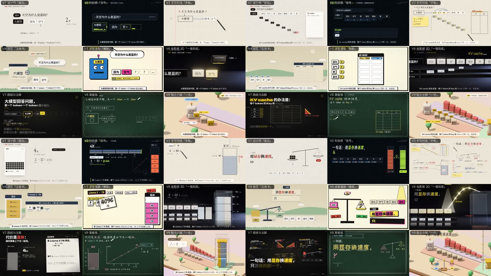

# Inside Lanshu's Explainer Video Skill: Nine Styles Are Nine Visual Languages on One Timeline, Not Nine Models

> **Bottom line:** This update is not nine skins for an AI presenter, nor nine video-generation models. It adds a presenter-free explainer route beside the original digital-human workflow. One word-timed `story.json` is rendered through nine HTML/CSS/JavaScript visual kits and HyperFrames into nine editable animation systems.


On October 6, 2026, Lanshu announced on X that the open-source [`lanshu-create-ai-presenter-video`](https://github.com/cclank/lanshu-create-ai-presenter-video) project had gained nine explainer-video styles, developed with help from Claude Opus 5.5.

The demo naturally raises a question: is this similar to a Remotion or HyperFrames skill, or is it a new AI-video product?

The source makes the answer clear. **It is an Agent Skill plus an explainer runtime built on HyperFrames.** The agent interprets the topic, writes the narration, chooses a style, plans the storyboard, and implements the scene performance. HyperFrames deterministically renders web elements, SVG, Three.js, audio, and timeline logic into video. The inspected repository contains no Remotion dependency or reference.

---

## 01 | What the Update Actually Added

The project originally had one `presenter` route. A user supplied a topic or script and an authorized portrait; the agent then orchestrated voice generation, presenter video, lip sync, editing, and verification.

Commit [`c2e3bd7`](https://github.com/cclank/lanshu-create-ai-presenter-video/commit/c2e3bd755458cb2bb45f4880399e9cb983c8cd1a) added a second `styled` route on October 6:

| Route | User input | Produced content | Paid generation | Current format |
|---|---|---|---|---|
| `presenter` | Topic/script + authorized portrait | Digital human, lip sync, captions, keyword graphics | Voice + presenter video | 9:16 by default; other ratios supported |
| `styled` | Topic or script | Presenter-free animated explainer | Voice only; none when audio is supplied | 16:9 only |

The commit added 235 files and roughly 34,635 lines: a shared runtime, nine style kits, nine starters, finished KV-cache examples, narration and timing tools, QA, rendering scripts, and tests.

This is not a filter pack layered onto the existing presenter video. It expands the repository from a digital-presenter skill into a two-route explainer-production system.

---

## 02 | The Nine Styles Are Not Nine Prompts

The styles are:

| Key | Style | Implementation and suitable subjects |
|---|---|---|
| `v1-editorial` | Editorial whitespace | Warm paper, ink, vermilion accent; business and serious topics |
| `v2-signal` | Signal HUD | Dark instrumentation and luminous data flows; AI, systems, networks |
| `v3-notebook` | Notebook | Grid paper, live handwriting, sticky notes; derivations and teaching |
| `v4-paper` | Pop-up paper | Folded pieces, parallax, soft shadows; processes and stories |
| `v5-comic` | Pop comic | Halftones, stickers, impact type; hot takes and myth-busting |
| `v6-cinematic` | Cinematic 3D | A continuous Three.js studio shot; launches and large concepts |
| `v7-drafting` | Drafting and footnotes | Technical drawings, leaders, real annotations; practitioner deep dives |
| `v8-chalkboard` | Chalkboard | Live chalk, eraser, recap mind map; classroom and beginner content |
| `v9-clay` | Clay town | Isometric Three.js clay world; concrete analogies for abstract ideas |

Each style includes at least:

- its own `kit.css` and `kit.js`;
- typography, palette, safe-area, and hierarchy rules;
- components for captions, chapters, numbers, formulas, bars, conclusions, and recaps;
- a runnable starter with the topic removed;
- a vocabulary for turning narration into shots;
- procedural sound and camera behavior.

V1–V5 and V7 are pure DOM/SVG styles; V8 has its own live-chalk drawing path; and V6 and V9 overlay HTML on Three.js scenes. Across the nine kits, `kit.js` totals about 6,340 lines and `kit.css` about 3,492. These are clearly more substantial than nine prompts or palettes: **they are nine visual component systems implementing one shared contract.**

---

## 03 | `story.json` Is the Real Center

The styles reuse one piece of content by compiling the script into structured timing data rather than asking a model to reinterpret it nine times:

```text
script.md
  ↓  generated or supplied narration
story.json
  ├─ narration lines
  ├─ word timestamps
  ├─ chapters
  ├─ closing line
  ├─ recap
  └─ approved facts
  ↓
style starter + beats.js
  ↓
HyperFrames render
```

`script.md` contains not only spoken lines but chapters, visual notes, a closing statement, a recap frame, and the facts permitted on screen. By default, `story.py` calls MiniMax T2A once per line, takes word timestamps returned by the voice engine, and caches by model, voice, speed, and text. Change one line and only that line needs to be voiced again.

Existing narration can be supplied with `--audio`. In that path, the tool finds lines from pauses and estimates word positions by speaking weight. The project describes the resulting timing as approximately 0.15 seconds: generally sufficient for captions, but looser for graphics that must fire on an exact spoken word.

Scenes read spoken moments through `story.at()`, `story.phrase()`, and `story.span()`. Captions, graphics, camera movement, and sound therefore share one clock instead of estimating independently.

---

## 04 | Why This Is HyperFrames, Not Generative Video

Each starter's `package.json` binds preview, checking, rendering, and publishing to `hyperframes@0.8.81`. Every frame is a deterministic function of time `t`; the same code, assets, and timestamp produce the same picture.

That differs fundamentally from a generative-video model:

| Method | Primary input | How output is produced | Editability |
|---|---|---|---|
| Text-to-video model | Prompt / references | Model samples pixels | Usually regenerate or apply bounded edits |
| Conventional template | Copy + fixed fields | Replace predefined placeholders | Stable but narrow |
| This skill | Structured narration + agent-authored scene logic | HyperFrames renders DOM/SVG/Three.js | Captions, shots, layout, palette, and rhythm remain code-editable |

The concept resembles Remotion because both describe video through code and time. This repository, however, uses HyperFrames and contains no Remotion code. The accurate description is: **a production skill that teaches Codex, Claude Code, and similar agents how to make explainer videos with HyperFrames.**

---

## 05 | What “Generate All Nine Drafts” Really Produces

`new_topic.sh` can load one `story.json` into all nine starters, generating nine end-to-end playable drafts and a comparison grid through `still_grid.py`.

Those drafts already contain:

- word-timed captions and chapter markers;
- narration and procedural sound;
- a performed closing line and one-frame recap;
- each style's fonts, palette, camera, and layout;
- an on-style placeholder shot for every narration line.

But the starter `beats.js` labels those shots as waiting to be performed. The agent must use the storyboard to replace them with visuals that explain the content. When the narration says “compute only the new token,” for example, the animation should visibly move that token into a cache instead of merely revealing the sentence as text.

The claim that all nine drafts cost no extra API calls is therefore conditionally accurate. Once narration is locked, every style reuses the same audio and does not need another model call. Local rendering, font downloads, 3D GPU time, and the design and coding required to turn the selected draft into a finished film still remain.



---

## 06 | The Most Mature Part Is the Production Discipline

The skill does not equate “an MP4 exists” with completion. It reuses the original presenter workflow's eight-stage state machine:

```text
intake → content_locked → audio_locked → visual_plan_locked
→ presenter_generated → composition_checked → rendered → verified
```

On the `styled` route, `presenter_generated` no longer means a digital human exists. It means the performed film project exists and has a recorded human visual review. The name carries historical baggage, but the evidence gate still functions.

`qa.py`:

- runs HyperFrames `check`;
- captures chapter, inter-line, closing, and recap frames;
- compares frames 0.3 seconds apart to detect a parked camera or frozen picture;
- creates a cover and `composition.json`.

`render.sh` then renders in strict mode and calls the common delivery finalizer for loudness normalization, full decoding, black/frozen-frame checks, master and share encodes, SRT, and a contact sheet. The important principle is that **the agent does not declare itself done; artifacts and reports advance the state.**

On October 7, I ran both repository smoke suites against commit `c24720a85d63b1bd494f6447e48a59384733647b`. All seven checks for the original presenter path and all five groups for the styled route passed. Every starter synchronized, received a duration stamp, and passed its script-level checks.

Those are offline structural tests, not fresh renders of nine finished 1080p films. This audit inspected source, tests, the official style grid, and the 45-second 1920×1080, 30 fps X demo. It did not independently run a complete HyperFrames delivery render.

---

## 07 | What the Public Evidence Says About Opus 5.5

The nine-style commit includes `Co-Authored-By: Claude Opus 5.5`, providing direct Git evidence that Opus participated. The documentation also records concrete review findings: text that was too small, empty compositions, weak caption contrast, cropped cards, and camera holds requiring another pass.

However, the public Git history compresses more than 34,000 added lines into one large commit. An outside reader cannot reconstruct each claimed iteration or quantify which code came from the model and which was revised by the developer. The defensible statement is: **Opus 5.5 co-developed the large implementation; the claim of multiple design iterations comes from the creator and repository notes, not a granular public commit sequence.**

This is also why line count alone is a weak measure of an AI-built project. More useful evidence is whether the interfaces cohere, examples transfer, failures are documented, tests exercise state boundaries, and finished outputs survive visual review.

---

## 08 | Current Boundaries

The system is far more complete than a motion-prompt collection, but its limits are explicit:

1. **The styled route is 16:9 only.** Vertical delivery currently means taking the presenter route or rebuilding the starters.
2. **Public finished subjects remain limited.** KV cache is bundled. The docs say the kits were also proven on HF Storage, but that project is not included.
3. **A starter is not finished content.** The agent must implement `beats.js`; otherwise the output remains a placeholder draft.
4. **External dependencies remain.** MiniMax is the default voice path, HyperFrames runs through `npx`, fonts come from Google Fonts and jsDelivr, and two 3D styles need GPU capability.
5. **Supplied-audio word timing is estimated.** It is adequate for captions, not necessarily for intricate word-perfect choreography.
6. **Cross-agent portability is primarily a textual contract.** The README names Codex, Claude Code, Gemini CLI, Cursor, and others, but this audit did not execute the workflow in every client.

The current sweet spot is therefore a 30-to-120-second, clearly structured, horizontal explainer whose ideas can be expressed through diagrams, typography, and analogy. It is not a general advertisement generator, footage editor, or open-ended documentary system.

---

## 09 | The Larger Shift

Many “video skills” are still collections of prompts wrapped around a few commands. This repository is moving toward a different shape:

- `story.json` is the content-and-time intermediate representation;
- a style kit is a reusable visual language;
- a starter is a runnable project with the subject removed;
- `beats.js` is the agent-authored performance for this episode;
- HyperFrames is the deterministic renderer;
- the state machine and QA bind completion to evidence.

That begins to resemble a small agent video-production operating system. Creative work is split into two parts: the human and agent decide how a sentence should become visible; the runtime guarantees that it happens on the intended frame and can be delivered reproducibly.

The nine styles also matter beyond appearance. Style is selected before the narration is locked. Comic favors short setups and reveals; notebook needs time for writing; drafting tolerates dense terminology; clay requires one coherent metaphor world. **The visual system constrains the language, which makes it more mature than a theme switcher.**

---

## 10 | A Skill and a Programmable Explainer Engine

Seen only through the X grid, the update looks like nine attractive templates. Seen only through “Opus 5.5” and 34,000 added lines, it looks like an AI-coding spectacle.

The source reveals something more specific. The original presenter pipeline became a two-route system. The new route uses narration as the master clock, connects structured content to nine visual kits, and renders inspectable, reproducible, editable video through HyperFrames.

It is reasonable to place it in the same conceptual family as a “Remotion skill,” but its actual implementation is **a HyperFrames skill, nine visual runtimes, and an evidence-driven production workflow**. It is neither nine video models nor a one-click machine that turns any topic into nine polished films. Its real contribution is teaching an agent how an explainer should be planned, implemented, checked, and delivered.

---

## Primary Sources

- [Lanshu's X announcement and demo](https://x.com/LufzzLiz/status/2107408409859359211)
- [The GitHub link post supplied by the user](https://x.com/LufzzLiz/status/2107408413458309193)
- [`lanshu-create-ai-presenter-video` on GitHub](https://github.com/cclank/lanshu-create-ai-presenter-video)
- [Commit adding the nine-style route](https://github.com/cclank/lanshu-create-ai-presenter-video/commit/c2e3bd755458cb2bb45f4880399e9cb983c8cd1a)
- [Guide to the nine styles](https://github.com/cclank/lanshu-create-ai-presenter-video/blob/main/explainer/STYLES.md)
- [Style-kit contract and implementation](https://github.com/cclank/lanshu-create-ai-presenter-video/blob/main/explainer/KITS.md)
- [Complete styled-explainer workflow](https://github.com/cclank/lanshu-create-ai-presenter-video/blob/main/references/styled-explainer.md)
- [Styled-route smoke test](https://github.com/cclank/lanshu-create-ai-presenter-video/blob/main/tests/explainer_smoke.sh)

*Audit date: October 7, 2026. Repository state, dependency versions, and feature boundaries may continue to change.*
