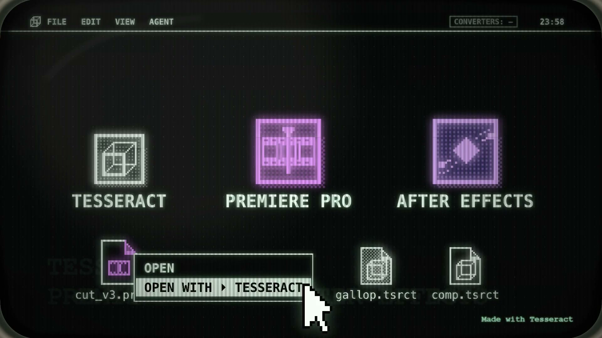
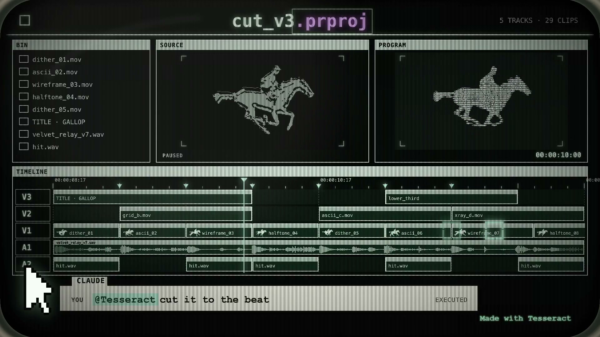
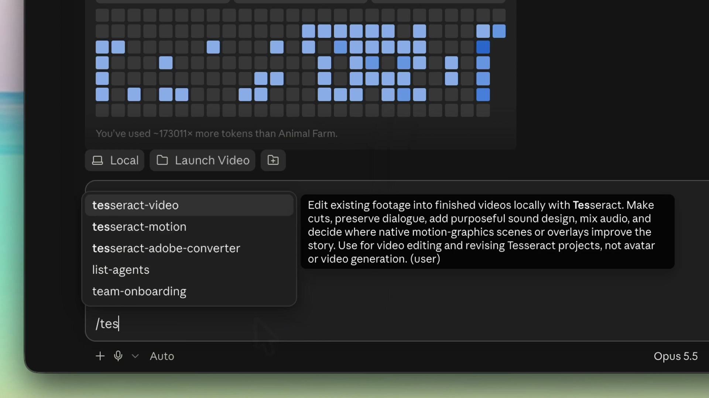
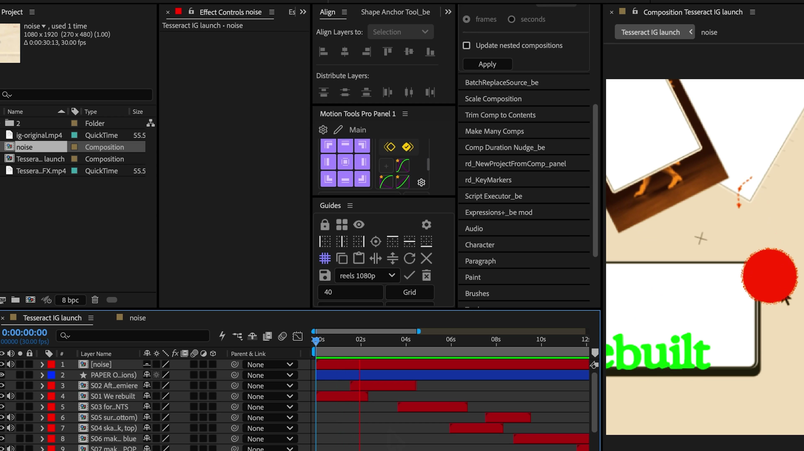

# Mirage Tesseract Deep Dive: Claude Does Not Directly Generate AEP; It Enters Adobe Workflows Through an Editable IR

> **TL;DR:** Mirage says Claude and ChatGPT can create Premiere Pro `.prproj` and After Effects `.aep` files, while existing Adobe projects can move in the other direction for continued agent editing. This does not mean the models suddenly understand every private Adobe behavior. The actual architecture has the agent edit Tesseract's `.tsrct` document, then uses an open-source Rust converter to map supported structure between `.tsrct` and Adobe projects. Both Premiere directions are currently **Partial**, and AEP export is explicitly **Experimental**. Expressions, plugins, cameras, lights, effects, and visual parity can be lost. The important development is not the headline that “AI can write AEP.” It is the arrival of an intermediate representation that can carry editable creative work between agents and professional post-production tools.

- **Launch post:** [Mirage on X](https://x.com/trymirage/status/2107504042205139269)
- **Tesseract:** [Feature page](https://mirage.app/tesseract/features) / [GitHub distribution repository](https://github.com/mirage-hq/Tesseract)
- **Converter:** [mirage-hq/Tesseract-Converter](https://github.com/mirage-hq/Tesseract-Converter)
- **Compatibility:** [Official compatibility page](https://mrkt.mirage.app/tesseract/converters/compatibility/)
- **Verified:** October 7, 2026



## The Short Version

Tesseract's breakthrough is not making Claude “understand Adobe natively.” It gives the agent a relatively stable **creative intermediate representation**. The agent changes layers, timing, text, audio, and animation in `.tsrct`; a converter then translates the subset it can map into Premiere or After Effects projects.

It resembles a compiler IR more than an Adobe replacement:

```text
Claude / ChatGPT / Codex
          ↓
Tesseract skill + CLI
          ↓
Editable .tsrct project
       ↙       ↘
  .prproj      .aep
 Premiere   After Effects
```

This architecture addresses how agents can manipulate complex creative documents predictably. It does not reproduce two mature desktop applications in full.

## What the Launch Demo Shows

Mirage's post says Claude and ChatGPT can now “natively create” `.prproj` and `.aep` files. It emphasizes bidirectionality: an agent can create a project for Adobe, or an existing Adobe project can be imported into Tesseract so the agent can continue the work.

The main video connects a horse-themed Premiere timeline, Tesseract projects, and agent instructions. A reply video shows Claude invoking `tesseract-adobe-converter`, producing an AEP, and opening a project with editable layers and timing inside After Effects.



Those demonstrations show that Mirage has a working conversion path. They do not establish lossless round trips for arbitrary AEP files. The official compatibility documentation uses more precise language: this is **project conversion**, not rendered-video export and not full Adobe behavior emulation.

## What “Native Creation” Actually Means

The open-source `tsrct-conv` is a Rust CLI. It imports Adobe projects into editable `.tsrct` files and writes new Adobe projects from `.tsrct`. It does not replay every hidden state from the source project. It reads supported current structure and authors a new destination project.

The workflow is roughly:

1. `inspect` an `.aep` or `.prproj` to list compositions or sequences;
2. verify that media reached by the selected target is accessible and compatible;
3. convert one composition or sequence into `project.tsrct`;
4. let the agent edit that document through a Tesseract skill;
5. convert it into a new `project.aep` or `project.prproj`;
6. reopen it in Adobe, relink assets, review diagnostics, and render for validation.



The model therefore operates on document semantics and a CLI exposed by Tesseract. It does not have to guess AEP binary structure. A deterministic converter handles the complex file format, which is much more reliable than asking an LLM to assemble the file directly.

## Why an Intermediate Representation Matters

When an agent can only remote-control Premiere or After Effects, every action depends on window layout, focus, dialogs, plugins, and machine state. Changing a hundred keyframes can require a hundred fragile UI operations.

A document-level workflow can express higher-level edits directly:

- move a title 12 frames earlier;
- apply consistent easing across a group of layers;
- replace media while preserving timing and layout;
- recut shots against musical beats;
- batch-edit text, color, gain, and keyframes;
- save a new editable version for a human editor to take over.

This does not make `.tsrct` more professional than AEP. It concentrates agent-readable structure, predictable commands, and local preview in a controlled interface. Adobe projects remain the industry handoff and human finishing environment at either end; the intermediate document carries automation between them.

## Premiere and After Effects Support Is Asymmetric

The current official compatibility table reads:

| Direction | Status | Main boundary |
|---|---|---|
| `.prproj` → `.tsrct` | Partial | One selected sequence; nesting, effects, captions, mixing, and media formats have limits |
| `.tsrct` → `.prproj` | Partial | Authors a new project; not all metadata or editing state is restored, and linked AEPs may be added |
| `.aep` → `.tsrct` | Partial / best effort | One selected composition; expressions, plugins, cameras, lights, and complex effects are not guaranteed |
| `.tsrct` → `.aep` | Experimental / Partial | Defaults to 24fps; the result must be opened and rendered in AE for verification |

Premiere is closer to a mapping of timelines, footage, cuts, basic motion, text, and audio. After Effects combines arbitrary layer graphs, expressions, plugins, cameras, and composition behavior, making the target substantially harder.

The converter README also says that Premiere export may automatically include one or more linked AEP files when native Premiere structure cannot adequately represent the picture. Such packages are marked `HYBRID-EXPERIMENTAL`; Adobe acceptance, rendering, alpha, audio, edit propagation, and relocation fidelity remain incompletely measured.



## Editable Does Not Mean Lossless

Three standards are easy to conflate:

1. **A file was produced:** the converter exited successfully;
2. **The project opens:** Premiere or AE accepts it without an immediate failure;
3. **The result is equivalent:** layers, timing, pixels, alpha, audio, fonts, and effects match the source.

The first two do not establish the third. Mirage's documentation explicitly asks users to preserve a visual reference and inspect the opening, middle, end card, complex effects, and full sequence. The warning list may also be incomplete; no warning is not proof of visual equality.

Media and fonts do not materialize inside the project automatically. Broken paths, incompatible codecs, missing fonts, and unavailable plugins can all alter a “successfully converted” project on another machine. For `.prproj` import, the inspection command can exit successfully while its JSON still reports `media_admission: blocked`.

## This Is Not the Same as Rebuilding an MP4

Tesseract separately offers a reference-video recreation workflow: give the agent an MP4 and ask it to build a new editable project from visible output. That differs fundamentally from project conversion.

- **Project conversion** reads existing layer, timeline, and media-reference structure and maps supported semantics.
- **Video recreation** observes final pixels and infers text, layers, animation, and asset relationships.

An MP4 has flattened hidden layers, expressions, keyframes, plugin parameters, and original asset identities. It can serve as a visual reference, but it cannot recover the source document. Importing an AEP and rebuilding from video therefore belong to different evidence tiers.

## The Converter Is Open Source; the Whole Suite Is Not

Mirage calls this its first open-source release. More precisely, `Tesseract-Converter` is published under the MIT License and exposes the Rust CLI source. The repository also states that the development source of truth lives under `opensource/conv/` in `bungeeapp/jerboa`, while the standalone public repository is a downstream distribution mirror.

That does not make the main Tesseract plugin open source. Its repository distributes skills, installation documentation, CLI releases, and notices, while the plugin itself remains governed by Mirage's proprietary terms. The current terms also say that commercial use by a for-profit business with at least US$1 million in annual revenue requires a separate written agreement with Mirage, and competing-product uses are restricted.

Teams therefore need to separate two things:

- **Converter source rights:** MIT;
- **Tesseract plugin and runtime rights:** Mirage product terms.

“The converter is open source” does not mean the entire creative engine can be embedded into a commercial product without additional restrictions.

## A Production-Sensible Workflow

The robust path is not to hand the agent the only copy of a client project. Build a reversible handoff package:

1. duplicate the original Adobe project and leave the source untouched;
2. collect source media, fonts, plugin inventory, and a reference render;
3. explicitly select one sequence or composition instead of letting the agent guess;
4. run `inspect` and resolve every missing, unreadable, or transcode-required asset;
5. verify playback and local render after importing to `.tsrct`;
6. ask the agent to modify only supported semantics and version the editable document;
7. export a new `.prproj` or `.aep` with an explicit frame rate;
8. relink media and fonts in Adobe and read every warning;
9. compare renders at the opening, middle, ending, complex effects, alpha, and audio;
10. treat it as a finishing project only after human review.

Projects dominated by third-party AE plugins, expressions, complex cameras, non-square pixels, or unusual audio routing are currently better candidates for experimental migration than lossless delivery promises.

## Why It Still Matters

AI video tools have mostly lived at two extremes: flattened MP4 output or UI automation over existing creative software. The first lacks editability; the second lacks stability.

Tesseract proposes a third route. The agent gets its own editable project format, and the platform builds explicit conversion boundaries to industry tools. Even with narrow support today, that changes the shape of human-agent handoff. Editors can give an existing timeline to an agent for batch work; the agent can return a real project for human finishing instead of only a video that cannot be taken apart.

The strategic question is not merely how many effects are supported this month. It is whether `.tsrct` can become a stable, sufficiently open document layer shared by multiple agents and creative tools. Whoever controls that IR may control the interface through which agents enter creative production.

## Conclusion

Mirage's headline is effective, but the more accurate description is that Claude and ChatGPT can now **create or continue editing a subset of Adobe project structure through Tesseract and a deterministic converter**.

That is less magical than “the model can write AEP,” but more useful as engineering. It connects agent intent, an editable document, and professional post-production software. It also turns failure boundaries into inspectable warnings, compatibility tables, and conversion logs.

For now, this is a bridge under construction: both Premiere directions are partial, AEP export is experimental, a file opening does not prove visual equality, and an open-source converter does not make all of Tesseract open source. The direction is still clear. If AI video is to enter real production, its deliverable cannot remain an MP4 forever. It must hand over editable structure, asset relationships, and a path for human takeover.

## Sources

1. Mirage, X launch post and demo thread
   https://x.com/trymirage/status/2107504042205139269

2. Mirage, Tesseract features
   https://mirage.app/tesseract/features

3. Mirage, Tesseract converter compatibility
   https://mrkt.mirage.app/tesseract/converters/compatibility/

4. mirage-hq, `Tesseract`
   https://github.com/mirage-hq/Tesseract

5. mirage-hq, `Tesseract-Converter`
   https://github.com/mirage-hq/Tesseract-Converter

6. Mirage, Tesseract terms
   https://github.com/mirage-hq/Tesseract/blob/main/TERMS.md

7. Mirage, recreate video use case
   https://mirage.app/tesseract/use-cases/recreate-video
