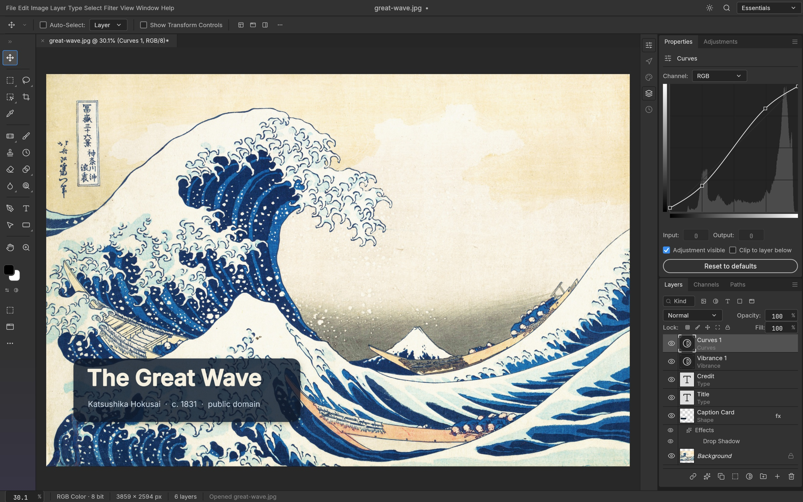
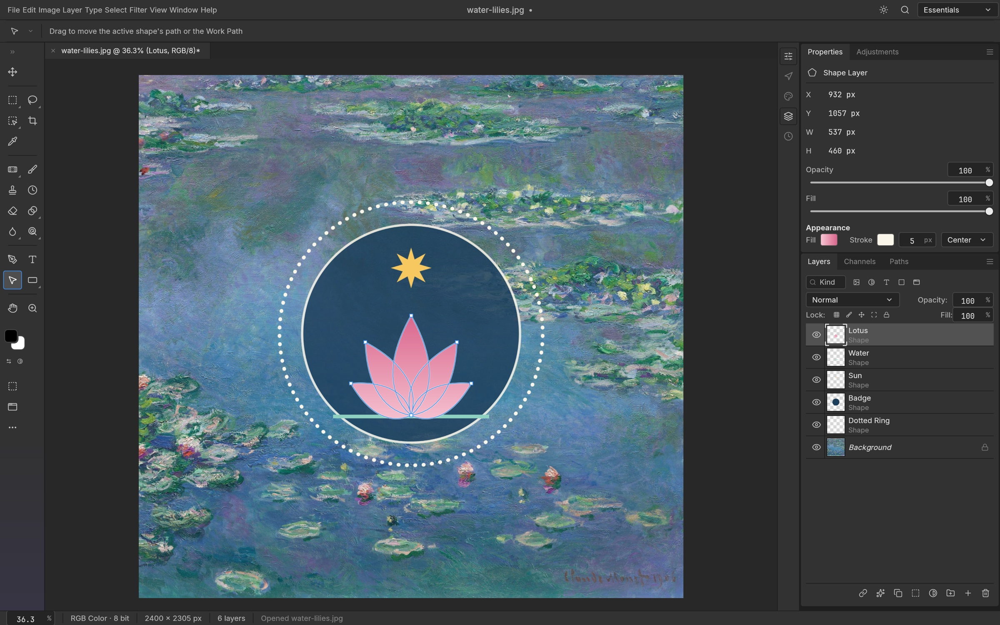

# PhotoCraft 源码审计：24 万行 Rust 编辑器是真的，“反编译 Photoshop”与“Adobe 被核爆”没有证据

> **一句话结论：** PhotoCraft 是一个真实、可下载、迭代速度异常快的原生 Rust 图像编辑器；但它仍处于 early alpha，项目自己的路线图估计真正的 Photoshop parity 低于 50%，而 Eric S. Raymond 所说的“先反编译 Photoshop，再让 LLM 翻译成 Rust”目前没有公开证据。

2026 年 10 月 7 日，Eric S. Raymond 在 X 上把 [PhotoCraft](https://github.com/storytold/photocraft) 称为自己几天前预言的“末日”：一个 Photoshop 的开源 clean-room 重实现。他进一步猜测，开发者很可能先把 Photoshop 反编译为源码，再转成某种非代码规格，最后交给 LLM 生成 Rust，并据此得出“Adobe just got nuked”和“closed source is dead”的结论。

这条推文抓住了一个真正值得关注的变化，却把三件不同的事揉成了一个故事：

1. **PhotoCraft 是否是真实软件？** 是。
2. **它是否大量借助 AI 编程？** 有开发者公开表述、提交历史和开发速度支持这一判断。
3. **它是否通过反编译 Photoshop 生成？** 没有公开证据，且与仓库声明的 clean-room 规则相冲突。

因此，真正值得讨论的不是“Photoshop 是否一夜死亡”，而是 AI 已经把一个人快速铺开大型桌面软件功能面的成本压低到了什么程度，以及剩下最难的部分为什么仍然无法靠代码量解决。

---

## 01｜先看结论：这不是空气项目，但也不是 Photoshop 替代品

截至 2026 年 10 月 7 日对仓库 `4337a6227a823a28728e68aed844feab62b3314d` 的检查，PhotoCraft 已经具备一套完整项目应有的外形：

- 约 **24.4 万行 Rust 源码**、1,000 个受 Git 跟踪的文件；
- 33 个 `Cargo.toml`，工作区包含二十多个内部 crate；
- 约 **2,826 个 Rust 测试标记**；
- 303 次提交，并有多位外部贡献者参与；
- macOS、Windows、Linux、FreeBSD 与 WebAssembly 目标；
- [v0.2.0](https://github.com/storytold/photocraft/releases/tag/v0.2.0) 提供 DMG、Windows 安装包、AppImage、deb、rpm、ARM64 包、CLI、Web ZIP 与校验文件；
- GitHub Actions 在检查时已通过 Windows、macOS、Ubuntu、语料测试、WASM 与 ARM64 等任务。

我还对仓库运行了 `cargo metadata --no-deps`，工作区清单可以正常解析。这些证据足以说明它不是只有 README 和几张概念图的“空气项目”。

但这仍不等于 Photoshop parity。PhotoCraft 自己的 [roadmap](https://github.com/storytold/photocraft/blob/main/docs/roadmap.md) 写得很坦率：菜单可以点击并不代表功能完整，更不代表效果与 Photoshop 一致；其真实 parity “well below 50%”，专业用户能够把它用于日常工作的完成度约为 25%–35%。

**本次审计验证了源码、Git 历史、发布物、CI 记录与项目文档，没有在本机完整编译、启动并进行 Photoshop 对照渲染。** 因此，界面截图和兼容性数字应视为项目方证据，而不是独立的使用验收。

---

## 02｜八天发生了什么：从 one-shot 到 24 万行代码

PhotoCraft 仓库创建于 9 月 30 日。初始提交只有 README 和 `.gitignore`，紧接着名为 [`one-shot`](https://github.com/storytold/photocraft/commit/16941f7) 的提交一次加入约 4.2 万行内容。到 10 月 7 日，代码已经增长到约 24.4 万行 Rust，提交分布如下：

| 日期 | 提交数 |
|---|---:|
| 9 月 30 日 | 6 |
| 10 月 1 日 | 15 |
| 10 月 2 日 | 24 |
| 10 月 3 日 | 26 |
| 10 月 4 日 | 59 |
| 10 月 5 日 | 102 |
| 10 月 6 日 | 45 |
| 10 月 7 日 | 26 |

开发者 Brandon Thomas 在 [公开帖文](https://www.reddit.com/r/Bard/comments/1wxmqpt/ive_created_open_source_100_rust_cleanroom/) 中表示，自己使用 Claude Opus 5.5 帮助重建了七款 Adobe 类应用。这个表述，加上 `one-shot` 提交和极高的迭代密度，足以支持“AI 显著参与开发”。

但它不能自动推出“代码来自 Photoshop 反编译”。AI 可以依据公开格式规范、行为测试、已有设计经验和开发者给出的架构约束生成大量实现；**AI 参与、clean-room 声明和反编译来源是三条不同的证据链。**

---

## 03｜它到底实现了什么

PhotoCraft 并非在浏览器里套一层 Photoshop 风格 UI，而是一套原生 Rust 编辑器：

- `egui/eframe` 负责桌面界面；
- 文档模型管理图层、蒙版、调整、文字、矢量和历史记录；
- CPU 合成器作为参考实现，`wgpu` 提供 GPU 合成路径；
- 256×256 稀疏 tile 与 copy-on-write 降低大画布编辑成本；
- PSD、常见栅格格式与原生 `.pcraft` 文档分别由 IO 层处理；
- 同一命令注册表连接桌面 UI、CLI、JSON 控制与 MCP；
- WASM 构建把核心能力带到 Web。

这套设计最重要的并不是“用了 Rust”，而是 **everything is a command**：用户点击菜单、CLI 调用、JSON 请求和 Agent 工具最终进入同一命令系统。这样，自动化不是在 UI 完成之后补上的宏系统，而是与编辑器内部操作共享语义。

换句话说，PhotoCraft 真正新鲜的地方可能不是“又一个 Photoshop 克隆”，而是一个从第一天就按人机共同操作设计的图像编辑器。

---

## 04｜PSD 兼容性：round-trip 不等于看起来一样

项目 README 给出了相当积极的 PSD 数据：在其语料中，应用模型重新保存后可保持 307/309 个 `psd-tools` 文件和 169/170 个混合样本的渲染结果；独立 parser/writer 对可解析语料还可以做到字节级往返。

这些是有价值的工程指标，但需要区分三层含义：

| 层级 | 它证明什么 | 它不证明什么 |
|---|---|---|
| 可解析 | 文件能被读取 | 图像与 Photoshop 一致 |
| 可往返 | 保存后仍可重新读取，结构或字节保持 | 所有特效、文字与颜色完全一致 |
| Photoshop oracle / 视觉对照 | 与 Photoshop 输出进行像素或行为比较 | 已覆盖所有真实生产文档 |

PhotoCraft 的 [scorecard](https://github.com/storytold/photocraft/blob/main/docs/scorecard.md) 也明确把 parser round-trip、应用模型 round-trip 和 Photoshop oracle 分开。这种区分很关键：PSD 是庞大且充满历史包袱的格式，“文件没有坏”只是第一步。

---

## 05｜项目自己的评估，比推文冷静得多

10 月 5 日版路线图给出的缺口包括：

- 约 20 个 Photoshop 工具仍缺失；
- AI / 生成式能力接近 0%；
- 不支持 ExtendScript、UXP、`.atn`、Adobe Libraries 与 cloud documents；
- 不兼容 Photoshop `.8BF` 插件，采用的是自己的 WASM 插件体系；
- 字体排版、专业工作流深度、大型复杂文档性能仍不足；
- 60/133 个设置项尚未真正产生作用。

更能说明问题的是：626/626 个菜单项可以 dispatch，但 scorecard 仍记录了 24 MP Content-Aware Scale 明显超时、150 图层移动导致 GPU 合成器崩溃等失败。**可点击的菜单是覆盖面，不是完成度；代码存在是实现证据，不是质量证据。**

这也是为什么“24 万行代码”和“专业用户可切换程度 25%–35%”可以同时成立。AI 最先压缩的是把功能铺开的成本，最后卡住它的仍是边界情况、格式语义、视觉一致性、性能调优与长期维护。

---

## 06｜“clean-room”到底意味着什么

PhotoCraft 当前声明：实现依据公开的 Adobe PSD 规范、ICC/ISO 规范、论文和对软件行为的观察，不使用 Adobe 的专有代码、shader 或资产。工作区采用 `MIT OR Apache-2.0` 许可，并在大部分代码中禁止 `unsafe`。

但 clean-room 首先是一套开发过程与来源隔离规则，不是只要写在 README 里就自动完成的法律认证。仓库历史还提供了一个需要如实说明的细节：最早的 `AGENTS.md` 和架构文档曾明确提到研究另一款专有编辑器 Photon Studio 的行为和架构，要求不得粘贴其可读 bundle 中的代码，并把其菜单快照当成功能 backlog。10 月 2 日的提交 [`9c9a680`](https://github.com/storytold/photocraft/commit/9c9a680) 移除了这些具名引用，现行文档改用“Photoshop and other proprietary editors”的概括表达。

这段历史**不能证明代码抄袭，也不能证明 clean-room 声明虚假**；它只能说明项目的行为参考来源比当前首页的一句话更具体，因此是否满足完整的 clean-room 法律标准仍需要独立审计。

同样，ESR 所说的“反编译 Photoshop → 生成规格 → LLM 生成 Rust”也只是他的猜测。公开仓库没有展示这条流水线，项目规则反而明确反对复制专有代码。把它写成既成事实，并不严谨。

---

## 07｜七个仓库，不等于“整个 Adobe 套件已经重写”

`storytold` 账号确实同时公开了 PhotoCraft、FilmCraft、VectorCraft、EffectCraft、DesignCraft、PrintCraft 和 LightCraft，分别对应 Photoshop、Premiere、Illustrator、After Effects、InDesign、Acrobat 与 Lightroom 一类工作流。

这说明开发者并非只做了一张截图，而是在尝试用共享的 Rust、命令系统和 AI 辅助开发方式铺开一组创意工具。但“七个仓库存在”与“七款成熟产品已经实现”之间还有巨大距离，更不能等同于“整个 Adobe suite”。这些项目普遍处于 early alpha，仓库数量衡量的是野心和功能面，不是生产替代率。

---

## 08｜真正值得 Adobe 警惕的是什么

“Adobe 被核爆”现在显然过早，但 PhotoCraft 仍然揭示了三个重要趋势。

### 1. 软件克隆的启动成本正在坍缩

过去，一个人很难在八天内搭出跨平台桌面 UI、文档模型、GPU 合成、PSD IO、CLI、MCP、安装包和数千个测试入口。AI 并没有让每一项都达到专业质量，却把“先铺出完整骨架”从团队级工作压缩到了个人级实验。

### 2. 竞争单位从功能列表转向验证体系

当 AI 可以快速补齐菜单和命令，真正的护城河会转向语料、oracle、兼容性测试、性能基线、真实用户反馈、插件生态和持续维护。PhotoCraft 最可信的部分不是 626 个菜单，而是它愿意把失败样本和低完成度写进 scorecard。

### 3. Agent-native 编辑器会成为独立路线

传统软件把自动化放在 UI 外围；PhotoCraft 把命令注册表作为 UI、CLI、JSON 与 MCP 的共同底座。即使它短期内无法替代 Photoshop，这种架构也可能让它在批处理、可复现编辑和 Agent 协作上形成不同优势。

MCP 文档已经提供读写目录限制和本地 bridge bearer token，但项目也承认尚无细粒度 session 与 tool capability 权限。因此，它适合受控本地自动化，不应直接暴露给不可信 broker。

---

## 09｜现在适合谁使用

PhotoCraft 当前更适合：

- 想研究 Rust 桌面图像架构、PSD 解析或 GPU 合成的开发者；
- 愿意报告边界问题、参与 early alpha 的贡献者；
- 需要 CLI / JSON / MCP 自动化，并能接受结果复核的实验工作流；
- 想观察 AI 如何改变大型软件开发组织方式的人。

它还不适合直接替换：

- 依赖复杂 PSD、精准文字排版与颜色管理的商业生产；
- 依赖 Photoshop 插件、Action、UXP、Adobe Fonts 或 Libraries 的团队；
- 无法容忍渲染差异、性能退化或文件往返风险的交付流程。

如果要试用，最合理的方式不是把原始项目直接交给它，而是复制真实文档做一组固定验收：视觉对照、文字、混合模式、智能对象、蒙版、颜色配置、保存重开、跨软件回读和大文件性能。

---

## 10｜结语：不是 Photoshop 已死，而是“做出第一版”的含义变了

PhotoCraft 最有说服力的事实不是 ESR 的推断，而是仓库本身：一个开发者借助 AI，在极短时间里搭出了可下载、可测试、跨平台、带真实编辑引擎的 Rust 应用，并吸引外部贡献者继续扩展。

它同时也给出了另一半答案：24 万行代码、626 个菜单和七个仓库，仍然没有自动变成专业工作流。项目自己的 25%–35% 日常可切换度，比“Adobe 被核爆”更接近现实。

所以，更准确的判断是：**闭源软件没有因为一个仓库而死亡，但闭源厂商再也不能假设重建其功能表面必然需要一支大团队和多年时间。** AI 正在消灭的是第一版软件的稀缺性；真正稀缺的，开始变成可信的兼容性、长期维护、生态与用户信任。

---

## 主要来源

- [Eric S. Raymond 的原始 X 帖文](https://x.com/esrtweet/status/2107561430568571363)
- [PhotoCraft GitHub 仓库](https://github.com/storytold/photocraft)
- [PhotoCraft 官方产品页](https://getartcraft.com/apps/photocraft)
- [PhotoCraft roadmap：项目自己的 parity 评估](https://github.com/storytold/photocraft/blob/main/docs/roadmap.md)
- [PhotoCraft scorecard：功能、性能与兼容性证据](https://github.com/storytold/photocraft/blob/main/docs/scorecard.md)
- [`one-shot` 初始实现提交](https://github.com/storytold/photocraft/commit/16941f7)
- [移除 Photon Studio 具名引用的提交](https://github.com/storytold/photocraft/commit/9c9a680)
- [开发者关于 Claude Opus 5.5 与七款应用的公开说明](https://www.reddit.com/r/Bard/comments/1wxmqpt/ive_created_open_source_100_rust_cleanroom/)
- [PhotoCraft v0.2.0 发布页](https://github.com/storytold/photocraft/releases/tag/v0.2.0)
- [官方截图来源与许可说明](https://github.com/storytold/photocraft/blob/main/docs/images/SOURCES.md)

*审计日期：2026 年 10 月 7 日。仓库、CI、发布物和完成度会继续变化；本文中的数字对应上述日期与提交快照。*
