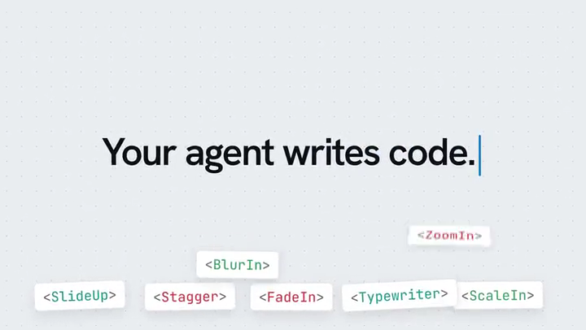
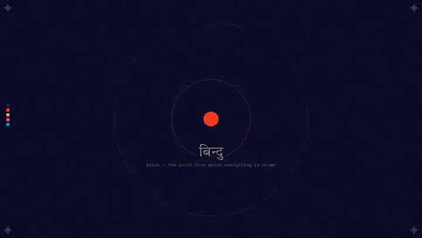

# Prompt Motion 深度拆解：它不是视频生成器，而是 Claude 动效作品的 Prompt 与 Skill 证据库

> **TL;DR:** Prompt Motion 不是视频生成模型、在线剪辑器或“一句话出片”SaaS，而是由 `@p4nthera_` 策展的 Claude Opus 5.5 动效案例库。它把散落在 X 上的成片、作者、原帖、Prompt、Skill、模型与制作信息重新连成一条可追溯链路。2026 年 10 月 7 日核验时，首页有 230 个作品：226 个仅提供 Prompt，3 个仅提供 Skill，1 个同时提供 Prompt 与 Skill。它最有价值的地方不是证明“短 Prompt 可以稳定一键生成大片”，而是让我们看见 Prompt、代码生成运行时、Remotion / HyperFrames、素材、迭代与渲染验收之间的区别。Prompt 适合找方向；真正可复用的生产能力，更多藏在 Skill、源码、依赖和 QA 流程里。

- **网站:** [Prompt Motion](https://prompt-motion.com/)
- **策展者:** [`@p4nthera_`](https://x.com/p4nthera_)
- **收录范围:** Claude Opus 5.5 生成或辅助制作的 motion video
- **当前快照:** 230 个作品，发布日期覆盖 2026-09-23 至 2026-10-06
- **提交门槛:** X 原帖包含成片，并公开 Prompt 或 Skill；每条提交由站方人工审核
- **核验日期:** 2026-10-07


## 一句话判断

Prompt Motion 不是“帮你生成视频”的产品，而是一个**把生成式动效作品从社交媒体演示还原成来源链路的索引层**。

用户不能在站内输入 Prompt、上传 Logo、调整时间线或点击 Render。首页的核心交互是浏览、筛选 Prompt / Skill、按热度排序，然后进入作品页查看：谁做的、原帖在哪里、用了什么 Prompt 或 Skill、模型与推理强度是什么、是否经过多轮迭代，以及底层使用 Remotion 还是 HyperFrames。

这使它与此前分析过的 [MotionSites](../2026-07-25/2026-07-25-motionsites-ai-prompt-gallery.md) 有一个关键区别：MotionSites 把网站 Prompt 当成可复制的设计商品；Prompt Motion 更接近一个有来源的作品档案。它不承诺复制后得到相同结果，而是努力回答“这个视频来自哪里，以及作者公开了多少制作信息”。

## 230 个案例到底包含什么

截至核验时，首页共有 230 个不重复的作品详情页。按站内标签拆分：

| 条目类型 | 数量 | 提供的信息 |
|---|---:|---|
| 仅 Prompt | 226 | 成片预览、作者、X 原帖、原始提示词，部分含模型、effort、stack 或迭代次数 |
| 仅 Skill | 3 | Skill 说明、安装命令、GitHub 仓库，以及部分运行栈信息 |
| Prompt + Skill | 1 | 同时公开起始指令和可安装 / 可检查的工作流 |
| **合计** | **230** | 覆盖 2026-09-23 至 2026-10-06 |

题材远比“AI 产品宣传片”宽：有产品发布片、功能演示、品牌片、动态字体、3D 实验、数据解释、历史短片、社交媒体内容，也有展示 coding agent 自身工作方式的 motion showreel。

不过数量不能直接当作能力排行榜。首页默认按 Popular 排序，但网站没有公开统一的评分公式、相同 brief、相同预算或盲测协议。它是策展画廊，不是 benchmark。

## 普通 Prompt 条目证明了什么

一个典型案例是 [Claude motion designer showreel](https://prompt-motion.com/stephanlivera-df17a2)。公开 Prompt 只有一句：

> make a dynamic 15-second motion graphics video that shows what an incredible motion designer you are, like it's your showreel for a résumé. go all out.

详情页同时给出 X 原帖、Claude Opus 5.5、Max effort 和发布日期。它至少证明：这段 Prompt 与这条公开成片被创作者关联在一起，读者可以回到原帖检查上下文。


但它**不能单独证明**：

1. 第一次运行就得到最终片；
2. 模型没有读取项目文件、品牌素材或既有代码；
3. 生成后没有人工修改代码、节奏、字体或音频；
4. 换一台机器、模型版本或依赖版本还能得到同样结果；
5. 成片中的字体、音乐和图像素材具备可复用授权。

所以 Prompt Motion 的 Prompt 更像“创作入口和来源证据”，不是可执行的项目快照。短 Prompt 之所以能对应复杂成片，往往不是因为一句话隐含了全部镜头，而是 Agent 在后面完成了大量未显示在卡片上的工作：检查环境、选技术栈、写组件、预览、修改、渲染，再根据结果继续迭代。

## Skill 条目为什么更接近生产能力

Prompt 描述一次意图，Skill 则试图固化一类工作的方法。

[Cinetic skill launch film](https://prompt-motion.com/lexnlin-6161a6) 提供安装命令 `npx skills add Leonxlnx/cinetic`，并指向 [Leonxlnx/cinetic](https://github.com/Leonxlnx/cinetic)。这个仓库不是一条更长的提示词，而是一套让 coding agent 设计、生成、渲染和验收短片的工作流：

- 默认使用 Remotion，也支持 HyperFrames；
- 提供 14 类、273 种 motion technique；
- 通过 seed 控制可重复的技法选择；
- 用 `timeline.ts` 建立 beat grid；
- 包含 motion blur、BT.709、像素检查、音画同步审计、contact sheet、critic pass 与 ship gate；
- 面向 Claude Code、Codex 和 Cursor；
- 需要 Node 22+、FFmpeg 6+、Python 3.11+ 与 Chromium。



这就揭示了 Prompt Motion 最重要的分层：**视频不是由 Prompt 直接“变”出来的，而是 Prompt 驱动 Agent，Agent 再操作一个代码、素材与渲染系统。**

Cinetic 作者还在仓库中报告，其评测运行平均约 95 分钟、626K tokens，约为 baseline 的三倍。这不是所有 Skill 的统一成本，也不是独立测量结果，但它足以提醒我们：视觉上像“一句话生成”的视频，背后可能是一次较长、较贵、带多轮检查的 agentic render。

另一个 [Reddit marketing tool launch video](https://prompt-motion.com/anthonyriera-9b1b2a) 更直接。条目明确标注 Stack 为 Remotion、Iterations 为 `Many rounds`，其 [product-film-skill](https://github.com/Rieranthony/product-film-skill) 会先学习产品设计系统，再询问影片方向，最后用真实组件、Logo 与音乐构建并渲染发布视频。这已经不是“文生视频”，而是让 Agent 进入现有产品代码和品牌资产中完成 motion design。

还有 [Animated agent session story](https://prompt-motion.com/jake11moran-a269c4)：Skill 读取本地 Claude Code 历史，把一次典型编码会话改编成带配乐的短片，再交给 HyperFrames 渲染。此时原始素材不是一句营销文案，而是用户真实的 agent session。

## Prompt + Skill：最有信息量的一类

[Indian civilisation history film](https://prompt-motion.com/buildfastwithai-53234e) 是当前唯一同时标记 Prompt 与 Skill 的条目。Prompt 同样很短：

> generate a creative mp4 video on indian civilisation with music and sound effects.

但页面还链接到 [generative-film-skill](https://github.com/buildfastwithai/buildfast-skills/tree/main/generative-film-skill)：它负责把任意主题变成代码绘制的动画 MP4，并合成与节拍同步的音轨。条目标记 One-shot，说明作者把这次运行作为一次成片展示；它不代表这个 Skill 对所有主题都能一次成功。



这类条目最有价值，因为它同时保留了三个层级：

1. **用户意图:** 最初要求生成什么；
2. **执行方法:** Skill 如何规划画面、写代码、生成声音与渲染；
3. **可见结果:** 最终公开的视频和原始社交媒体来源。

如果未来站点为每个案例再增加 commit、依赖锁文件、输入素材清单、渲染日志和成片哈希，它就能从灵感库继续向可复现实验库靠近。

## 一条动效真正经过的三层系统

看完这些条目，比较准确的技术模型不是 `Prompt -> MP4`，而是：

```text
创作意图 / Prompt
        ↓
Agent Skill 与运行时
读取项目、规划镜头、写 Remotion / HyperFrames / WebGL 代码、调用素材
        ↓
渲染与验收
Chromium / FFmpeg、音画同步、色彩、contact sheet、人工修改、最终导出
```

三层中只有第一层最容易被截图传播。第二层决定是否能稳定执行，第三层决定视频是否真的可交付。

这也解释了为什么两个创作者使用同一句 Prompt，结果仍可能完全不同：他们的上下文文件、Skill、组件库、字体、音乐、浏览器、FFmpeg、模型版本、token 预算和人工修改都不同。Prompt 是控制信号，不是完整工程。

## Prompt Motion 真正解决的问题

社交平台上的 AI 成片通常存在三个断点：只看到最终视频，不知道作者；找到作者，不知道原始指令；拿到 Prompt，又不知道背后的代码与工具。Prompt Motion 把这些断点尽量连接起来：

```text
成片预览 → 作者 → X 原帖 → Prompt / Skill → 模型 / effort / stack / 日期
```

它的提交规则也强化了这一点：推荐内容必须有 X 视频，并公开背后的 Prompt 或 Skill；站方再人工审核。人工审核不能替代独立复现，但至少比无来源的搬运合集多了一层出处检查。

因此它的核心产品不是播放器，也不是提示词复制按钮，而是**来源结构**。对于正在研究 AI motion design 的团队，这能显著降低发现案例和回溯方法的成本。

## 哪些结论不能从画廊里推出

### 1. “Made with Claude” 仍是来源声明

站点核对公开信息，但没有为 230 个作品逐个重跑环境。模型、effort、one-shot 或迭代次数主要来自创作者与原帖，不应当被当作独立审计结论。

### 2. 成功案例存在选择偏差

画廊天然收录最好看的结果，不展示失败生成、废弃版本和调参过程。它适合研究能力上限与视觉语言，不适合估计平均成功率。

### 3. “公开 Prompt”不等于“可复现”

Prompt 条目普遍缺少源码、依赖、素材和渲染参数。Skill 条目更接近可复现，但仍需要检查仓库版本、许可证、安装条件和外部服务。

### 4. 热度不是统一评测

作品的传播量会受到作者粉丝、发布时间和题材影响。没有统一 brief、固定预算与匿名评分，就不能根据排序得出模型或工具优劣。

### 5. 成片权利需要逐项检查

网站明确表示视频和 Prompt 归各自创作者所有。即使 Skill 采用开源许可证，字体、音乐、Logo、产品截图和第三方素材仍可能有不同授权。

## 团队应该怎样使用它

比较稳妥的工作方式是把 Prompt Motion 当作研究入口，而不是交付承诺：

1. 保存案例页、X 原帖、作者、Prompt / Skill、模型、日期与 stack；
2. 先判断它是 Prompt 灵感、可安装 Skill，还是带源码的完整工作流；
3. 对 Skill 检查许可证、依赖、安装脚本和固定 commit，不直接运行陌生代码；
4. 在自己的仓库中保留 brief、素材来源、模型版本、迭代记录和人工修改；
5. 保存实际渲染文件，用 `ffprobe`、contact sheet、音画同步和颜色检查完成 QA；
6. 区分第一次生成、最后成片和用于发布的压缩版本；
7. 发布前单独核对音乐、字体、Logo 与客户素材授权。

这样，画廊里的灵感才能变成团队自己的、可追溯且可交付的生产资产。

## 结论

Prompt Motion 最值得关注的，不是“Claude Opus 5.5 能做 230 个漂亮视频”，而是它开始为这批作品建立一套最小来源结构。

普通 Prompt 条目告诉我们创作者从哪里出发；Skill 条目展示可复用方法怎样进入 Remotion、HyperFrames、FFmpeg 与项目代码；混合条目则把意图、执行和结果第一次连在一起。三者的证据强度并不相同。

所以它既不是 Remotion，也不是 HyperFrames，更不是两者的替代品。它位于这些工具之上，负责发现、策展和追溯。真正决定视频能不能稳定复现和交付的，仍然是下面那套不太适合做成一张社交媒体截图的东西：Skill、源码、素材、依赖、迭代、渲染与 QA。

## Sources

1. Prompt Motion
   https://prompt-motion.com/

2. Prompt Motion, “Claude motion designer showreel”
   https://prompt-motion.com/stephanlivera-df17a2

3. Prompt Motion, “Cinetic skill launch film”
   https://prompt-motion.com/lexnlin-6161a6

4. Leonxlnx, `cinetic`
   https://github.com/Leonxlnx/cinetic

5. Prompt Motion, “Reddit marketing tool launch video”
   https://prompt-motion.com/anthonyriera-9b1b2a

6. Rieranthony, `product-film-skill`
   https://github.com/Rieranthony/product-film-skill

7. Prompt Motion, “Animated agent session story”
   https://prompt-motion.com/jake11moran-a269c4

8. Prompt Motion, “Indian civilisation history film”
   https://prompt-motion.com/buildfastwithai-53234e

9. buildfastwithai, `generative-film-skill`
   https://github.com/buildfastwithai/buildfast-skills/tree/main/generative-film-skill
