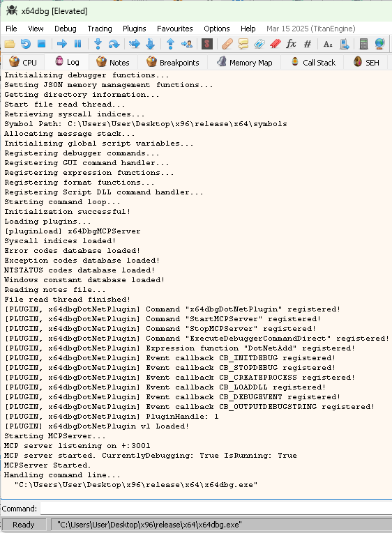
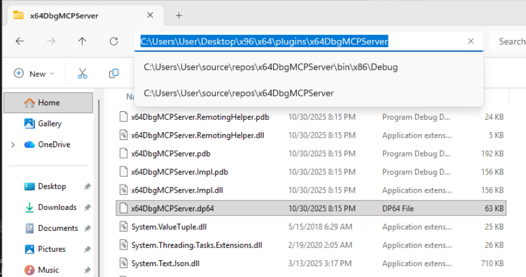
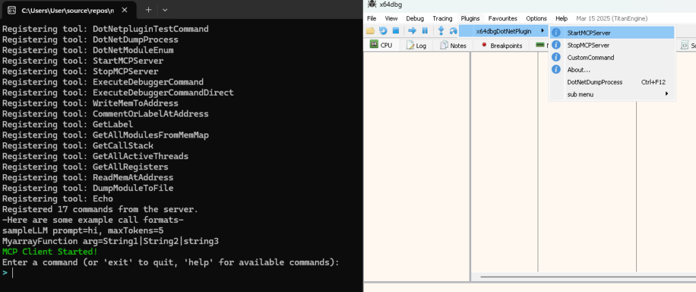

# x64DbgMCPServer 源码审计：AI 真能直接操控 x64dbg，但默认安全边界还没跟上工具权限

> **一句话结论：** x64DbgMCPServer 不是让 AI “看着界面猜按钮”的演示，而是一个运行在 x64dbg 进程内的 C# 插件，把寄存器、内存、反汇编、调用栈、断点和执行控制封装成 MCP 工具；但当前版本默认监听所有网卡、实际启动时不启用认证，还存在一个“导出模块”工具悄悄写入固定内存地址的严重实现错位，因此只适合在隔离、可丢弃、明确授权的本地调试环境中研究。



用户给出的仓库是 [`donghaozhang/x64DbgMCPServer`](https://github.com/donghaozhang/x64DbgMCPServer)。先澄清出处：它是 [`AgentSmithers/x64DbgMCPServer`](https://github.com/AgentSmithers/x64DbgMCPServer) 的 fork。截至 2026 年 10 月 7 日，两者都指向提交 `a8303d7ac7bfd251b9da83b80c9d1d4407ddd8df`，对比结果为 `ahead 0 / behind 0`，也就是用户提供的 fork 当时没有自己的代码改动。

所以下文的技术实现、贡献历史和设计判断都归于上游 AgentSmithers 项目及其贡献者；`donghaozhang` 仓库只是本次请求提供的入口。

---

## 01｜它是什么：嵌进调试器内部的 MCP 控制层

x64DbgMCPServer 的核心不是一个独立调试器，也不是屏幕自动化。它基于 `DotNetPluginCS` 的 C# 插件骨架，最终构建成 x64dbg 可加载的 `.dp64` 或 `.dp32` 插件，并通过 P/Invoke 调用 x64dbg 的 Bridge、Script 和插件 API。

完整链路可以概括为：

```text
Cursor / Claude Desktop / Windsurf / 其他 MCP Client
                    |
             HTTP + SSE / Streamable HTTP
                    |
       SimpleMcpServer（进程内 HttpListener）
                    |
       [Command] 反射注册 + JSON Schema 绑定
                    |
        x64dbg Bridge / Script / command engine
                    |
               被调试的 Windows 进程
```

这条链路的意义在于：模型拿到的不是截图或 OCR，而是调试器已经解析过的结构化状态。例如寄存器值、模块基址、线程列表、调用栈、反汇编和交叉引用都直接来自 x64dbg。x64dbg 官方文档也说明，插件可以通过 Bridge 调试函数和命令引擎扩展自动化；项目使用的 `DbgCmdExecDirect` 会在调用线程上直接执行 x64dbg 命令。

因此，它更接近“给现有调试器增加 Agent API”，而不是“让通用电脑操作 Agent 学会用 x64dbg”。

---

## 02｜26 个业务工具加一个 Echo：它绝不是只读助手

对当前提交中未被注释、且面向 MCP 的 `[Command]` 声明进行核对，可以得到 **26 个业务工具**；服务器还额外加入一个内置 `Echo`，因此 `tools/list` 最多可以返回 27 个工具。标记为 `DebugOnly` 的工具会在没有活动调试会话时被隐藏。

它们大致分成四组：

| 能力 | 代表工具 | 实际权限 |
|---|---|---|
| 状态读取 | `GetAllRegisters`、`GetAllActiveThreads`、`GetAllModulesFromMemMap`、`GetCallStack` | 读取正在调试的进程状态 |
| 代码分析 | `ReadDismAtAddress`、`SearchForStrings`、`FindAllMem`、`refstr`、`FindXrefs` | 搜索内存并生成反汇编、字符串与引用信息 |
| 调试控制 | `LoadBinary`、`run`、`PauseDebug`、`StopDebug`、`RestartDebug`、`StepInto/Over/Out` | 启动程序并改变执行流 |
| 修改环境 | `SetBreakpoint`、`DeleteBreakpoint`、`WriteMemToAddress`、`CommentOrLabelAtAddress`、`ExecuteDbgCommand`、`DumpModuleToFile` | 写内存、改调试数据库、执行任意 x64dbg 命令或写磁盘文件 |

其中 `ExecuteDbgCommand` 是最值得警惕的扩展口。即使某个动作没有专门工具，模型仍可以传入任意 x64dbg 命令字符串。也就是说，命名工具的数量不是实际能力上限。

项目在 Agent 体验上做了一些认真设计：`McpParam` 可以描述参数示例、枚举、正则表达式和数值范围；搜索结果会在 50 或 100 条附近截断，避免一次返回塞满上下文；错误消息还会提示模型修正 x64dbg 的地址或模块语法。这些都说明作者不是只把几个函数挂到 HTTP 端口，而是在尝试做一层适合 LLM 自我纠错的调试接口。



---

## 03｜MCP 层怎么实现：轻量、直接，也承担了更多安全责任

服务器没有使用 ASP.NET Core 或 Kestrel，而是直接在插件进程中创建 `System.Net.HttpListener`。`SimpleMcpServer` 通过反射扫描 `[Command]`，预先构建工具定义和输入 JSON Schema，然后处理：

- `initialize`；
- `tools/list` 与 `tools/call`；
- `prompts/list`、`resources/list`；
- 长连接 SSE 与现代 Streamable HTTP；
- 15 秒一次的 SSE heartbeat；
- 旧版 `rpc.discover` 兼容入口。

代码把协议版本写为 `2025-11-25`。Cursor 可以直接连接 SSE URL；README 对 Claude Desktop 和 Windsurf 仍建议使用作者另一个 `MCPProxy-STDIO-to-SSE` 项目，因为直接 SSE 曾出现 context deadline 超时。

这种实现的优点是部署简单：插件、依赖 DLL 与调试器放在一起，不需要额外 Web 宿主。代价也很直接：认证、监听范围、跨域、请求并发、调试器线程约束和生命周期都要由这个插件自己正确处理。

---

## 04｜真正的问题不是 MCP，而是默认信任边界

当前代码已经写了 Bearer Token 校验，而且使用常量时间比较；问题是 **插件实际启动没有把 token 传进去**。

启动路径调用的是：

```csharp
new SimpleMcpServer(typeof(DotNetPlugin.Plugin), GMcpServerConfig)
```

而这个构造函数在源码注释中明确表示认证关闭，并继续把 `bearerToken: null` 传入完整构造函数。配置文件只保存 IP 与端口，没有 token 字段，也没有看到其他启动路径把密钥接入服务器。

默认网络配置又把问题放大了：

- `IpAddress` 默认为 `+`，端口默认为 `50300`；
- `HttpListener` 因此注册 `http://+:50300/`，即监听所有可用主机名/网卡，而非只监听回环地址；
- 响应设置 `Access-Control-Allow-Origin: *`；
- 传输是明文 HTTP；
- README 还建议用 `user=Everyone` 为通配 URL 添加 Windows URL ACL；
- 但 `GetDisplayUrl()` 会把 `+` 显示成 `127.0.0.1`，日志或 UI 看起来像只在本机开放。

把这些事实放在一起，默认状态就是：一个能够加载程序、控制执行、写入进程内存、执行任意调试器命令并写文件的服务，可能监听局域网接口，却没有实际启用认证，而且展示 URL 容易让用户误以为它仅绑定本机。

上游 README 自己也在 Known Issues 中承认，已编译版本当前会监听所有 IP，未来才计划改为 `127.0.0.1`。这应当被视为当前版本的部署阻断项，而不是普通优化建议。

---

## 05｜最严重的源码错位：“导出模块”会先修改被调试进程

`DumpModuleToFile` 的描述是把当前模块的寄存器和反汇编写入文本文件。按名称理解，它应该是“读取调试状态 + 写报告”。但实际代码在创建报告前执行了下面的逻辑：

```csharp
IntPtr ptr = new IntPtr(0x14000140B);
byte[] nops = Enumerable.Repeat((byte)0x90, 7).ToArray();
bool success = WriteMemory(address, nops);
```

也就是无条件尝试向固定地址 `0x14000140B` 写入 7 个 NOP。这个地址显然来自某个开发样本，却留在了通用工具路径中。

风险不只是“可能写失败”：

- 如果另一个目标恰好在该地址映射了可写或可修改内存，它会被意外篡改；
- 工具名称和描述没有告诉客户端它会改内存；
- 文件参数接受绝对路径，并用覆盖模式创建文本文件；
- 当前业务工具没有设置 `readOnlyHint`、`destructiveHint`、`idempotentHint` 或 `openWorldHint`，客户端无法从工具元数据区分读取与破坏性动作。

MCP 官方关于 Tool Annotations 的说明强调，这些字段只是风险提示，不是安全强制机制。但对这样一个高权限服务器而言，连提示都缺失，会进一步削弱客户端的确认和审批体验。

`DumpModuleToFile` 中的固定内存补丁应当直接删除；如果确实需要 patch，必须拆成一个名称明确、参数明确、默认需要人工确认的独立工具。

---

## 06｜成熟度：构建通过，不等于调试路径已经被验证

当前提交是 2026 年 10 月 4 日合并的 PR #41，主要增加调试生命周期工具并修复菜单图标崩溃。针对该精确提交，上游 GitHub Actions 的 x64 与 x86 Windows 构建都成功，项目使用经典 Windows-only `.NET Framework 4.7.2`，并依赖 DllExport/ILRepack 生成 x64dbg 插件。

但仓库中没有发现测试项目或测试源码，两个工作流也只执行 restore、build 和 artifact upload，没有启动 x64dbg、加载插件、连接 MCP 客户端、附加测试程序并验证工具结果的端到端测试。

另外还有一些明显的早期项目信号：

- README 仍写着“not every command is fully implemented”；
- 文档中的部分命令名已经和当前代码不一致；
- `run` 等命令依赖固定的 250ms 或数秒延迟判断状态，而非完整的事件驱动等待；
- 仓库根目录没有 `LICENSE` 文件，GitHub API 也未识别许可证，因此“源码公开可见”不等于已经授予复制、修改或再分发权利。

**本次检查在 macOS 上完成，验证了 Git 历史、源码、工具声明、配置、CI 记录与官方截图，没有在 Windows 上启动 x64dbg、加载插件或连接真实 MCP Client。** 所以可以确认架构与风险路径存在，但不能把它写成已经独立验收过的生产可用调试系统。



---

## 07｜怎样把它变成更可信的调试 Agent

如果继续建设，我认为优先级应该是：

1. 默认绑定 `127.0.0.1`，并让显示地址与真实监听地址完全一致；
2. 把已有 Bearer Token 能力接入配置，启动时默认要求认证，并支持密钥轮换；
3. 为每个工具补全读写、破坏性、幂等和开放世界 annotations；
4. 把读取工具与执行/写入工具分成不同 capability，默认只开放只读集合；
5. 对写内存、加载二进制、执行任意命令和写文件增加人工确认与审计日志；
6. 删除 `DumpModuleToFile` 的硬编码 NOP patch，并限制输出目录；
7. 用调试事件代替固定 sleep，给“运行直到断点”“等待模块加载”等动作建立明确状态机；
8. 增加 Windows 端到端测试：加载插件、枚举工具、启动样本、断点、单步、读取、写入拒绝策略和断开重连；
9. 补充明确许可证，避免使用者把公开仓库误认为可自由再分发。

在这些改动完成前，较安全的研究方式是：只处理自己拥有或明确获准分析的程序；使用隔离 Windows 虚拟机和一次性样本；关闭桥接网卡或用防火墙限制回环；不要以管理员权限暴露通配监听；每次 Agent 动作后都在 x64dbg 中人工复核内存、断点和执行状态。

---

## 08｜结语：它证明了 Agent Debugger 的价值，也证明了权限设计不能后补

x64DbgMCPServer 最有价值的地方，是它把“AI 调试”从屏幕点击推进到了调试器内部语义。模型可以直接询问寄存器、模块、线程、调用栈、字符串、交叉引用和反汇编，也能设置断点、单步和继续执行。这种结构化闭环，确实比通用电脑控制更适合复杂逆向与故障分析。

但它也暴露了 Agent 工具最典型的工程误区：先追求“模型能做什么”，再处理“谁可以调用、默认暴露到哪里、哪些动作需要确认、工具描述是否诚实”。当工具只读文件时，这种延后可能只是体验问题；当工具可以改写活进程内存时，它就是安全边界本身。

因此，对当前版本最准确的评价不是“AI 已经接管 x64dbg”，也不是“这只是一个概念 Demo”，而是：**它已经是一座真实、直接、高权限的调试桥梁；正因为桥梁是真的，默认认证、网络隔离、工具权限和行为一致性才必须先于更多功能。**

---

## 主要来源

- [用户提供的 donghaozhang/x64DbgMCPServer fork](https://github.com/donghaozhang/x64DbgMCPServer)
- [上游 AgentSmithers/x64DbgMCPServer](https://github.com/AgentSmithers/x64DbgMCPServer)
- [本次审计对应提交 `a8303d7`](https://github.com/AgentSmithers/x64DbgMCPServer/commit/a8303d7ac7bfd251b9da83b80c9d1d4407ddd8df)
- [插件启动服务器时使用无 token 构造函数](https://github.com/AgentSmithers/x64DbgMCPServer/blob/a8303d7ac7bfd251b9da83b80c9d1d4407ddd8df/DotNetPlugin.Impl/Plugin.Commands.cs#L89-L105)
- [默认 IP、端口与显示 URL](https://github.com/AgentSmithers/x64DbgMCPServer/blob/a8303d7ac7bfd251b9da83b80c9d1d4407ddd8df/DotNetPlugin.Impl/McpServerConfig.cs#L11-L65)
- [服务器构造、Bearer Token 与监听前缀](https://github.com/AgentSmithers/x64DbgMCPServer/blob/a8303d7ac7bfd251b9da83b80c9d1d4407ddd8df/DotNetPlugin.Impl/MCPServer.cs#L194-L245)
- [CORS 与认证校验实现](https://github.com/AgentSmithers/x64DbgMCPServer/blob/a8303d7ac7bfd251b9da83b80c9d1d4407ddd8df/DotNetPlugin.Impl/MCPServer.cs#L549-L589)
- [`DumpModuleToFile` 的固定地址 NOP 写入](https://github.com/AgentSmithers/x64DbgMCPServer/blob/a8303d7ac7bfd251b9da83b80c9d1d4407ddd8df/DotNetPlugin.Impl/Plugin.Commands.cs#L3296-L3353)
- [x64dbg 官方插件开发文档](https://help.x64dbg.com/en/latest/developers/plugins/)
- [x64dbg `DbgCmdExecDirect` 文档](https://help.x64dbg.com/en/latest/developers/functions/debug/DbgCmdExecDirect.html)
- [MCP 官方博客：Tool Annotations 是风险提示，不是强制安全边界](https://blog.modelcontextprotocol.io/posts/2026-03-16-tool-annotations/)
- [x64 Windows 构建记录](https://github.com/AgentSmithers/x64DbgMCPServer/actions/runs/37189335491/job/111398057141)
- [x86 Windows 构建记录](https://github.com/AgentSmithers/x64DbgMCPServer/actions/runs/37189335490/job/111398057104)

*审计日期：2026 年 10 月 7 日。本文仅讨论经授权的软件调试与安全研究；仓库代码和默认配置会继续变化，结论对应提交 `a8303d7ac7bfd251b9da83b80c9d1d4407ddd8df`。*
