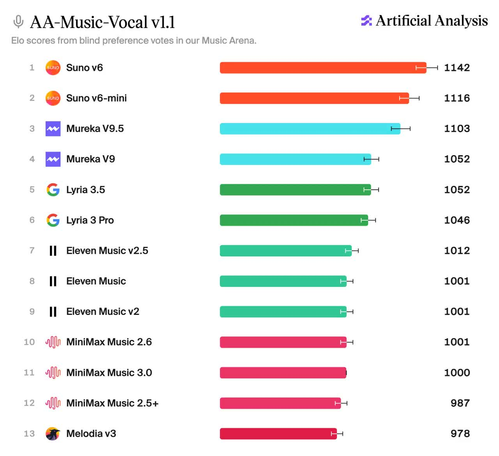
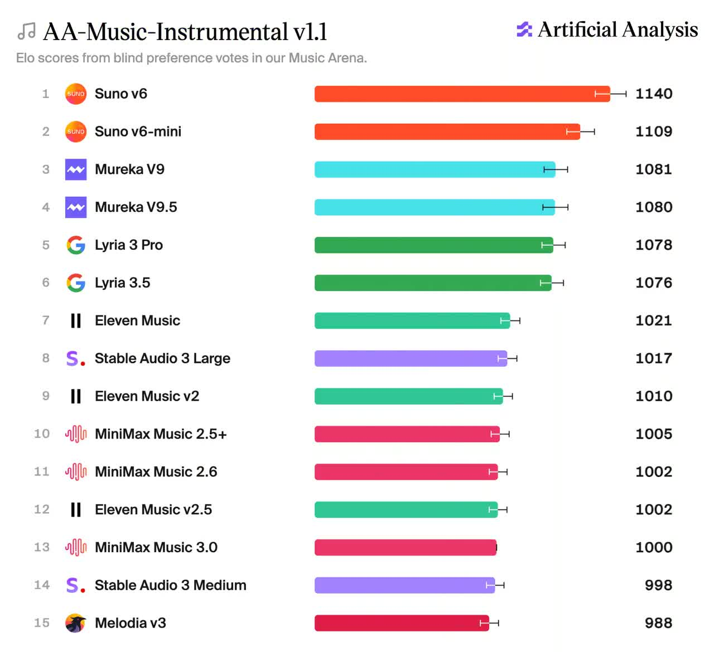
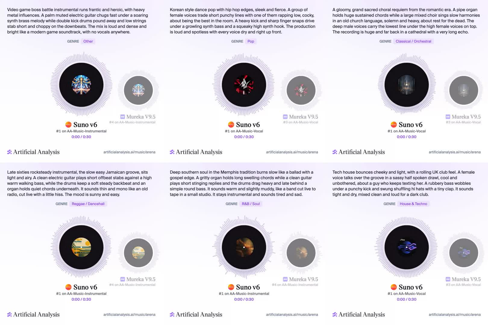

# AA-Music v1.1 Deep Dive: Suno v6 Leads Both Boards, but Ten Seconds of Listening Cannot Prove Full-Song Quality

> **Bottom line:** Artificial Analysis' AA-Music-Vocal v1.1 and Instrumental v1.1 are more than a leaderboard refresh. They introduce 1,000 new prompts across 17 genres, more than 37,000 blind votes from a recruited panel, loudness-normalized audio, and Bradley-Terry rankings with confidence intervals. Suno v6 currently leads both boards, but its Elo describes relative preference under this particular harness. The benchmark does not separately score lyric accuracy, prompt adherence, editability, cost, speed, or rights risk. More importantly, panelists can vote after hearing only ten seconds of each approximately three-minute track, so the result does not by itself establish long-form song structure.

On October 8, 2026, Artificial Analysis introduced AA-Music-Vocal v1.1 and AA-Music-Instrumental v1.1 in [an X thread](https://x.com/ArtificialAnlys/status/2107942662481612982). The two boards separately evaluate complete songs with sung or spoken vocals and instrumental music without vocals. Artificial Analysis says the new version uses 1,000 prompts across 17 genres, with formal ratings derived from blind preferences submitted by a recruited evaluator panel.

The refresh follows a concentrated run of releases including Suno v6, Lyria 3.5, Mureka V9.5, Eleven Music v2.5, and MiniMax Music 3.0. Music models are no longer producing only short clips with a musical texture. They are attempting lyrics, singing, sections, arrangement, and an approximately three-minute finished track in one pass. The evaluation problem has changed with them: the useful question is no longer whether a model can produce a melody, but whether its chorus works, its voice remains believable, and the song is still worth hearing three minutes later.

---

## 01 | These Are Two Different Tasks, Not One Board

AA-Music v1.1 separates vocals and instrumental generation:

| Benchmark | Input | What the model must complete | Major mixed variables |
|---|---|---|---|
| AA-Music-Vocal v1.1 | Style and song requirements in text | Write lyrics, generate singing or speech, and arrange the track | Songwriting, voice, pronunciation, sections, backing track, mix |
| AA-Music-Instrumental v1.1 | Style and instrumentation requirements in text | Generate music without sung or spoken vocals | Form, orchestration, performance feel, genre authenticity, mix |

No lyrics are supplied in the Vocal benchmark. This is not singing synthesis over a reference lyric. It is end-to-end song generation from a prompt. Off-topic lyrics, weak writing, repetitive sections, and poor accompaniment can all affect the final preference.

The Instrumental benchmark requires an endpoint with an explicit way to suppress vocals. Artificial Analysis may use an instrumental flag, style controls, or negative prompting. If an endpoint cannot separate instrumental and vocal generation, it enters only the Vocal benchmark. Elo therefore cannot be compared directly across the two boards, and strength in one modality does not guarantee strength in the other.

---

## 02 | The Real v1.1 Upgrade Is the Evaluation Harness

The published methodology and X thread describe this pipeline:

1. Vocal and Instrumental each use 500 prompts, for 1,000 total.
2. Prompts are balanced across 17 genres and test song structure, mood, instrumentation, or vocal style.
3. Each matchup presents two tracks generated from the same prompt and modality.
4. Model names, logos, and identifying details remain hidden until after the vote.
5. A panelist must listen to at least ten seconds of each track before choosing a preference.
6. Formal Elo uses only recruited-panel votes; public Music Arena votes do not count.
7. Bradley-Terry maximum-likelihood estimation converts pairwise preferences into a ranking, then rescales it to an Elo-like range.
8. The leaderboard reports 95% confidence intervals and genre-level rankings once enough votes exist.

At launch, Artificial Analysis reported more than 16,000 Vocal votes and more than 21,000 Instrumental votes, with more than 2,000 votes for every ranked model. Pairwise blind choice answers a useful and intuitive question more directly than asking a small panel to assign an isolated score from one to ten: given the same brief, which track would the listener rather continue hearing?

The harness also reduces common presentation bias. Tracks are moved toward -16 LUFS integrated loudness with one static gain change, capped at -1 dBTP true peak, then encoded to 44.1 kHz, 320 kbps MP3. Artificial Analysis applies no compression, limiting, or EQ. That reduces the advantage of “the louder track sounds better” and inconsistent delivery formats while preserving each model's dynamics and tonal balance as far as possible.

---

## 03 | Current Results: Suno Leads, but Places Three Through Six Form Tiers

The current Vocal results are:

| Model | Rank | Elo | 95% interval |
|---|---:|---:|---:|
| Suno v6 | 1 | 1142 | 1127–1157 |
| Suno v6-mini | 2 | 1116 | 1101–1131 |
| Mureka V9.5 | 3 | 1103 | 1088–1118 |
| Mureka V9 | 4 | 1052 | 1038–1066 |
| Lyria 3.5 | 5 | 1052 | 1038–1066 |
| Lyria 3 Pro | 6 | 1046 | 1032–1060 |
| MiniMax Music 3.0 | 11 | 1000 anchor | Fixed anchor |

Suno v6 is 26 Elo above v6-mini. Mureka V9.5 is 51 Elo above V9, the largest same-family version gain on the Vocal board. Mureka V9 and Lyria 3.5 have identical scores, while the interval for Lyria 3 Pro overlaps heavily with both. Ranks four through six are better understood as one statistical tier than as three precise capability levels.

The Instrumental top six are:

| Model | Rank | Elo | 95% interval |
|---|---:|---:|---:|
| Suno v6 | 1 | 1140 | 1125–1155 |
| Suno v6-mini | 2 | 1109 | 1094–1124 |
| Mureka V9 | 3 | 1081 | 1067–1095 |
| Mureka V9.5 | 4 | 1080 | 1065–1095 |
| Lyria 3 Pro | 5 | 1078 | 1064–1092 |
| Lyria 3.5 | 6 | 1076 | 1062–1090 |
| MiniMax Music 3.0 | 13 | 1000 anchor | Fixed anchor |

Only five Elo separate third from sixth, and Artificial Analysis explicitly calls the group statistically tied. The honest reading is that the two Suno models occupy the first tier while Mureka and Lyria form a tightly packed second tier. Turning 1081 and 1080 into durable claims of “third best” and “fourth best” mistakes table order for statistical certainty.

The thread describes [MiniMax Music 3.0](../2026-08-15/2026-08-15-minimax-music3-open-music-model-en.md) as the leading open-weights music model, yet it sits at 11th and 13th overall. Open weights have entered the mainstream comparison, but the preference gap to the current proprietary frontier remains visible. “Open weights” also does not automatically mean open training data, data licensing, or complete training code.

---

## 04 | One Thousand Complex Prompts Are Closer to Production Than a Handful of Demos

The X thread spans Korean dance pop with hip-hop edges, Memphis soul, UK-flavored tech house, late-sixties rocksteady, a Romantic sacred requiem, and a heavy-metal-influenced video-game boss battle.

These prompts describe more than a genre label. They specify:

- who performs and the desired vocal attitude;
- primary instruments, rhythmic organization, and timbral relationships;
- structural or emotional development;
- recording space, mix distance, and period character;
- required speech or vocals, or their explicit absence.

That is closer to a creator's real brief than “make a pop song,” and it is more likely to separate frontier systems. Mature models can all make a pleasant clip from a simple request. Complex prompts expose role-binding errors, missing instruments, inaccurate period style, structural collapse, and inconsistent mixing.

Genre stratification is also more useful than a single global score. An advertising team, a game-audio team, and an independent singer do not need the same “best model.” They need to know whether a system remains reliable in their genre, with or without vocals, under the structure and instrumentation they actually request.

---

## 05 | Preference Elo Measures “Liked More,” Not “More Correct”

Pairwise preference is effective for overall listening appeal, but it compresses many dimensions into one choice:

- a panelist may reward an attractive voice while overlooking off-topic lyrics;
- familiar commercial arrangements may beat a more faithful niche style;
- missing prompt requirements may be forgiven if the result is pleasant;
- a brighter, denser mix may win despite more repetitive structure;
- language, culture, and musical training can change the judgment of the same performance.

An Elo of 1142 does not mean Suno v6 is separately first in lyrics, melody, arrangement, audio quality, and prompt adherence. It means the model was preferred more often under this prompt set, generation configuration, matchup sampling, and panel distribution.

The public board does not separately score prompt adherence, lyric accuracy or language quality, long-range structure, audio artifacts, editability, controllability, inference time, price, or licensing risk. Production buyers need those dimensions alongside preference Elo, not hidden inside it.

---

## 06 | The Central Design Tension: Three-Minute Outputs, Ten Seconds to Vote

The methodology targets approximately three-minute tracks, and Vocal is described as end-to-end songwriting. Yet the voting gate requires only ten seconds of listening per track.

Ten seconds is better than allowing an unheard vote. It does not guarantee exposure to:

- the transition from verse to chorus;
- whether a second verse merely copies the first;
- lyrics that deteriorate later in the song;
- long-range development in the arrangement;
- a complete ending rather than an abrupt stop;
- stable vocal identity, pitch, and fidelity over the full duration.

The prompts and output length have entered the full-song era, while the voting protocol can still be dominated by the opening seconds. A stronger test of long-form quality would add segment sampling, completion rate, section-level questions, ending checks, and structural-consistency labels, separating immediate appeal from complete-work quality.

---

## 07 | The Methodology Is Public, but the Benchmark Is Not Independently Reproducible

Artificial Analysis publishes meaningful operational detail: task definitions, nominal duration, seed policy, loudness and encoding, blinding, minimum listening time, Bradley-Terry estimation, confidence intervals, leaderboard sample counts, and the API shape for Elo and CI.

I did not find the following artifacts on the public methodology, leaderboard, or API documentation pages:

- a versioned manifest containing all 1,000 prompts;
- model outputs or verifiable content hashes for every prompt;
- raw anonymous pairwise votes and the matchup-sampling matrix;
- panel size, location, language distribution, musical training, or recruitment filters;
- inter-rater agreement, repeated-item stability, or quality-control statistics;
- a bridge study that reruns the same models on both v1.0 and v1.1.

The methodology calls the prompt set reproducible, but without a downloadable fixed snapshot an external researcher cannot rerun the entire board from scratch. The formal ratings exclude public Arena votes, so the public can experience matchups but cannot reconstruct official Elo from those votes.

Two additional implementation choices matter. First, the benchmark generates one track per prompt per model. Random model variance is averaged across 500 prompts rather than measured through multiple seeds on the same prompt. Second, seed 42 is used only where the provider exposes a seed; unsupported controls fall back to the closest available value or provider default. The board therefore measures a combination of model capability, product endpoint, and exposed control surface.

These gaps do not make the ranking invalid. They define it as a third-party preference leaderboard with unusually useful public methodology, not an open benchmark artifact that anyone can independently recompute.

---

## 08 | Put Elo Inside a Larger Production Acceptance Matrix

Teams evaluating a music model can use AA-Music v1.1 to shortlist candidates, then add a production-specific test:

| Dimension | What to check |
|---|---|
| Overall preference | Global and target-genre Elo, confidence intervals, rank ranges |
| Prompt adherence | Instruments, structure, roles, mood, period, and negative constraints |
| Long-form quality | Verse/chorus/bridge/ending, repetition, late-song degradation |
| Lyrics and vocals | Natural language, rhyme, pronunciation, identity stability, speech-to-song transitions |
| Control and editing | Lyric locking, continuation, local regeneration, stems, duration, structural controls |
| Engineering cost | Generation time, failure rate, price, concurrency, API stability |
| Rights boundary | Commercial license, training-data statement, voice imitation, moderation |

For a 15-second advertising bed, ten-second blind preference may already be predictive. For a released three-minute song, looping game music, or a film deliverable that requires stems, the same Elo means something very different.

---

## 09 | Conclusion: The Leader Will Change, but the Evaluation Target Has Become a Work

The visible AA-Music v1.1 result is that Suno v6 leads both boards, Suno v6-mini follows, Mureka V9.5 makes a substantial Vocal gain, and Instrumental places three through six form an effectively tied Mureka/Lyria tier.

The more important change is methodological. Artificial Analysis is moving AI-music evaluation from cherry-picked demos and impressions toward prompt scale, genre stratification, loudness normalization, blind panels, pairwise statistics, and confidence intervals. That is far more reliable than a model vendor choosing its best examples.

A complete song still cannot be explained by one Elo score. The present protocol is strongest at measuring overall initial preference. It does not separately establish three-minute structure, lyric quality, prompt fidelity, production control, or rights safety. The next useful step is not merely more votes, but versioned public prompts and richer audit metadata, plus a separation of “which track do you like?” from “did it follow the brief, remain coherent, support editing, and meet delivery requirements?”

---

## Primary Sources

- [Artificial Analysis launch thread](https://x.com/ArtificialAnlys/status/2107942662481612982)
- [AA-Music benchmarking methodology](https://artificialanalysis.ai/methodology/music)
- [AA-Music-Vocal v1.1 leaderboard](https://artificialanalysis.ai/music/leaderboard/vocals)
- [AA-Music-Instrumental v1.1 leaderboard](https://artificialanalysis.ai/music/leaderboard/instrumental)
- [Artificial Analysis Data API documentation](https://artificialanalysis.ai/data-api/docs)
- [Music Arena](https://artificialanalysis.ai/music/arena)

*Data snapshot: October 9, 2026; the source thread was published on October 8, 2026. Rankings, sample counts, Elo, and confidence intervals will change as votes accumulate. Images are preserved locally from the original X thread. This audit did not have the recruited panel's raw votes, the complete prompt manifest, or the evaluation tracks, so its reproducibility assessment is limited to public pages and media.*
