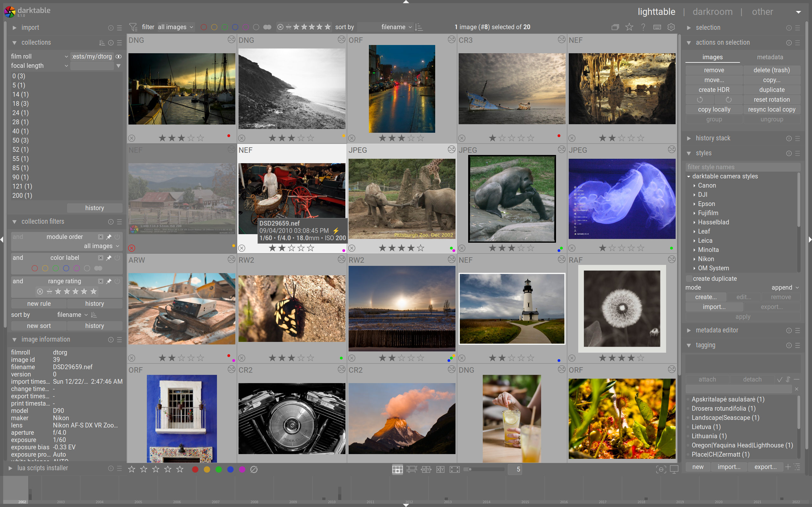
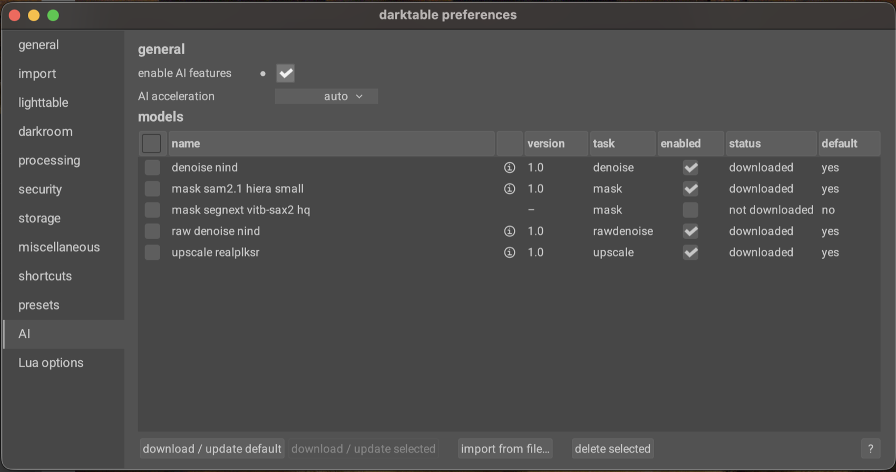
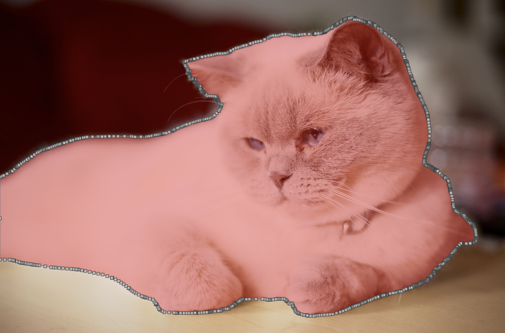
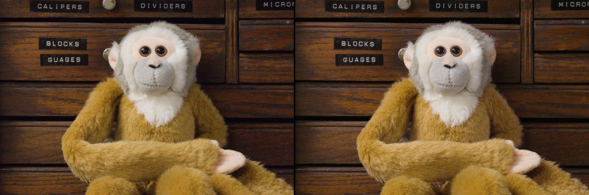

# Inside darktable 5.6: Not “Free Lightroom,” but an Auditable RAW, Color, and Local-AI Pipeline

> **Bottom line:** darktable does not win by being a free imitation of Lightroom. It is an open-source photographic system built around scene-referred color, an ordered pixelpipe, SQLite/XMP edit history, and local inference. Version 5.6 adds AI for the first time, but its most mature decision is refusing to disguise every neural operation as a nondestructive filter.

At first glance, [darktable](https://github.com/darktable-org/darktable) is easy to describe as “open-source Lightroom”: a catalog on one side, editing controls on the other, a RAW preview in the middle, and batch export at the end. The project's own README explicitly rejects that framing: **darktable is not a free Adobe Lightroom replacement.**

That is not modesty. It marks a different product contract. Lightroom draws much of its value from Adobe's ecosystem, cloud sync, mobile clients, presets, and commercial support. darktable's center of gravity is a RAW pipeline whose source, processing order, parameters, and local execution can be inspected.

As of October 8, 2026, the stable release is [darktable 5.6.2](https://www.darktable.org/2026/10/darktable-5.6.2-released/), published on October 4. This article pins its inspection to tagged commit [`20891f6`](https://github.com/darktable-org/darktable/commit/20891f6c6fa7be995e5bf9dff9d1ee5062051773) rather than mixing moving `master` features into the stable product.

---

## 01 | Three Systems, Not One Editing Panel

The darktable workflow has three major layers:

1. **lighttable** is a digital asset manager. Imports, collections, ratings, tags, metadata, filtering, and batch actions are backed by a SQLite catalog.
2. **darkroom** is the RAW development and editing environment. Each processing module enters a pixelpipe with a defined order.
3. **export** reruns a full-resolution, high-quality pipeline to produce delivery formats such as JPEG, TIFF, AVIF, and HEIF.

In the 5.6.2 source, `src/iop/CMakeLists.txt` declares 91 image-processing modules. They are not 91 flags in one giant function. They are modular plugins linked into darktable: exposure, demosaic, lens correction, color calibration, tone mapping, local contrast, and sharpening each read pixels at a particular stage and hand their output to the next stage.

That is why module order is not merely interface layout. Moving an operation before or after exposure can change its mathematical meaning. The history stack records when the user made edits; the pixelpipe order records how computation actually occurs. Those are separate concepts.

The source also shows the project's scale. The stable tag contains roughly 410,000 lines of code under `src/`, including about 353,000 lines of C plus C++, headers, OpenCL kernels, a Lua API, and platform integration. Its history exceeds 46,000 commits and it is licensed under GPL-3.0. Scale is evidence of engineering depth, not a substitute for image-quality validation.

---

## 02 | The Pixelpipe Is the Product: Interaction and Export Take Different Paths

darktable uses 4×32-bit floating-point pixel buffers and accelerates traditional image processing through SSE, OpenMP, and OpenCL. To keep desktop editing responsive, however, it does not run one identical pipeline for every task:

- the thumbnail pipe favors speed;
- the standard darkroom pipe processes the visible region;
- a reduced interactive pipe serves slider movement and immediate feedback;
- high-quality preview and export use more complete paths.

Modules that depend on neighboring pixels, scale, or boundary information can therefore show subtle differences between normal preview and final output. High-quality mode is not a decorative toggle; it trades responsiveness for a result closer to the export pixelpipe.

This is an honest engineering choice. The editor does not pretend every mouse movement recomputes the final deliverable. It distinguishes an interactive approximation from delivery computation, a distinction professional users should understand before evaluating output.

---

## 03 | Scene-Referred Is an Exposure Model, Not a Filter Style

Since 3.6, darktable has recommended a scene-referred workflow. Most edits occur in linear RGB that is approximately proportional to scene light. A late display transform such as sigmoid, filmic rgb, or AgX then compresses the scene's dynamic range into a monitor or output medium.

This differs from the intuitive pattern of first making an image look pleasing in display RGB and stacking filters afterward. Exposure, white balance, and color calibration operate on scene information; the display transform maps an unbounded lighting world into a bounded medium. Version 5.6 uses sigmoid by default for new installations, while filmic rgb, AgX, and legacy display-referred workflows remain available.

The benefit is a clearer division of responsibility for highlights, color, and contrast, especially with high-dynamic-range RAW files. The cost is a real learning curve: users cannot infer processing order from module names or translate Lightroom slider values one for one.

---

## 04 | Nondestructive Editing Still Depends on Both a Database and Sidecars

darktable does not overwrite the original. Exposure, crop, masks, and module parameters are stored as edit history. By default, `library.db` provides fast catalog queries while XMP sidecars next to the photographs support migration, recovery, and external backup.

This dual design is pragmatic: the database is optimized for speed, XMP for portability. But XMP is not a universal rendering recipe. darktable can import Lightroom tags, ratings, GPS data, and a subset of edits, yet the two engines use different algorithms and will not produce identical results. Unknown or deprecated operations can also be lost.

Downgrades require similar care. Database migrations are generally one-way, and history written by a new release may reference modules an older release cannot understand. A responsible upgrade starts with recoverable backups of the catalog database, configuration, XMP files, and originals, followed by validation on copied data.

---

## 05 | Why AI in 5.6 Matters: Opt-In, Local, and Governed Separately

[darktable 5.6](https://www.darktable.org/2026/06/darktable-5.6.0-released/) is the project's first official AI release. The source-level `USE_AI` build option defaults to off. Official packages include AI support, but users must enable it in preferences; models are neither bundled nor downloaded or loaded before activation.

The project separates traditional GPU processing from neural inference:

- OpenCL accelerates exposure, denoise, color, and other pixelpipe modules;
- ONNX Runtime executes AI models through CoreML, CUDA, MIGraphX, OpenVINO, or DirectML, with CPU always available as a fallback.

An available OpenCL device therefore does not mean AI uses the same GPU path. These are separate runtimes with separate drivers and failure modes.

Weights live in the separate [`darktable-ai`](https://github.com/darktable-org/darktable-ai) repository. Its model criteria include a compatible license, published research, training-code and data provenance, documented limitations, local inference, and conversion tooling. The catalog is deliberately smaller than those of many commercial editors, but easier to audit. The project says all inference is local, with no cloud processing or telemetry. This audit verified that design in source and documentation but did not perform independent network capture.

---

## 06 | Object Masks: Let the Model Find the Subject, Then Return to Ordinary Editing

The 5.6 object mask uses SAM 2.1 or SegNext. After a user clicks a subject, the encoder analyzes the image and positive or negative prompts refine the selection. The important part is its output: darktable vectorizes the prediction into a normal editable path and passes it to the existing masking and blending system.

AI is therefore not an opaque final switch. Users can move nodes, repair boundaries, feather or combine the mask, and continue processing it with established modules. The model proposes a starting point; conventional tools make it deliverable.

The limits are explicit. A vector path cannot preserve every high-frequency strand of hair or fur. Initial encoding can take several seconds, and disconnected objects generally require separate masks. It accelerates selection; it is not one-click professional roto.

*Sample “A cat named Ebby” © 2020 Suki2019, CC BY-SA 4.0; interface image from darktable's official 5.6 AI article.*

---

## 07 | Keeping Neural Restore Outside the Pixelpipe Is a Sign of Architectural Discipline

Neural Restore in 5.6 offers RAW denoise, RGB denoise, and upscaling, but does not pretend to be an ordinary nondestructive module. It creates a new file and imports it back into the catalog:

- RAW denoise runs before demosaic and writes CFA Bayer or LinearRaw DNG;
- RGB denoise and upscale write TIFF with an ICC profile;
- upscaling belongs near the end of the editing workflow.

The reasoning is practical. Neural processing can alter resolution, pixel structure, and data semantics. Forcing that operation into a freely reorderable pixelpipe would complicate caches, masks, coordinates, and reproducibility. A new DNG or TIFF consumes storage, but creates an explicit branch: the original RAW and its history remain intact while the neural result becomes a new editable asset.

This is not purely “nondestructive AI.” It is a traceable derived-file workflow. Making the irreversible boundary visible rather than hiding the model behind another slider may be the most mature product decision in 5.6.

*“A Raw Denoise Cross-comparison” © 2025 Dave22152, CC BY-SA 4.0; comparison from darktable's official 5.6 AI article.*

---

## 08 | Maturity: Formal Releases, but Not an All-Green Acceptance Snapshot

darktable 5.6.2 is a bug-fix release following 5.6.1, combining 63 darktable and Rawspeed commits across 26 merged pull requests. It fixes AI buffer handling, object-mask output sizing, a Neural Restore RAW-denoise crash, and several OpenCL issues. Official Windows, macOS, Linux/AppImage artifacts and checksums are available.

The source contains unit tests and dedicated AI backend/API tests. Still, the GitHub checks attached to the exact `release-5.6.2` commit were not universally green at inspection time. Packaging jobs plus Linux LLVM, Linux GNU Debug, and Windows UCRT64 succeeded; one Linux release test and one macOS release job failed, and another job was cancelled. The defensible claim is “formal releases with multi-platform CI evidence,” not “every check passed.”

Operational limits remain:

- examples of unsupported modes include some Apple ProRAW DNG, compressed CinemaDNG variants, DNG 1.7 JPEG XL, and newer compressed Sony ARW files;
- printing is not implemented on Windows;
- AI models are separate downloads, and backend/driver compatibility affects speed;
- Lightroom XMP migration preserves only part of the semantics and cannot guarantee visual equality;
- database upgrades require recoverable backups.

This audit inspected the stable source tag, history, build configuration, tests, release notes, manual, and CI records, and counted source/modules. **It did not compile or launch darktable locally, nor run controlled RAW exports, color-difference measurements, performance tests, or model-quality comparisons.** Its conclusions concern architecture and inspectable evidence, not independent image-quality acceptance.

---

## 09 | Who Should Put It Into a Real Workflow

darktable is a strong fit for:

- photographers who want RAW files, metadata, and edit history to remain local;
- advanced users willing to learn scene-referred color and module ordering;
- teams that value Linux, Lua automation, batch work, or an auditable pipeline;
- users able to maintain a representative RAW regression set for their cameras.

It should not be treated as a frictionless Lightroom replacement. Anyone dependent on Adobe cloud services, mobile sync, plugins, team review, printing, or a large installed base of presets and XMP edits must validate those migration costs separately.

A responsible trial starts with a copied project and 20–50 representative RAW files spanning cameras, ISO values, skin tones, highlights, and lenses. Test import, color, masks, denoise, export, restart recovery, and downgrade strategy before expanding the catalog.

---

## 10 | Conclusion: Its Advantage Is Not “Free,” but Honest Processing Boundaries

The most instructive part of darktable is neither its 91 modules nor the arrival of AI. It is how the project handles boundaries: preview and export are described as different paths; database and sidecars have distinct jobs; OpenCL and ONNX Runtime are not conflated; object recognition becomes an editable mask; neural processing that changes pixel structure produces a new asset.

It is not an open-source Lightroom skin, and it is not the right migration for every photographer. It is mature, complex local photographic infrastructure with real compatibility gaps. **The central achievement of darktable 5.6 is not merely admitting AI into photo editing, but keeping the original, history, model, and irreversible boundary visible after AI arrives.**

---

## Primary Sources

- [darktable GitHub repository](https://github.com/darktable-org/darktable)
- [darktable 5.6.2 release notes](https://www.darktable.org/2026/10/darktable-5.6.2-released/)
- [darktable 5.6.0 release notes](https://www.darktable.org/2026/06/darktable-5.6.0-released/)
- [Meet darktable 5.6 AI tools](https://www.darktable.org/2026/06/meet-darktable-5.6-ai-tools/)
- [darktable 5.6 user manual](https://docs.darktable.org/usermanual/5.6/)
- [The pixelpipe and module order](https://docs.darktable.org/usermanual/5.6/en/darkroom/pixelpipe/the-pixelpipe-and-module-order/)
- [History stack](https://docs.darktable.org/usermanual/5.6/en/darkroom/pixelpipe/history-stack/)
- [XMP sidecar files](https://docs.darktable.org/usermanual/5.6/en/overview/sidecar-files/)
- [Lightroom sidecar import boundaries](https://docs.darktable.org/usermanual/5.6/en/overview/sidecar-files/sidecar-import/)
- [AI-generated masks](https://docs.darktable.org/usermanual/5.6/en/darkroom/masking-and-blending/masks/ai-masking/)
- [darktable AI model repository](https://github.com/darktable-org/darktable-ai)
- [Stable AI build option and source](https://github.com/darktable-org/darktable/blob/20891f6c6fa7be995e5bf9dff9d1ee5062051773/DefineOptions.cmake#L26)

*Audit date: October 8, 2026. Stable snapshot: `release-5.6.2` / `20891f6c6fa7be995e5bf9dff9d1ee5062051773`. The repository, model catalog, CI, and platform support will continue to change.*
