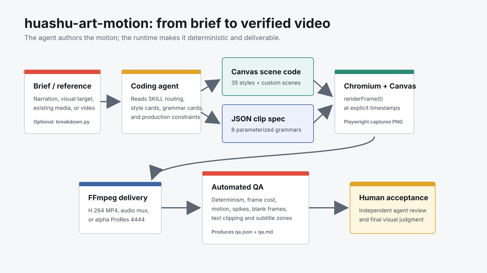
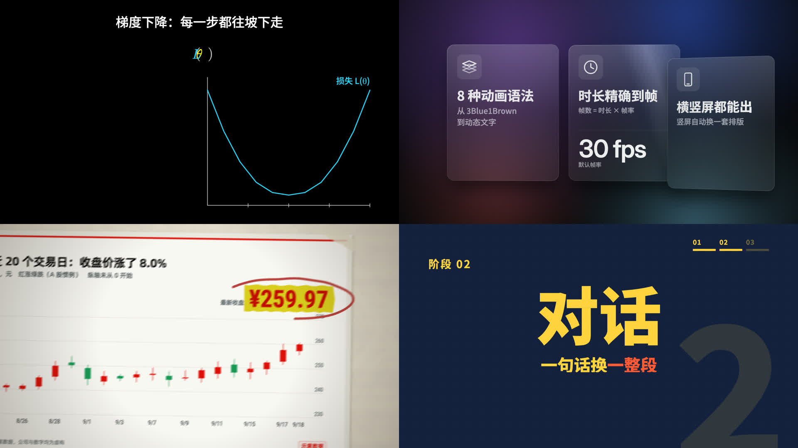
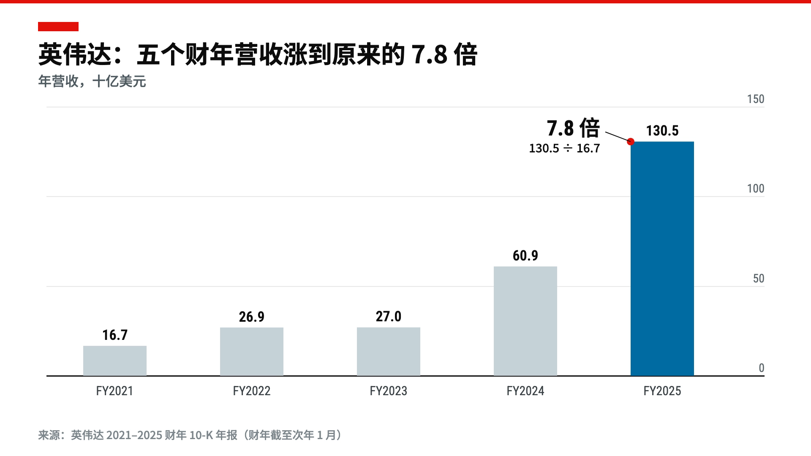

# Inside huashu-art-motion: Not a Text-to-Video Model, but a Canvas Animation Production System for Coding Agents

> **Bottom line:** `huashu-art-motion` is an agent skill, but calling it a prompt pack misses most of the repository. It combines task-routing documents, 35 coded art-style scenes, nine explainer-animation grammars, a Canvas 2D runtime, frame-by-frame Playwright rendering, FFmpeg encoding, and quantitative QA. The coding agent interprets the brief and authors or adapts the scene. A deterministic browser pipeline produces the actual video. That makes it much closer to a reusable animation production system than a conventional skill, but it is not a text-to-video model that turns one sentence into a finished film.

- **Project:** [alchaincyf/huashu-art-motion](https://github.com/alchaincyf/huashu-art-motion)
- **First public release and v1.0.0:** October 6, 2026
- **Inspected revision:** [`57d6760`](https://github.com/alchaincyf/huashu-art-motion/commit/57d67608ab458f57d9b153b1a2831b921e22498b), October 8, 2026
- **Inspection date:** October 9, 2026
- **Snapshot:** four commits, one release, 2,630 stars, 275 forks, and passing CI on the current main branch



## 01 | It Is a Skill and a Runtime, but Not a Video Model

Two descriptions can misrepresent this project in opposite directions.

“It is just a prompt skill” understates the executable repository. `scripts/engine/` contains Canvas scenes, transitions, painting tools, camera helpers, charts, typography, and character rigs. `render.py` exports frames and video. `qa.py` tests determinism, motion, rendering cost, discontinuities, blank frames, and text framing.

“It generates any artistic animation from one sentence” overstates the automation. There is no trained model or standalone natural-language-to-video service here. The coding agent that loads the skill makes the creative decisions: it routes the task, chooses a recipe or grammar, prepares assets, writes scene code or a JSON specification, then runs rendering and QA.

The more accurate stack is:

| Layer | Responsibility | What it does not do |
|---|---|---|
| `SKILL.md` and references | Route work into analysis, style, narration, character, music, or scrolling-world workflows | Produce pixels |
| Style and grammar cards | Supply parameters, motion motifs, transitions, failure notes, and acceptance rules | Act as model weights or filter presets |
| Canvas engine | Draw scenes, cameras, charts, text, and transitions at a requested time | Understand user intent |
| Playwright and FFmpeg | Turn browser frames into MP4 or alpha video | Replace creative judgment |
| QA and independent review | Surface nondeterminism, stillness, spikes, blank frames, and text-layout problems | Prove that the art is good |

It is a knowledge and execution environment for agent-authored programmatic animation, not another Veo, Sora, or Seedance.

## 02 | A Reference or Narration Passes Through Four Compilers

The repository separates production into inspectable stages.

**Evidence extraction comes first.** `scripts/analyze/breakdown.py` reads dimensions and frame rate with FFprobe, decodes low-resolution grayscale frames with FFmpeg, and computes mean frame-to-frame differences. Its outputs include 4fps contact sheets, transition starts, beat-grid candidates, per-segment motion heatmaps, keyframe overviews, and full-resolution reference frames. The point is not to claim that AI “understands” the video, but to measure where cuts and movement occur before reconstruction begins.

**The evidence becomes executable design.** The agent follows the skill router and selects a style recipe or explainer grammar. Full artistic scenes are JavaScript. Narration-driven inserts can instead use a JSON specification containing duration, frame rate, aspect ratio, safe areas, theme, data, and timed cues.

**The design becomes deterministic frames.** Export does not screen-record real-time playback. The browser exposes `renderFrame(t)`, and `render.py` requests every timestamp explicitly, reads the Canvas as PNG, and pipes those frames into FFmpeg. The same timestamp can therefore be rendered again for comparison, while a parameterized clip contains exactly `round(duration × fps)` frames.

**Frames become deliverables and evidence.** The default output is H.264/yuv420p MP4. Parameterized clips can also export transparent ProRes 4444. FFmpeg muxes or encodes audio at the end. `qa.py` then redraws fixed timestamps and writes `qa.json`, `qa.md`, sampled frames, and motion heatmaps.

The workflow is valuable because each intermediate representation can be inspected and changed. Its strength is control, not invisible end-to-end automation.

## 03 | The 35 Art Styles Are Not 35 Filters

The repository really does contain 35 numbered scene files and 35 corresponding recipe cards. They cover cave painting, Egyptian murals, Gothic manuscripts, Renaissance art, Impressionism, Post-Impressionism, Bauhaus, Constructivism, 8-bit graphics, ink painting, Dunhuang, Klimt, Munch, Dali, Hopper, Monet, Shinkai, and other directions.

A “style” here is not a LUT or diffusion LoRA. Each scene defines:

- how brushes, textures, palettes, and geometry construct the image;
- which subjects move in small loops rather than becoming a slideshow;
- which elements live in camera coordinates and which remain in world coordinates;
- which transition language should introduce the next scene;
- where the current implementation is most likely to fail.

That is why the skill requires a one-frame-first checkpoint and three alternative directions. Static composition and style recognition are validated before motion. For humans or character-like subjects, the author recommends generated frames or existing sprites, while code controls placement, timing, material, and compositing. Canvas is the controllable scene and motion layer, not a universal character illustrator.

These style labels should still be treated as production routes, not authoritative art-history classifications or automatic permission to imitate a living artist, channel package, brand character, or copyrighted work.

## 04 | Eight of the Nine Explainer Grammars Are Truly Parameterized



The project lists nine explainer-animation grammars: Kurzgesagt, Vox, whiteboard, storytime, kinetic type, 3Blue1Brown, keynote UI, finance charts, and presenter-led financial explanation.

One boundary matters. The first eight include `clips/*.js`, example JSON, and a parameterized clip runtime. The ninth ships as a grammar card and full-film code snapshot that requires user-supplied character assets. The README itself distinguishes “reference implementation” from a ready-to-render project.

The parameterized contract is practical:

```json
{
  "grammar": "t3_finance_chart",
  "duration": 7,
  "fps": 30,
  "width": 1920,
  "height": 1080,
  "data": { "chart": "bar", "series": [] },
  "cues": [
    { "at": 0.0, "kind": "title" },
    { "at": 1.2, "kind": "bar" },
    { "at": 4.4, "kind": "highlight" }
  ]
}
```

It turns “make a seven-second finance chart” from a one-off JavaScript project into data a narration pipeline can invoke. Landscape, portrait, safe areas, transparency, and exact frame count belong to the runtime. The agent still chooses the copy, data, pacing, and grammar.

## 05 | How It Relates to Remotion, HyperFrames, and MotionClone

All four systems can produce video from code, but they operate at different levels.

| Tool | Primary input | Main role |
|---|---|---|
| Remotion | React components, data, and time | General-purpose programmatic video framework |
| HyperFrames | HTML, CSS, media, and seekable animation | Deterministic rendering of browser content |
| [MotionClone](../2026-09-10/2026-09-10-motionclone-reference-video-editable-hyperframes-en.md) | A reference video | Reconstruct references as editable HyperFrames layers |
| huashu-art-motion | A brief, narration, reference, or JSON spec | Teach an agent how to design, then supply a Canvas engine, style library, and QA |

The closest description is “a Canvas animation framework with its own production textbook and sample rooms.” It does not use React compositions or treat arbitrary web pages as its main input. Scenes center on one 2D Canvas and explicit time functions. That is lightweight and controllable for drawing, charts, and explanation, but mature React composition ecosystems, complex DOM layout, and a visual timeline editor are outside its strengths.

## 06 | The Acceptance System Matters More Than the Style Count

Many animation skills stop at “an MP4 was exported.” This repository asks harder questions:

- Does the same timestamp render to identical pixels twice?
- What are average, peak, and cold-frame rendering costs?
- How much of the frame actually moves, and does it remain nearly static too long?
- Are there isolated visual discontinuities?
- Does a near-blank frame appear?
- Is text clipped, overlapping, or entering the subtitle safe zone?
- Can every declared transition render rather than merely exist in source code?

`qa.py` hooks Canvas `fillText`, `strokeText`, `drawImage`, and transform state. It propagates text boxes from offscreen canvases to the main output and filters momentary warnings by duration. That is not a general aesthetic model, but it is substantially better than assuming a successful render is a good render.

Quantitative QA remains diagnostic. More moving pixels do not guarantee better animation. Determinism does not prove correct composition. Text inside bounds does not make a story clear. The skill therefore requires a second agent that did not participate in production to watch the result. Automated checks and independent visual acceptance are deliberately separate.

## 07 | Local Verification: Working Paths Without Claiming the Whole System Passed



I ran the following checks on macOS against the inspected revision:

| Check | Result |
|---|---|
| `python3 -m unittest discover -s tests -v` | 61/61 passed |
| Post-Impressionist scene still | Produced a 1920×1080 RGBA PNG |
| Post-Impressionist scene QA | Deterministic; 14.78% motion area; zero spikes and zero framing warnings |
| Parameterized finance-chart clip | Produced a 7.000-second, 1920×1080, 30fps H.264/yuv420p MP4 |
| Full decode | FFmpeg decoded the complete file without errors |
| Current GitHub Actions | Python 3.10/3.12 contracts and Windows render smoke test passed |

This evidence covers base configuration, media contracts, one Canvas scene, one parameterized encoding path, and QA. It does **not** establish that all 35 styles pass as complete films on this machine. I did not independently validate alpha ProRes, real Volcengine voice synthesis, every host image tool, a complete narrated film, or all online agent hosts.

The repository's own compatibility report preserves the same boundary. Codex online regression passed. Claude Code and Kimi installed and ran the local CLI, but online sessions were blocked by 429 and 403 responses from the test accounts. That is not evidence of three fully validated end-to-end hosts.

## 08 | Voice and Images Are Permissioned Bridges, Not Embedded Models

Base code animation requires no image or voice account. The optional media layer starts only when a task needs character frames or narration:

- images can be imported or generated through a real image tool exposed to the current agent session;
- audio can reuse an existing recording, use a macOS system voice, or call a configured Volcengine voice clone;
- Python prepares a plan, checks permissions, validates dimensions, transparency, and hashes, then accepts the asset into the project;
- the scripts do not pretend to invoke host tools and do not treat the presence of credentials as authorization to spend money or upload media.

The policy design is unusually careful. Project configuration may tighten permissions to `deny`, but cannot grant cloud access, paid API use, reference-image upload, or voice training. Upgrading an old config does not activate a new capability. Existing output is not overwritten, and successful artifacts receive source and SHA sidecars.

Cloud remains cloud. Choosing a remote image or voice service sends media away from the local machine. A `configured_unverified` state means only that invocation prerequisites exist; it does not prove account status, quota, voice quality, or service availability.

## 09 | Maturity and Licensing: Disciplined Engineering in a Very Young Project

At the snapshot date, the public repository had only four commits. `v1.0.0` shipped on October 6. The main branch subsequently added media capabilities, 61 tests, a release manifest, CI, and a Windows concurrent-loading fix. The release and current `main` therefore do not expose exactly the same surface.

The rapid rise to 2,630 stars and 275 forks shows strong attention, not long-term compatibility, migration history, or production adoption. At roughly 51 MB, the repository includes fonts, character frames, and showcase media. It behaves more like a production kit with examples than a small library.

The root MIT license is not the entire rights story:

- code and documentation are MIT;
- fonts retain their SIL OFL terms;
- derived stroke-order data uses the Arphic Public License;
- Huashu character artwork, character frames, and overview or demo media containing that character are for this skill's demonstration only and are not included in the MIT grant.

Reusing the engine and grammars is therefore much clearer than lifting the demonstration character and visual package into a commercial production. This article does not republish those restricted character assets. Its images are an original architecture diagram and character-free frames rendered locally from MIT-licensed code.

## 10 | Where It Fits Best

It is a strong fit for:

- chart, whiteboard, typography, and concept animations inside technical, finance, or educational narration;
- inserts that need exact duration, deterministic rerendering, landscape or portrait output, and transparency;
- teams that want one reference analysis to become reusable scene, transition, and style rules;
- creators comfortable asking a coding agent to change code and using command-line rendering and QA.

It should not be mistaken for:

- a one-prompt model for arbitrary cinematic shots;
- a desktop editor with a timeline, media bin, and manual keyframe UI;
- a reverse-engineering tool that recovers source layers from a reference;
- permission to reproduce an artist, channel package, or character IP commercially;
- a system where numeric QA replaces direction, design, and editing judgment.

A practical workflow is to divide narration into five-to-twelve-second animation tasks, select a grammar, and author a spec. Important style scenes should pass a one-frame checkpoint. Generate characters or media only when needed. Inspect QA and keyframes after rendering, ask an independent agent or human to review the clip, and return the accepted inserts to the normal edit.

## Conclusion

The most important part of `huashu-art-motion` is not the marketable number of 35 styles. It is the way one animation experiment became a structure an agent can read, code can execute, FFmpeg can deliver, and QA can revisit.

The project is not primarily asking which model can draw best. It asks a more engineering-oriented question: **once a coding agent can write software, how do we make it follow an animator's production order and turn the result into stable video?**

The answer is backed by real code and runnable examples: measure the reference, validate one frame first, make time explicit, render deterministically, and separate technical QA from aesthetic acceptance. It remains a project with only days of public history, and its full-film automation, cross-host online validation, and third-party asset governance have visible limits. As an agent-native animation production kit, however, it has already moved far beyond a conventional prompt skill.

## Primary Sources

1. [huashu-art-motion repository and README](https://github.com/alchaincyf/huashu-art-motion)
2. [Inspected revision 57d6760](https://github.com/alchaincyf/huashu-art-motion/commit/57d67608ab458f57d9b153b1a2831b921e22498b)
3. [SKILL.md](https://github.com/alchaincyf/huashu-art-motion/blob/57d67608ab458f57d9b153b1a2831b921e22498b/SKILL.md)
4. [Canvas frame renderer](https://github.com/alchaincyf/huashu-art-motion/blob/57d67608ab458f57d9b153b1a2831b921e22498b/scripts/engine/render.py)
5. [Automated QA](https://github.com/alchaincyf/huashu-art-motion/blob/57d67608ab458f57d9b153b1a2831b921e22498b/scripts/qa.py)
6. [Reference-video breakdown](https://github.com/alchaincyf/huashu-art-motion/blob/57d67608ab458f57d9b153b1a2831b921e22498b/scripts/analyze/breakdown.py)
7. [Compatibility and validation scope](https://github.com/alchaincyf/huashu-art-motion/blob/57d67608ab458f57d9b153b1a2831b921e22498b/references/compatibility.md)
8. [v1.0.0 release](https://github.com/alchaincyf/huashu-art-motion/releases/tag/v1.0.0)
9. [MIT license](https://github.com/alchaincyf/huashu-art-motion/blob/57d67608ab458f57d9b153b1a2831b921e22498b/LICENSE); asset exceptions are stated in the [README license section](https://github.com/alchaincyf/huashu-art-motion#许可证)

*Repository and popularity snapshot: October 9, 2026. Stars, forks, issues, CI, and main-branch contents will change. Independent verification was limited to the tests, scene, parameterized clip, and decode checks listed above.*
