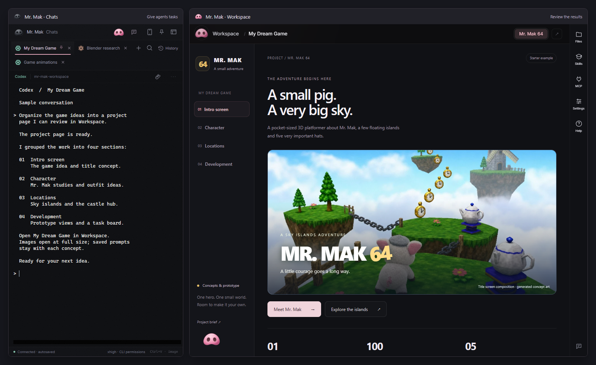
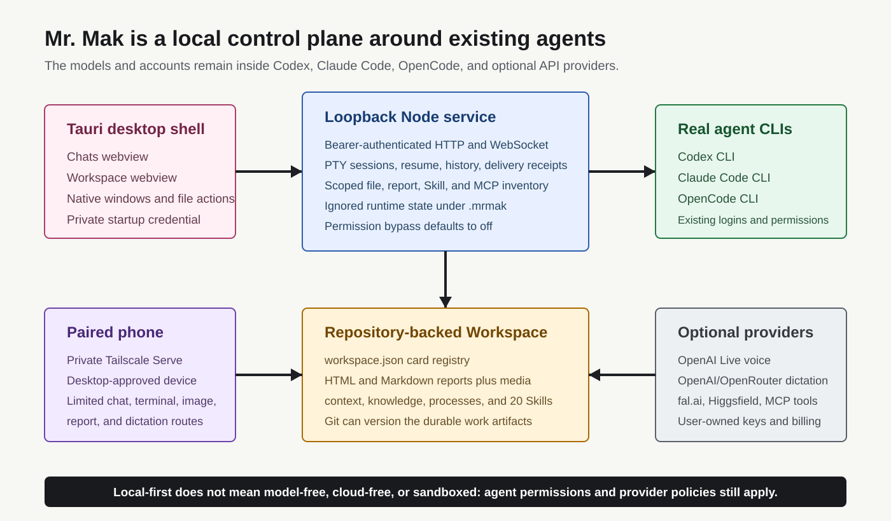
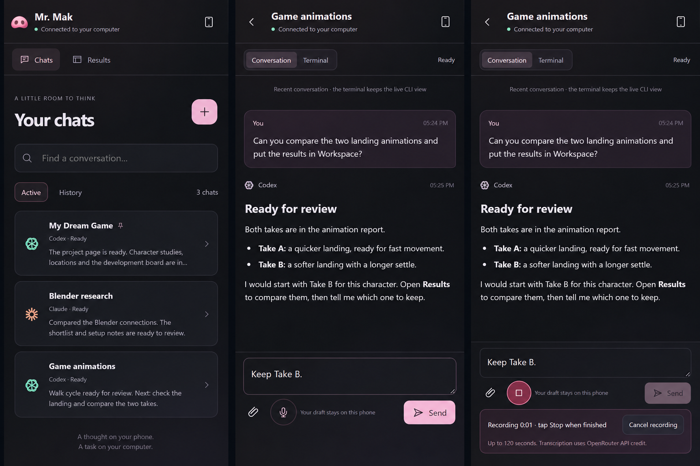

# Mr. Mak Workspace Source Audit: Not a New Agent, but a Local Studio Joining CLIs, Project Evidence, and Mobile Access

> **Bottom line:** Mr. Mak Workspace neither trains a model nor replaces Codex, Claude Code, or OpenCode. It is an MIT-licensed local control plane for those tools. Tauri opens separate Chats and Workspace windows; a loopback Node service manages real CLI PTYs, session recovery, files, and reports; React organizes project cards, Markdown, HTML, media, Skills, and MCP inventory. Release 0.5.0 adds a Tailscale-backed mobile surface with a deliberately limited action set. Its strongest idea is not another chat interface. It separates running tasks from reviewing durable work.

[`witnesstodark/mr-mak-workspace`](https://github.com/witnesstodark/mr-mak-workspace) was created on September 15, 2026. At the October 9 audit it had roughly 343 stars and 97 forks. The latest public version was [`v0.5.0`](https://github.com/witnesstodark/mr-mak-workspace/releases/tag/v0.5.0), published on October 8. The main branch had already moved to `0.5.1`, adding mobile terminal navigation, chat closing, and direct Workspace status and category controls.

This article audits main at [`c7c9fbf`](https://github.com/witnesstodark/mr-mak-workspace/tree/c7c9fbfd0d9c4f961536392fbd50b71ff0b0c528), while treating `v0.5.0` as the released product boundary. That distinction matters when a fast-moving main branch contains features downloaded users do not yet have.

---

## 01 | It Is Not an Agent Model; It Is a Local Console for Existing CLIs

Mr. Mak launches real command-line tools already installed and authenticated on the user's computer:

- Codex CLI;
- Claude Code CLI;
- OpenCode CLI; and
- ordinary shell sessions.

Each chat is a real PTY rendered through xterm.js. When sessions are created, stopped, resumed, or reconnected, the service attempts to preserve the provider CLI's native conversation or session identity instead of treating a terminal screenshot as history. The underlying tools still own model selection, accounts, usage limits, native histories, and permission behavior.

Mr. Mak therefore does not provide its own AI. It provides three kinds of infrastructure:

1. **Session control:** terminal tabs, activity, unread completions, pinning, order, history recovery, and attachment paths;
2. **Durable work:** project cards for research, images, videos, prompts, Markdown, and HTML reports; and
3. **Project context:** `context/`, `knowledge/`, `processes/`, `.agents/skills/`, and `.claude/skills/` keep working methods with the repository.

That is the difference between a thin chat wrapper and a workbench. The agent operates on real files, deliverables enter the project tree, and Workspace becomes a review surface rather than another transcript.

---

## 02 | Two Windows Separate Execution from Acceptance

The desktop is not merely a split pane. It uses two independently minimizable Tauri webviews:

| Window | Main responsibility | Persistence |
|---|---|---|
| Chats | Run CLIs, issue tasks, watch terminals, and manage sessions | Native CLI history and local `.mrmak` state |
| Workspace | Review project cards, reports, media, files, Skills, and MCP state | Repository files under `workspace/` plus `workspace.json` |

This simple division addresses a real long-running-agent problem: execution logs are not deliverables, and a completed chat does not prove that work was saved, organized, previewed, or accepted.

The template includes four sample cards: My Dream Game, Creative MCP Connections, Make Workspace Yours, and Arachne Character Lab. Its own validation found **four cards, 16 steps, 177 images, eight videos, and 20 shared Skills**. These are not bundled models. They demonstrate the kinds of file-backed work the interface can review.

---

## 03 | The Architectural Center Is the Loopback Node Service

Tauri owns desktop lifecycle, native windows, file selection, drag and drop, trash, and platform integration. Most product behavior lives in the local Node service:

1. Tauri launches the packaged Node runtime and service.
2. The service binds an ephemeral `127.0.0.1` port.
3. It creates a bearer credential and sends it to Tauri through a private startup pipe.
4. Chats and Workspace use authenticated HTTP and WebSocket calls.
5. The service starts real CLI PTYs and reads repository files, native histories, and ignored `.mrmak` state.

`runtime.json` stores only the process ID and local origin, not the window credential. File previews use another origin and scoped grants, so report content does not automatically receive the desktop control API.

This is a cleaner boundary than placing unrestricted filesystem and terminal power directly inside a frontend. UI, terminal control, file content, and mobile access receive different interfaces. It is still a same-user local application, not an operating-system sandbox for arbitrary untrusted programs.

---

## 04 | The Repository Is the Durable Memory Layer, Not a Hidden Cloud Database

`workspace/workspace.json` is the card registry. Each entity records a title, description, category, status, dates, folder, default step, and report paths. The actual content remains ordinary HTML, Markdown, images, videos, and project files.

That gives the design several useful properties:

- reports remain openable in browsers and editors outside Mr. Mak;
- artifacts can be diffed, backed up, copied, or published with Git;
- `knowledge/` and `processes/` become project-level experience rather than opaque global model memory;
- Codex and Claude Skills share a maintained source, with drift checked automatically; and
- one agent can create an artifact while another agent or a human reviews the same file.

Not all state belongs in Git. `.mrmak` session state, native chat histories, `.env`, account logins, and job receipts are intentionally local and ignored. The repository preserves **deliverable work memory**, not a complete portable clone of every terminal and provider session.

---

## 05 | Mobile Is a Restricted Remote Control, Not a Cloud Agent

Mobile access is the visible headline in 0.5.0. It does not move execution to a server. The computer must remain awake, Mr. Mak and the selected CLI must remain running, and both devices must be connected through the same Tailscale network.

Pairing combines a QR code, a phone request, a matching six-digit code, and explicit desktop approval. Tailscale Serve creates a private HTTPS route; the code refuses to enable public Funnel. A paired device receives an HttpOnly session cookie. The desktop stores a credential hash and does not send its control token or model API keys to the phone.

The current phone surface can:

- read recent Codex and Claude messages or open the live terminal view;
- send a complete prompt, images, and a limited set of terminal navigation keys;
- resume, close, or start an installed agent session;
- read scoped Workspace reports inside the repository; and
- record speech, review a transcription draft, and then choose whether to send it.

It is not a full remote desktop or general file manager. Conversation mode omits tool output and exposes a bounded recent transcript. Attachments are images. Reports must stay inside granted repository boundaries. Phone and desktop keep independent selection, scrolling, and terminal geometry.

That is a sensible product boundary: the phone handles follow-up and decisions; heavy inspection stays on the computer.

---

## 06 | Message Delivery Is More Careful Than Remotely Pressing Enter

Before a mobile prompt is written to a terminal, the service persists its request ID, content hash, and receipt. A retry with the same request ID is accepted only when the content is identical. Writes are queued per session. The complete prompt is inserted with bracketed paste, followed by a separate Enter.

If a connection drops around the terminal write, the system does not blindly send the prompt again. It marks delivery as `uncertain` and tells the user to inspect the terminal first. That distinction matters because a failed HTTP response does not prove the PTY missed the message. Automatic replay could duplicate a paid request or a file-changing task.

The documentation and tests preserve another boundary: `Delivered to terminal` means the PTY received the input. It does not mean the agent accepted the task, finished it, or produced an accepted Workspace artifact.

---

## 07 | “Voice” Actually Refers to Two Different Systems

The repository contains two voice paths with different purposes and billing:

| Feature | Purpose | Dependency and billing |
|---|---|---|
| Talk to Mak desktop coordinator | Operate chats, Workspace, and local tools conversationally | OpenAI Live API plus an authenticated Codex CLI |
| Mobile microphone | Turn up to two minutes of speech into an editable draft | OpenRouter or OpenAI transcription API |

Typed Codex and Claude Code chats can continue using subscription-backed CLI authentication and need no new API key. Voice APIs are billed separately, with keys stored in the ignored desktop `.env`. Mobile recordings remain in the phone browser until transcription; the computer submits audio to the selected provider and returns text.

“Local-first” therefore does not mean all content remains on-device. CLI conversations remain subject to their model providers' policies, while voice data reaches the explicitly selected transcription or realtime provider.

---

## 08 | The Security Design Is Substantive, but the Final Authority Is Still the User Account

The source and tests cover several boundaries often omitted from local agent shells:

- permission bypass defaults to off, and the coordinator cannot raise the user's selected permission level;
- loopback APIs validate Host, Origin, and bearer credentials;
- cross-site pages cannot call mobile APIs, sockets, or embedded report routes;
- mobile report grants remain folder-scoped, rejecting external symlinks and out-of-repository paths;
- Tailscale configuration preserves other routes and refuses Funnel;
- MCP inventory hides credentials and URL secrets, and connection checks do not invoke tools;
- image, file, and transcription requests have type, size, count, rate, and revocation limits; and
- revoking a phone closes its connection and aborts its paid transcription request.

The residual risk is equally important. Mr. Mak starts CLIs as the current OS user. Enabling bypass expands what those CLIs can do. The app does not protect against a malicious process already running as that user. A paired phone does not receive API keys, but it can ask agents to act with existing permissions, so a lost device must be revoked in both Mr. Mak and Tailscale.

This is a local control plane with meaningful permission boundaries, not an OS security container.

---

## 09 | Engineering Maturity: Real Release Automation, with an Unresolved macOS Story

The audited checkout contains roughly 530 Python, TypeScript/JavaScript, Rust, and shell source files totaling about 156,000 lines across application code, tests, utilities, and project Skills. Its 33 commits list four Git authors. Size is not quality, but this is well beyond a configuration template.

I ran the following checks at the fixed snapshot:

- `npm ci`: passed; both locked npm trees reported zero known vulnerabilities at audit time;
- `npm run lint`: passed;
- `npm run build`: passed, producing the React/Vite client;
- `npm run test:template`: passed, including 9/9 asset-manifest tests and identity checks across 375 Codex/Claude Skill files;
- `MRMAK_TEST_BROWSER=chrome npm run test:preview`: passed, including failed-module recovery; and
- `npm test`: 86 passed, four failed, and two skipped out of 92; the failures were concentrated in real PTY spawning and service paths on this macOS host.

The corresponding main-branch GitHub Actions run is green on Windows and Linux. Windows also runs theme, voice, mobile, and Workspace-edit UI checks; Linux builds an AppImage. The `v0.5.0` release workflow successfully produced Windows, Linux, and macOS artifacts with a SHA-256 manifest.

There is an important product inconsistency. The release contains a macOS `.app.zip` and `.dmg`, but the README and architecture documents still name Windows x64 and Linux as supported native targets and describe macOS as future work. Combined with the local macOS PTY failures, **the existence of a macOS package should not be read as confirmed macOS support and acceptance**.

This audit did not sign into real Codex, Claude Code, or OpenCode accounts, pair a real phone over Tailscale, or trigger voice and paid model calls. It validates source structure, builds, test design, and release evidence, not live-account behavior, long-running mobile recovery, or creative acceptance.

---

## 10 | Who This Workspace Is Actually For

Mr. Mak is best suited to someone already using several local CLI agents whose outputs include research, images, video, 3D assets, prompts, and reports. In that setting, the bottleneck is often not opening another chat. It is knowing which terminal is active, where the result was saved, how versions compare, what can be reviewed from a phone, and which artifacts are actually ready.

It is a weaker fit for:

- occasional short coding questions that need no report or asset organization;
- users expecting agents to continue after the computer is turned off;
- teams requiring multi-user roles, organizational audit, or server isolation;
- anyone expecting bundled models, usage credit, MCP services, or creative accounts; and
- workflows that treat green CI as proof of real-phone, real-account, voice, and creative acceptance.

The most accurate description is: **Mr. Mak Workspace is a personal agent studio with the repository as its durable artifact layer, real CLIs as its execution layer, Tauri and Node as its local control layer, and a phone as a restricted follow-up surface. It does not invent a new agent; it turns agent work from disposable conversations into projects that can be organized, reviewed, resumed, and continued.**

---

## Primary Sources

- [Mr. Mak Workspace repository](https://github.com/witnesstodark/mr-mak-workspace)
- [Audited snapshot `c7c9fbf`](https://github.com/witnesstodark/mr-mak-workspace/tree/c7c9fbfd0d9c4f961536392fbd50b71ff0b0c528)
- [v0.5.0 release](https://github.com/witnesstodark/mr-mak-workspace/releases/tag/v0.5.0)
- [Desktop architecture](https://github.com/witnesstodark/mr-mak-workspace/blob/c7c9fbfd0d9c4f961536392fbd50b71ff0b0c528/desktop/README.md)
- [Mobile access](https://github.com/witnesstodark/mr-mak-workspace/blob/c7c9fbfd0d9c4f961536392fbd50b71ff0b0c528/docs/mobile-access.md)
- [Security policy](https://github.com/witnesstodark/mr-mak-workspace/blob/c7c9fbfd0d9c4f961536392fbd50b71ff0b0c528/SECURITY.md)
- [Agent working rules](https://github.com/witnesstodark/mr-mak-workspace/blob/c7c9fbfd0d9c4f961536392fbd50b71ff0b0c528/AGENTS.md)
- [Loopback service](https://github.com/witnesstodark/mr-mak-workspace/blob/c7c9fbfd0d9c4f961536392fbd50b71ff0b0c528/desktop/service/server.mjs)
- [Mobile gateway](https://github.com/witnesstodark/mr-mak-workspace/blob/c7c9fbfd0d9c4f961536392fbd50b71ff0b0c528/desktop/service/mobile.mjs)
- [Main-branch CI](https://github.com/witnesstodark/mr-mak-workspace/actions/runs/37900834185)

*Audit date: October 9, 2026. Stars, forks, main, releases, dependencies, and CI will continue to change; technical conclusions are pinned to the commit named above. Project screenshots are preserved locally with this article, and the architecture diagram was redrawn from the fixed source.*
