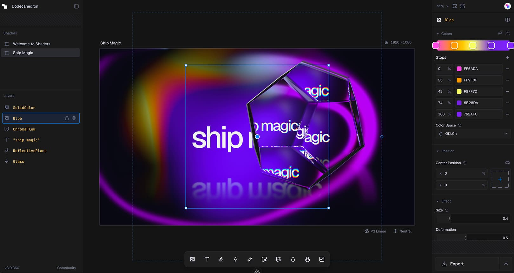
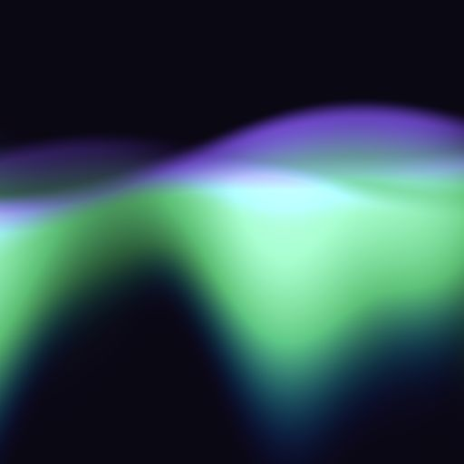
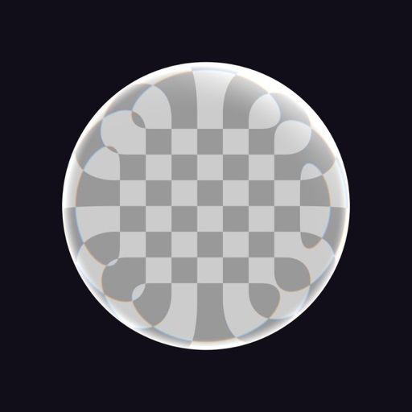
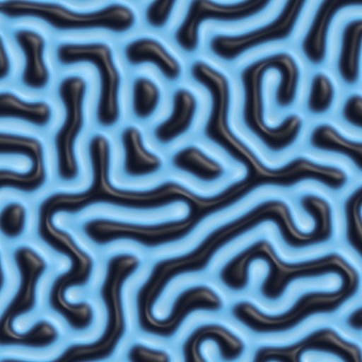

# Shaders 4.0 源码拆解：它不是特效素材库，而是把 WebGPU 编译成跨框架组件树

> **一句话结论：** Shaders 4.0 的核心不是“200 个炫酷 shader”，而是一种可序列化的视觉组件树：同一棵树可以在在线编辑器里设计，被 React、Vue、Svelte、Solid 或原生 JavaScript 渲染，再由运行时编译成尽量少的 WebGPU fragment、compute 与离屏纹理 pass；但它是 WebGPU-only，云端编辑器与 Pro preset 也不属于 MIT 开源包。

看到 [shader-effects-inc/shaders](https://github.com/shader-effects-inc/shaders) 的首页，很容易把它归类为“网页特效组件库”：Aurora、Glass、Glow、CursorTrail、ReactionDiffusion，安装 npm 包，然后像搭 React 组件一样叠起来。

这个描述没有错，却漏掉了真正有价值的部分。传统 shader 素材库交付的是一段 GLSL/WGSL、几个 uniform 和一张 demo；Shaders 交付的是一个从设计器到代码、从框架组件到 GPU 执行计划的统一模型。视觉效果不再只是一段难以组合的像素函数，而是一棵带类型、参数、图层关系、蒙版、混合、动画驱动和布局语义的树。

截至 2026 年 10 月 8 日，最新版本是 [`v4.0.2`](https://github.com/shader-effects-inc/shaders/releases/tag/v4.0.2)，对应提交 [`9435282`](https://github.com/shader-effects-inc/shaders/commit/9435282c29d3505c67eef427470c8d835095a199)。本文固定审查这一快照，而不是把网站上的未来功能或 Pro 内容算进开源运行时。

---

## 01｜先划清边界：开源的是引擎，不是整个 shaders.com

仓库的 [MIT 许可证](https://github.com/shader-effects-inc/shaders/blob/9435282c29d3505c67eef427470c8d835095a199/LICENSE) 覆盖 WebGPU 引擎、内置组件和 React、Vue、Svelte、Solid、JavaScript 绑定。`npm install shaders` 得到的 `4.0.2` 包就是这套公开实现。

但以下内容属于独立平台或商业层：

- shaders.com 在线设计编辑器、账户与项目存储；
- 官方所称 1,000+ production presets 与 55+ 网站 sections；
- Pro preset 安装、无限版本历史、Framer 一键安装；
- 无水印高清图片与视频导出；
- 托管在 `shaders.com/mcp` 的 MCP 服务及其账户能力。

CLI 把两层连接起来：它能检测框架、写入 `shaders.config.ts`、通过浏览器登录、关联在线项目，把设计结果安装成普通组件文件，并用 `shaders.lock.json` 记录版本。基础组件可以完全在本地手写和运行；搜索、同步在线项目或安装 Pro preset，则会访问 shaders.com API。

项目的 `CHANGELOG.md` 还明确写着：`v3.2.475` 是最后一个闭源版本，之后才以 MIT 开源。公开仓库从 9 月 29 日开始，到本文审查时只有 14 个提交；这说明代码是一次成熟产品迁入公开历史，而不是两周内从零写成。公开提交数不能代表真实研发周期。

---

## 02｜199 个组件只是表面，真正的产品是统一定义

固定提交中，`packages/core/src/shaders/` 有 **199 个组件目录**，分为纹理、形状、shape effects、模糊、扭曲、调整、风格化、交互、转场与工具十类。每个组件不只是 WGSL 字符串，还包含：

- 名称、角色与输入要求；
- 有类型的 props、默认值和 UI 控件元数据；
- 参数是运行时 uniform，还是会改变程序结构的 compile-time 值；
- 是否使用指针、时间、子图层、蒙版或离屏纹理；
- fragment、compute、host-side 生命周期与清理逻辑；
- 封面、文档描述与框架代码生成信息。

例如 Aurora 是 generator，可以独立生成像素；Glass 是需要输入图层的 shape effect；ReactionDiffusion 是保留跨帧状态的 simulation；Blur 则可能把前面的内容变成纹理后再处理。

React、Vue、Svelte、Solid 与原生 JS 不是五套手写实现。核心定义通过脚本生成各框架组件和导出表，因此相同效果、参数名和默认值可以跨框架保持一致。框架层主要负责把响应式属性、DOM 生命周期和 `<canvas>` 接到同一个核心 renderer。

这也是它比“复制一段 shader 代码”更适合产品团队的地方：设计师和工程师交换的不是截图，而是同一个可执行组件树。

---

## 03｜组件树如何变成 GPU：先生成 IR，再安排 pass

Shaders 的 `<Shader>` 只创建一个 canvas。子组件按图层顺序进入 registry，组合器随后把树降低为 `CompositionIR`，其中包含四类关键内容：

1. **compute steps**：粒子、流体、反应扩散、模糊预处理等计算任务；
2. **RTT passes**：必须先渲染到纹理、再被下一层采样的离屏结果；
3. **final fragment pass**：把最终颜色经过 tone mapping 与输出变换写进 canvas；
4. **资源与生命周期**：uniform、纹理、外部视频、resize、frame hooks 和 cleanup。

执行顺序不是简单的“从上到下画 199 次”。组合器会先把依赖图排序，让 compute 先更新状态，让叶子到根的 RTT 结果按顺序准备好，最后才执行全屏输出。

更重要的是，它会尝试避免 RTT。像 Bulge、Twirl 这类可表示为 UV 映射的效果，在条件允许时会把坐标变换向下折叠到生成器，让底层内容直接在新坐标求值。这样可以省掉一次纹理写入与重新采样，也避免放大时受中间纹理分辨率限制。只有遇到模糊、反馈、复杂蒙版、透明度边界或真正需要邻域采样的操作，才退回离屏 pass。

所以，“组件组合”不是把多个 canvas 叠在 DOM 里，而是一次小型的图形编译过程。

---

## 04｜运行时参数与结构参数分开，决定它能否实时编辑

Shaders 把大多数颜色、位置、强度和时间参数放进 uniform buffer。改变这些值只更新 GPU 数据，下一帧即可生效，不需要重新编译 pipeline。

但某些选择会改变 WGSL 结构，例如颜色空间分支、采样模式、循环规模或效果是否需要 compute pass。这些 props 被标记为 compile-time，并进入 structural hash。结构变化时，运行时构建新 composition；普通数值变化则复用已有 pipeline。

这一区分支撑了在线编辑器的实时体验，也解释了为什么不是所有滑块成本相同。源码中的 pipeline cache、结构哈希与 swap-when-ready 逻辑，目的就是避免每一次拖动都让页面等待 shader 编译。

自定义组件也进入相同体系。`defineShader` 可以接收稳定的原始 WGSL body，也可以使用仍标为 experimental 的 std primitives 组合像素逻辑。自定义 prop 同样获得类型转换、uniform 绑定、框架包装与编辑器元数据，而不是逃到运行时之外。

---

## 05｜性能策略：共享一个 GPUDevice，比“少写几行 shader”更重要

默认情况下，一页上的所有 `<Shader>` 共享同一个延迟创建的 `GPUDevice`。这样做有三个直接收益：

- 同一 shader 的已编译 pipeline cache 可以跨组件与 SPA 路由复用；
- 避免每个 canvas 都申请 adapter/device；
- 降低浏览器并发设备限制和 GPU 资源抖动风险。

运行时还会监听尺寸与可见性。canvas 离开视口后自动降到约 1 FPS；分辨率由 CSS 尺寸与 pixel ratio 控制；页面级 circuit breaker 会在无 adapter、设备失败或显存不足时停止继续创建 renderer，防止多个效果一起把标签页拖死。

这些选择比单个 shader 少几个乘法更接近真实网页性能工程。复杂效果仍可能昂贵：模糊、反馈 simulation、3D 距离场、高清 DPR 和多层嵌套都会增加纹理内存、dispatch 或 pass 数。官方 skill 自己也建议保持扁平图层、隐藏不用的节点而不是把 opacity 设为 0，并减少不必要的嵌套。

包体也不是零成本。npm 元数据给出的 `4.0.2` 解压体积约 **29.1 MB**；本地完整构建产生的原生 JS convenience bundle 约 2.49 MB minified，React CDN bundle 约 3.3 MB。正常 bundler 可以利用逐组件导出和 `sideEffects: false` 做 tree-shaking，因此不能把完整 bundle 数字当成每个页面的实际下载量，但“只导入需要的组件”仍然很重要。

---

## 06｜WebGPU-only 是清晰选择，也是最大兼容性边界

源码明确拒绝 WebGL context：当前 renderer 只有 WebGPU 路径。所谓 SSR-safe，是模块可以在服务端导入、框架组件在服务端不触碰 `navigator.gpu`；它不表示服务器能生成画面，也不表示旧浏览器会自动切换 WebGL。

如果浏览器没有 WebGPU、拿不到 adapter、设备丢失或初始化失败，内置行为倾向于保持透明 canvas，并默认不向生产 console 连续报错。宿主可以用 `isWebGPUSupported`、异步 support probe 与 `onUnavailable` 决定静态图、CSS 背景或普通 DOM fallback。

这个策略适合装饰性视觉：特效失败不应拖垮正文。但如果 shader 承担按钮状态、数据含义或关键导航，透明失败就不够。无障碍语义、静态替代和 `prefers-reduced-motion` 仍然是应用层责任。

---

## 07｜4.0.2 的固定时间步，让它开始连接网页与视频

`v4.0.2` 新增 `createRendererFromJSON(...).renderFrame({ deltaSeconds })`。一旦进入 frame-locked 模式，动画时钟不再依赖真实墙钟，而是严格累加宿主传入的时间步。以 `1/60` 连续推进，同一组件树就能按固定帧率重复渲染；`deltaSeconds: 0` 则只重绘而不推进时间。

这对 Puppeteer 截帧、Remotion 集成或离线视频生成很重要，因为“机器快慢”不再改变动画相位。默认 `renderFrame` 还会等待 GPU fence，确保宿主读取 canvas 前该帧已经完成。

但 Shaders 不是 Remotion 替代品。它没有多镜头时间轴、音频、字幕、媒体编码和成片编排；带反馈状态的 simulation 也必须逐帧推进，不能直接跳到第 600 帧。它提供的是**可确定推进的视觉渲染层**，视频框架仍负责时间线、合成与输出。

---

## 08｜Agent Skill 与 MCP：AI 操作的是组件语义，不是直接乱写 WGSL

仓库包含一个完整的 Agent Skill，列出 199 个组件、组合规则、动态 props、性能约束和跨框架习惯；官网还提供 `llms.txt` 与完整组件参考。CLI 可以安装 skill，`install-mcp` 则把托管 MCP endpoint 配进 Claude Code、Cursor、Codex 等工具。

这条路线的价值在于把 Agent 的输出空间收窄：先选择现有组件、设置真实 props、生成组件树；找不到时才编写自定义 WGSL。相比让模型从空白开始猜 shader API，结构化目录更容易验证，也能把结果继续交给可视化编辑器修改。

边界同样要讲清楚：开源仓库包含 skill 文档和 MCP 安装器，但 MCP 服务本身托管在 shaders.com；预设搜索、在线项目同步与 Pro 内容依赖远端 API 和账户权限。它不是完全离线的开源 Agent 工作台。

---

## 09｜一个不应藏在炫酷 demo 后面的默认项：性能遥测

源码中的 telemetry 会在外部网站上对普通 `<Shader>` 进行 **5% 随机采样**；标记为 preview 的组件则跳过随机采样。发送内容包括：

- FPS、平均/最小/最大/P99 frame time、jank 与预算使用率；
- renderer 类型、draw calls、texture count；
- 组件名称、是否需要 RTT、渲染顺序；
- 当前域名、浏览器家族和 desktop/mobile/tablet 分类；
- 随机 session ID、版本与时间戳。

payload 中没有组件 props、用户内容或完整 user-agent，但请求仍会发送到 `shaders.com/api/telemetry`。设置 `<Shader disableTelemetry>` 或浏览器 `Do Not Track` 可关闭；shaders.com、localhost 与 `127.0.0.1` 不走外部用户路径。

遥测实现是公开的，也有明确 opt-out，这比不可见统计好。但 README 与 skill 主流程没有突出说明它。对隐私敏感、内网或合规项目，应该把 `disableTelemetry` 作为显式部署决定，而不是依赖 5% 概率。

---

## 10｜成熟度：测试很扎实，公开治理仍很年轻

在固定提交上，我完成了以下验证：

- `pnpm install --frozen-lockfile` 成功；
- **268 个测试文件、1,795 个测试全部通过**；
- 8 个 workspace build task 全部成功；
- 构建后生成文件与 Git 跟踪版本一致；
- 固定提交对应的 Core Renderer、release check、npm publish 与 GitHub CodeQL checks 全部成功；
- npm 上的 `shaders@4.0.2` 已发布，依赖主体是 `typegpu@0.12.3`。

测试覆盖组合器、结构哈希、WGSL snapshot、uniform、设备丢失、RTT、compute scaffolds 和大量组件契约，明显不是“只有 demo 图”的仓库。但这轮本地测试主要在 Vitest 中验证生成代码和 CPU 侧逻辑；**我没有完成跨 Chrome、Safari、Firefox 与不同 GPU 的逐像素浏览器回归，也没有验证官网所称 16,000+ 用户、数千网站或全部性能结论。**

公开治理也刚起步。核心实现虽然规模很大，公共 Git 历史只有 14 个提交，公开 issue、外部维护者与长期升级记录仍需时间积累。MIT 开源是重要变化，但不能立刻等同于成熟的社区治理。

---

## 11｜它适合谁，不适合谁

Shaders 很适合：

- 想把 GPU 视觉纳入 React/Vue/Svelte/Solid 组件系统的产品团队；
- 需要设计器与代码共享同一棵可编辑视觉树的设计工程师；
- 需要交互背景、材质、光效、转场或指针效果，但不想先搭 Three.js scene 的前端；
- 需要固定时间步，把网页视觉交给视频宿主逐帧渲染的工具链；
- 希望 Agent 使用受约束组件语义，而不是从零生成 shader 的团队。

它不适合直接承担：

- 必须覆盖没有 WebGPU 环境、又没有静态 fallback 的关键 UI；
- 需要复杂 3D 场景图、相机、骨骼、物理与通用材质系统的应用；
- 把完整视频时间线、音频和编码交给一个组件库；
- 要求编辑器、preset 市场、MCP 服务与运行时全部离线自托管的流程。

最稳妥的采用方式，是从一个非关键视觉开始：只导入 2–3 个组件，记录首屏 JS、GPU 内存、交互帧率、低端设备、后台标签页、WebGPU 不可用和 reduced-motion 行为，再决定是否扩大范围。

---

## 12｜结语：shader 代码正在变成设计系统里的中间表示

Shaders 4.0 最有价值的变化，不是把 Aurora 包成 `<Aurora />`，而是把原本散落在 shader 文件、uniform 面板、框架状态和设计稿之间的信息，压进一棵可编译、可导出、可同步的组件树。

这棵树让编辑器、五套框架、CLI、Agent Skill、MCP 和逐帧 renderer 共享同一种语言；GPU 运行时再负责把它优化为 fragment、compute 和必要的 RTT passes。商业平台卖的是设计资产与协作效率，MIT 仓库开放的是执行这门语言的引擎。

所以，更准确的定义不是“WebGPU 特效库”，而是：**一套面向设计工程的视觉中间表示，加上把它编译到浏览器 GPU 的运行时。** 它还年轻、只支持 WebGPU，也带着需要显式处理的包体、遥测与平台依赖；但它展示了一条比“复制 shader 代码”更接近真实产品生产的路线。

---

## 主要来源

- [Shaders GitHub 仓库](https://github.com/shader-effects-inc/shaders)
- [Shaders 官方网站与在线编辑器](https://shaders.com/)
- [Shaders v4.0.2](https://github.com/shader-effects-inc/shaders/releases/tag/v4.0.2)
- [npm registry：shaders 4.0.2 元数据](https://registry.npmjs.org/shaders/4.0.2)
- [组件组合器 `composer.ts`](https://github.com/shader-effects-inc/shaders/blob/9435282c29d3505c67eef427470c8d835095a199/packages/core/src/gpu/composer.ts)
- [GPU device 共享与缓存 `root.ts`](https://github.com/shader-effects-inc/shaders/blob/9435282c29d3505c67eef427470c8d835095a199/packages/core/src/gpu/root.ts)
- [WebGPU 可用性与故障策略 `support.ts`](https://github.com/shader-effects-inc/shaders/blob/9435282c29d3505c67eef427470c8d835095a199/packages/core/src/gpu/support.ts)
- [固定时间步 `presetRenderer.ts`](https://github.com/shader-effects-inc/shaders/blob/9435282c29d3505c67eef427470c8d835095a199/packages/core/src/presetRenderer.ts)
- [遥测配置与 opt-out](https://github.com/shader-effects-inc/shaders/blob/9435282c29d3505c67eef427470c8d835095a199/packages/core/src/telemetry/index.ts)
- [Shaders Agent Skill](https://github.com/shader-effects-inc/shaders/blob/9435282c29d3505c67eef427470c8d835095a199/skills/shaders/SKILL.md)
- [CLI 文档](https://shaders.com/docs/guide/cli)
- [自定义组件文档](https://shaders.com/docs/guide/custom-shaders)
- [许可证与平台边界](https://shaders.com/license)

*审计日期：2026 年 10 月 8 日。源码快照为 `v4.0.2` / `9435282c29d3505c67eef427470c8d835095a199`；组件目录、在线服务、Pro 权益、浏览器 WebGPU 支持与遥测实现会继续变化。*
