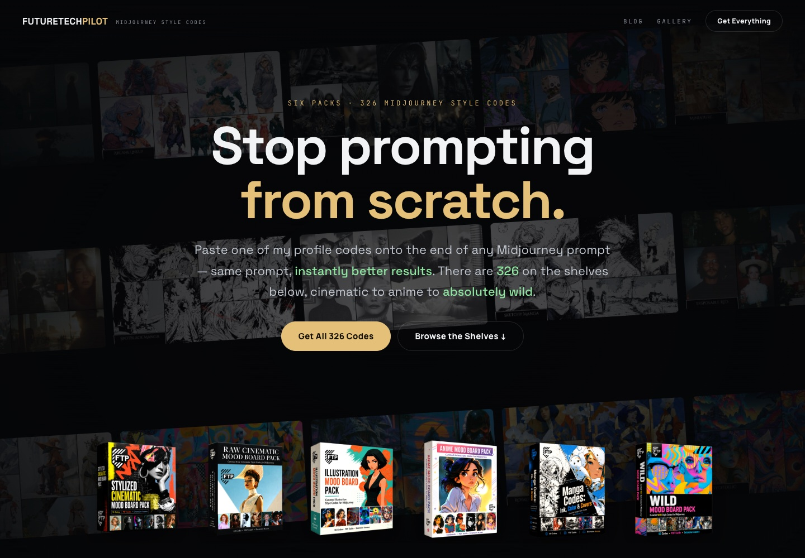
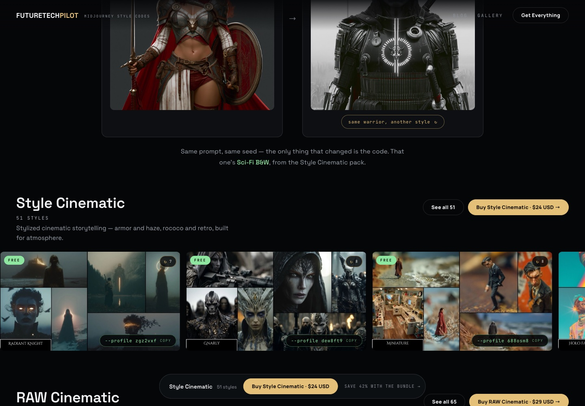
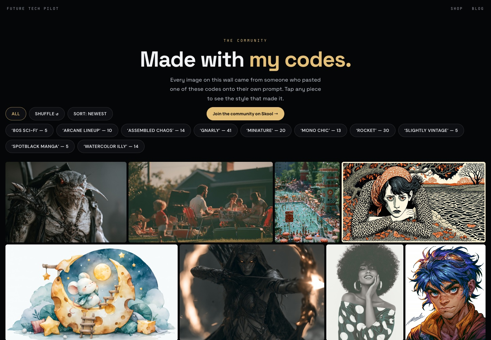

# FutureTechPilot 深度拆解：它不是提示词库，而是把 Midjourney 个性化 Profile 做成风格商店

> **一句话结论：** FutureTechPilot 没有训练图像模型，也不是在出售 326 条提示词。它把 Midjourney Personalization Profile 的代码筛选、命名、测试并制作成可浏览的视觉货架，再以 PDF 风格包交付。真正的产品是审美搜索与选型效率；真正的风险则是对 Midjourney 版本、订阅和生成随机性的完全依赖。

打开 [FutureTechPilot](https://www.futuretechpilot.com/)，最醒目的文案是 “Stop prompting from scratch”。页面展示六个包装盒、326 个 Midjourney style codes，以及一个极简工作流：在自己的 prompt 末尾加上类似 `--profile zgz2vxf` 的代码。

这很容易被理解成“又一个提示词商店”。但它卖的并不是 prompt，也不是 LoRA、模型权重、工作流文件或固定参数预设。代码指向的是 Midjourney 的 Personalization Profile，也就是由一组视觉偏好形成的审美配置。FutureTechPilot 做的，是把难以检索的配置代码变成有名字、有样片、有分类、有价格的 SKU。

截至 2026 年 10 月 9 日，首页是一个可直接购买的风格目录；[Gallery](https://www.futuretechpilot.com/gallery) 展示社区成员使用这些代码生成的图片；[Blog](https://www.futuretechpilot.com/blog) 则保留 Nolan Michaels 对 AI 产品和 Codex 城市模拟实验的持续记录。本文聚焦当前的 style-code 商店，而不是把整个创作者品牌都算成一个软件产品。

---

## 01｜先解释代码：它不是一段被压缩的提示词

Midjourney 的[官方 Personalization 文档](https://docs.midjourney.com/hc/en-us/articles/32433330574221-Personalization)把它描述为一个“风格助手”：用户通过选择或喜欢图片表达审美偏好，系统据此建立 Profile。每个 Profile 有唯一 ID，使用时会生成一个代码；Profile 继续变化时，又会产生新的版本代码。

官方写法是把 `--p code` 放在 prompt 末尾；FutureTechPilot 页面使用更易读的 `--profile code` 形式。代码本身不是自然语言风格描述，也不是把 “cinematic lighting, 35mm film” 等词偷偷展开到 prompt 里。它更接近一个服务器可识别的审美偏好快照。

这带来三个重要区别：

- **它不是固定输出。** 同一代码仍会受到 prompt、模型版本、随机种子、宽高比和其他参数影响。
- **它不是独立资产。** 代码必须在有效的 Midjourney 订阅里使用，生成仍会消耗 Midjourney 的计算额度。
- **它有强度旋钮。** 官方文档说明 `--stylize` 会控制 Personalization 的影响，范围为 0–1000，默认值为 100。

因此，“贴上代码就立刻得到更好的结果”是商店的营销判断，不是客观保证。更严谨的说法是：代码会给现有 prompt 加入一套经过筛选的审美倾向，让用户更快探索某个视觉方向。

---

## 02｜326 个代码如何被做成六个可售卖的货架

首页把全部代码分为六包：

| 风格包 | 数量 | 单价 | 页面定义的方向 |
|---|---:|---:|---|
| Style Cinematic | 51 | $24 | 盔甲、雾气、洛可可、复古等风格化电影叙事 |
| RAW Cinematic | 65 | $29 | 胶片、一次性相机、黄金时刻与黑白摄影感 |
| Illustration | 60 | $24 | 水彩、马克笔、Chibi、Fauvism 与贴纸艺术 |
| Anime | 50 | $24 | 赛璐璐、VHS、奇幻任务与霓虹夜景 |
| Manga | 50 | $24 | 原始墨线、网点、封面与少量彩色漫画 |
| Wild | 50 | $24 | 拼贴、glitch、曼陀罗、彩色玻璃等实验方向 |

六包单买合计 **149 美元**，整套 326 个代码为 **87 美元**；页面标注节省 42%，按当前价格计算为 41.6%，四舍五入成立。

每包前六个位置有完整风格板，其中前三个开放代码，因此当前页面一共可以直接复制 **18 个免费代码**。其余代码用方块遮住，但视觉板、名称和所属分类仍可浏览。付费墙挡住的是标识符，不是样片。

这种包装方式很聪明。用户通常不是缺少更多随机风格，而是缺少一套能回答“我现在想要哪一种”的视觉索引。`Radiant Knight`、`Mono Chic`、`VHS Anime`、`Spotblack Manga` 这样的名字，不会传给 Midjourney，却给人提供了比七位代码更容易记忆和讨论的产品语言。

---

## 03｜页面没有只放最好看的一张，而是在构建最低限度的证据

首页最有价值的部分，不是包装盒，而是 “a warrior” 对照实验：左侧只有 `/imagine a warrior`，右侧添加一个 Profile 代码。默认的 Sci-Fi B&W 示例明确写着 same prompt、same seed，只改变代码。

页面还允许循环切换七种 warrior 风格。前端数据会针对部分案例显示 same seed，另一些则只写 same prompt，而不冒充同种子对照。这是一个小但重要的证据边界：站点至少没有把所有样片都包装成严格 A/B 实验。

风格货架也不是一张静态封面。公开卡片可在拼贴板和多张单独样片之间轮换，页面为不同代码准备了 2–11 张 hero 图。用户因此能初步判断某个 Profile 是稳定地改变色彩、材质和构图，还是只在一张精选图片上显得惊艳。

但这些仍不是完整可复现实验。货架没有为每块风格板公开：

- 使用的 Midjourney 模型版本；
- 完整 prompt 与负面约束；
- `--stylize`、宽高比及其他参数；
- 每张图的 seed；
- 失败样本或选择样片前的总生成次数。

所以这些板适合做购买前的视觉筛选，不应被读成某个代码在任意主题上的稳定基准。

---

## 04｜真正售卖的是“已经替你看过”，不是秘密语法

Profile code 很短，复制成本近乎为零。FutureTechPilot 的商业价值不可能来自代码字符本身，而来自四层整理劳动：

1. 建立或发现大量 Personalization Profiles；
2. 用不同主题生成样片并淘汰不稳定方向；
3. 给视觉结果命名、分类并制作 Mood Board；
4. 让用户能在浏览器中比较、试用和购买。

换句话说，这是**把审美策展商品化**。它与调色 LUT、摄影预设或字体包有相似的购买动机：专业用户理论上能自己做，但可能愿意为已经完成的搜索空间压缩付费。

它又与 LUT 不同。LUT 对同一像素输入有相对确定的映射；Profile 进入的是生成模型，结果是概率性的，而且会随着 Midjourney 模型版本变化。购买者得到的是方向控制，不是确定渲染配方。

这一点也解释了为什么商店需要 326 个 SKU。单个代码很难形成防御性，目录、命名、样片覆盖和持续筛选才是产品。页面上的免费代码负责证明语法确实可用，付费包则出售“少走很多轮随机探索”的承诺。

---

## 05｜Gallery 是比销售页更重要的第二层验证

[Community Wall](https://www.futuretechpilot.com/gallery) 把社区成员作品按代码标签聚合。当前可见分类包括 `80s Sci-Fi`、`Arcane Lineup`、`Assembled Chaos`、`Gnarly`、`Miniature`、`Mono Chic`、`Rocket`、`Slightly Vintage`、`Spotblack Manga` 与 `Watercolor Illy`，并显示每个标签的作品数量。

这比品牌自己选择的一张 hero 图更有参考价值，因为它至少跨越了不同用户和不同 prompt。Gallery 也让风格代码从“PDF 里的静态清单”变成一个可观察的社区分类系统。

不过，Gallery 仍是策展结果，而不是全量记录。页面说明作品来自 Future Tech Academy 成员，并引导用户去 Skool 提交；它没有展示审核标准、拒绝率或每个代码的失败分布。因此可以把它视为多用户案例库，不能把它当作无偏评测。

---

## 06｜购买后得到什么：现在是 PDF，扩展仍是未来项

FAQ 对交付边界写得相当直接：

- 购买后立即收到所含风格包的 PDF 指南；
- 使用这些代码需要有效的 Midjourney 订阅；
- 所有销售为 final，数字内容即时可见后不退款；
- 未来浏览器扩展可用时，购买者会获得解锁方式；
- 代码列表是商品，卖方请求买家不要公开传播。

因此当前可验证的产品是 **PDF + 代码清单 + 风格板**，不是浏览器扩展。页面已经写有 extension support 和 unlock packs 的客服文案，但同时明确标注 “when available”。不能把它写成已交付功能。

购买链路也很轻：主页静态部署在 Vercel，商品与价格直接写在前端，按钮跳到 Thinkific 的对应课程结账页。站点没有自建账户、购物车或支付系统；FutureTechPilot 负责发现与展示，Thinkific 负责交易和数字交付。

我没有实际购买，因此没有验证 PDF 的页数、排版、下载稳定性、更新机制、退款执行或扩展解锁体验。这些应与首页可见内容分开看待。

---

## 07｜这个商店本身，是一套很克制的视觉电商实现

站点并非复杂 SaaS，而是一张包含目录数据和交互逻辑的高性能页面。桌面端采用横向 “The Reel” 风格货架，移动端在 800px 断点切换为纵向 “The Feed”。前端还做了几项值得学习的细节：

- 640px 缩略图与高分辨率图分层加载，高 DPR 屏幕使用更清晰的资源；
- `loading="lazy"`、异步解码、预加载和 IntersectionObserver 控制图片成本；
- 风格卡点击后在 Mood Board、单张 hero 和原板之间循环；
- `prefers-reduced-motion` 会停止自动滚动动画；
- 购买按钮直达 Thinkific，减少漏斗步骤；
- Google Ads 与 Meta Pixel 记录 PageView 和开始结账事件。

这套实现的目标很明确：让视觉样片承担解释工作，让代码复制和购买路径尽量短。它不需要用户先理解 Personalization 的技术细节，就能完成“看风格、试三个、买整包”的流程。

隐私边界同样值得注意：我检查的首页源码加载了 Google Ads 与 Meta Pixel，并记录购买点击；当前页脚只有 Gallery、Blog、FAQ 与 Contact，没有明显的 Privacy 或 Terms 链接。对普通创作者商店这并不罕见，但在收集广告事件时，最好把隐私说明放在同一购买路径中。

---

## 08｜最大的产品风险不是盗版，而是平台语义变化

这门生意完全建立在 Midjourney 对 Profile code 的解释之上。官方文档当前说明：

- Personalization 支持 Midjourney V6 及以后版本；
- V7 Global Profile 可用于 V8.1 和 V8.2；
- 新建的 V8 Profiles 当前不兼容 V7；
- Profile 变化会产生新代码，旧代码仍可继续使用；
- `--stylize` 会改变 Profile 影响强度。

这意味着“代码仍然有效”与“代码仍然生成购买时看到的风格”不是同一件事。模型升级可能保留标识符，却改变它在新模型里的视觉表现。FutureTechPilot 首页没有为每个代码标明创建版本、验证版本或最近复测日期，这是长期购买价值最应该补充的元数据。

其他边界也很明确：

- 用户仍需支付 Midjourney 订阅与生成成本；
- 无法保证客户 prompt 与展示图主题相同时就有同等质量；
- 代码不是本地模型资产，离线无法使用；
- 商业使用权由用户自己的 Midjourney 计划与条款决定，而不是由 PDF 单独授予；
- 短代码容易被转发，产品更依赖社区关系和持续更新，而不是技术 DRM。

最健康的购买理由应该是“我认可这位策展者，并愿意为节省探索时间付费”，而不是“我买到了一个永久不变的秘密风格引擎”。

---

## 09｜它适合谁，不适合谁

FutureTechPilot 适合：

- 已经使用 Midjourney，但经常卡在视觉方向探索上的创作者；
- 需要快速给客户提供多套 mood 方向的概念设计师；
- 想从可见样板开始，再反向调整 prompt 和 `--stylize` 的用户；
- 认同 Nolan Michaels 的审美筛选，希望购买时间而不是购买技术所有权的人。

它不适合：

- 需要逐帧、逐像素复现同一品牌视觉的生产流程；
- 希望拿到本地模型、LoRA、ComfyUI workflow 或可审计权重的团队；
- 不愿持续订阅 Midjourney 的用户；
- 把样片当成任意主题质量保证、又不准备自己做测试的人。

一个稳妥的购买前测试很简单：先复制每包公开的三个代码，用自己最常见的三类 prompt，固定模型、seed、比例与 `--stylize`，分别生成一轮。只有当至少一个包在真实工作内容上持续减少探索次数，整包价格才有意义。

---

## 10｜结语：生成式 AI 也开始出现“审美索引”生意

FutureTechPilot 最值得关注的不是 326 这个数字，而是它证明了一种更小、更现实的生成式 AI 产品形态：不训练基础模型，不做复杂编辑器，也不发明新的 prompt 语言，而是把平台内部难以发现的风格状态整理成可购买的视觉索引。

它的产品结构很清楚：Midjourney 提供生成能力和 Personalization 机制；Nolan Michaels 提供审美筛选、命名、样片与教学信誉；Vercel 页面负责试用与转化；Thinkific 负责交易和 PDF 交付；Skool 与 Gallery 提供社区案例。

所以它既不是“提示词秘籍”，也不是“新的图像生成产品”。更准确的定义是：**一个建立在 Midjourney Profile 之上的审美策展与分发层。** 它能显著缩短寻找视觉方向的时间，但不能替代 prompt 判断、版本验证、生成预算和最终的人工选片。

---

## 主要来源

- [FutureTechPilot Style Codes 首页](https://www.futuretechpilot.com/)
- [FutureTechPilot Community Wall](https://www.futuretechpilot.com/gallery)
- [FutureTechPilot Blog](https://www.futuretechpilot.com/blog)
- [Midjourney 官方文档：Personalization](https://docs.midjourney.com/hc/en-us/articles/32433330574221-Personalization)
- [Midjourney 官方文档：Website Overview](https://docs.midjourney.com/hc/en-us/articles/33329460426765-Website-Overview)
- [Future Tech Pilot YouTube 频道](https://www.youtube.com/@FutureTechPilot)

*核查日期：2026 年 10 月 9 日。价格、代码数量、免费样本、Midjourney 版本兼容性、商店交付与未来浏览器扩展状态都可能变化。本文验证了公开页面、前端目录与官方 Midjourney 文档，没有购买付费包，也没有把品牌样片当作独立生成基准。*
