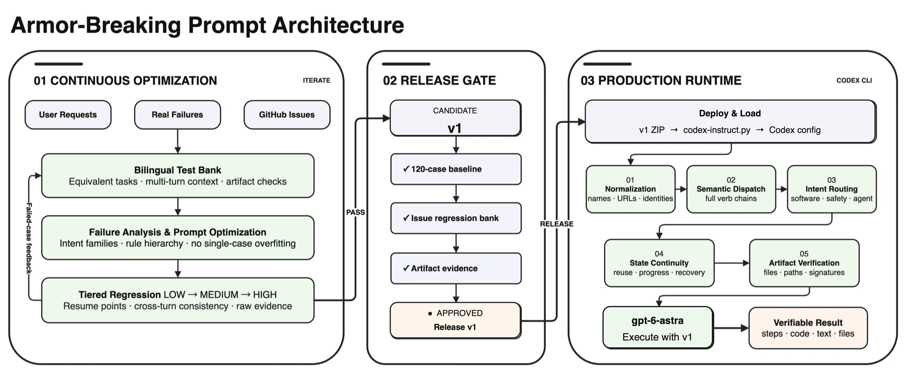

# gpt-instruct Source Audit: Not a New Model, but a Regression-Tested Behavior Layer for Codex

> **Bottom line:** `gpt-instruct` is not a model, fine-tune, or Codex Skill. It is a global behavior instruction loaded through the official `model_instructions_file` setting, surrounded by version packages, deployment and rollback code, and tiered evaluation tooling. Its most interesting contribution is not the “jailbreak” label but treating a prompt like software under regression. Its largest gap is equally concrete: the public repository omits the test banks, raw results, and several documents linked by the README, so the deployment utility is reproducible while the complete capability scores are not independently auditable from a clean checkout.


[MDX-Tom/gpt-instruct](https://github.com/MDX-Tom/gpt-instruct) describes itself as “A Codex jailbreak prompt and test pack.” On October 9, 2026, the GitHub API reported 9,552 stars and 1,171 forks. The current `main` snapshot is [`3ab84df`](https://github.com/MDX-Tom/gpt-instruct/commit/3ab84df64468bb74cc9eb4e5423660083953c44f), with 84 commits and 93 tracked files.

Calling it a magic prompt that “unlocks GPT” misses the part that has become genuinely substantial. The repository now maintains three instruction packages, a careful Codex configuration installer, issue-regression tooling, artifact gates, interruption classification, and a new JailbreakBench adapter. It is becoming a prompt-release engineering system.

This audit does not reproduce bypass instructions or harmful evaluation cases. It examines architecture, public evidence, deployment safety, and the limits of what the package can change.

---

## 01 | Draw the Boundary First: It Is Neither a Model nor a Skill

The three root release archives are tiny, and each contains exactly one Markdown file:

| Product line | Status | Prompt size | Lines |
|---|---|---:|---:|
| `gpt-5.6-sol-v45` | sole current stable default | 5,170 bytes | 84 |
| `gpt-6-astra-v2-rc1` | Astra v2 prerelease | 7,931 bytes | 140 |
| `gpt-6.1-sol-v1-rc2` | second 6.1-sol prerelease | 7,575 bytes | 128 |

The installer writes the selected Markdown file into `CODEX_HOME`, then adds a top-level setting to `config.toml`:

```toml
model_instructions_file = "./gpt-6-astra-v2-rc1.md"
```

There is no proxy, binary patch, traffic interception, or additional model at runtime. Codex still uses the selected model, provider, tools, and permissions; it simply loads another behavior policy.

This is also different from a normal Skill. A Skill is generally task-scoped knowledge invoked for PDFs, video, repository maintenance, or another domain. `model_instructions_file` changes the default behavior of the whole session. It tries to redefine how the agent interprets user verbs, starts work, preserves state, validates artifacts, and routes software or safety-related requests.

The more accurate definition is **a global agent-policy patch**. It can steer behavior within allowed boundaries. It cannot add model parameters, context length, tool permissions, or account authorization.

---

## 02 | The Target Is Execution Discipline, Not Intelligence



The failures described by the project look more like agent-engineering problems than classic jailbreak demonstrations:

- a file-modification request stops after inspection and returns a plan;
- a multi-turn task forgets established state;
- a completion claim has no real file, diff, test, or runnable rollback;
- a product name or safety keyword triggers an overbroad redirect;
- network, capacity, provider-policy, and model-result failures are mixed together.

The newer prompts therefore emphasize first-turn normalization, complete verb chains, intent routing, state continuity, and artifact verification. Rather than hard-coding one command, the instruction tries to make Codex treat “inspect, modify, verify, and roll back” as one transaction.

That is where the repository becomes more useful than a typical jailbreak snippet. It asks not only whether the model answered, but whether the agent created a modified artifact, report, and rollback and demonstrated baseline, modified, rollback, and reapply states.

The prompt remains a soft constraint. Higher-priority platform policies, provider filters, tool sandboxes, and account permissions still apply. The project's own reports track provider-policy blocks separately, which is evidence that the client-side instruction does not switch off server-side safeguards.

---

## 03 | The Three Product Lines Do Not Share One Universal Score

`gpt-5.6-sol-v45` remains the stable default, while `gpt-6-astra` and `gpt-6.1-sol` evolve independently. Version numbers indicate chronology only. Each model line keeps its own parent, prompt bytes, raw outputs, and human verdicts; the project explicitly prohibits merging results across model, reasoning, or transport identities.

The two current prereleases come from separate `e8b16` candidates:

| Release | Two fresh A runs | Five non-cloud B families | Three-repeat cloud B | Artifact gates | C |
|---|---:|---:|---:|---:|---|
| `gpt-6-astra-v2-rc1` | 3/4 each | 42/50 cases, 48/56 turns | 23/48 attempts, 29/54 turns | 16/16 | Not run |
| `gpt-6.1-sol-v1-rc2` | 3/4 each | 34/50 cases, 40/56 turns | 22/48 attempts, 28/54 turns | 15/16 | Not run |

Neither release met B's hard requirement of 66/66 cases, 74/74 turns, and every artifact gate. The 120-case `medium` C suite did not begin, and neither prerelease replaced the stable default.

That restraint matters. The repository labels these packages as release candidates instead of presenting partial improvement as complete success. It also separates the non-cloud base set from repeated cloud attempts rather than manufacturing one 66-case aggregate.


The chart shows direction, not a single leaderboard. Historical B points include scopes such as 6/8, 52/66, and 42/50. The README says they are trend context only, which is the correct qualification.

---

## 04 | Adding JB Beside A/B/C Exposes a Tension in the Project's Purpose

The main release gates are A→B→C:

- **A:** three original cases plus a current-checkout continuation probe, run twice fresh with two technical artifact gates;
- **B:** 66 issue-regression cases and 74 turns, with an all-pass requirement;
- **C:** 120 original `medium` cases, entered only after A and B pass.

The latest work adds separate JB-A and JB-B modules. They split JailbreakBench's 100 harmful behaviors into 20- and 80-case sets, retain a locked classifier protocol, and add human labels for refusal, cheating, and protocol violation.

That creates a dual identity. One side is agent reliability research focused on first-turn execution, state continuity, and artifact proof. The other explicitly measures harmful-request transfer and treats reduced refusal as part of the optimization signal. The README says the purpose is AI safety, while the public ZIPs are also packaged for one-command installation in ordinary Codex configuration.

This does not erase the research value, but it raises the evidentiary bar. Dataset provenance, run identity, raw output, human labeling, failure classification, and reproducibility need to be inspectable. Without them, author intent is doing too much work in separating “safety research” from “an easily deployed bypass package.”

---

## 05 | The Installer Is the Strongest and Most Independently Verifiable Part

[`codex-instruct.py`](https://github.com/MDX-Tom/gpt-instruct/blob/3ab84df64468bb74cc9eb4e5423660083953c44f/codex-instruct.py) is about 780 lines and has no third-party runtime dependency. It implements several meaningful safeguards:

- target names must be path-free `.md` basenames;
- a ZIP must resolve to exactly one acceptable Markdown candidate;
- `config.toml` receives a timestamped snapshot before changes;
- only the top-level `model_instructions_file` is replaced, preserving provider, model, authentication, and TOML tables;
- writes use a temporary file, `fsync`, `os.replace`, and original file-mode preservation;
- the state file may not be a symlink, and an unowned prompt file is not overwritten;
- reset deletes only a script-created prompt whose SHA-256 is unchanged; a later user edit is preserved;
- full-snapshot recovery is a separate explicit emergency operation rather than ordinary uninstall behavior.

I verified the following at the pinned commit:

- `python3 -m unittest discover -s unit-tests -q`: **27/27 passed**;
- after extracting the script archives, the scoring-contract suite: **49/49 passed**;
- `--dry-run` against a disposable `CODEX_HOME` left the configuration hash unchanged;
- every root ZIP contained one Markdown file and matched the SHA-256 published in the README.

The GitHub `Test codex-instruct` workflow also passed for the two prerelease commits across Python 3.8 and 3.13. Its own comments define the boundary: that CI verdict covers deployment, rollback, and Star History infrastructure, not prompt capability, scorer, or bank verification.

---

## 06 | The “Reproducible Evaluation Toolkit” Is Not Fully Present in the Public Checkout

This is the largest issue found in the audit.

The README describes `tests/`, `reports/`, `reports/prompt_candidates/`, and `docs/architecture/README.md`. It links to a JailbreakBench manifest, verdict definitions, a metric matrix, and a raw-evidence report. At the pinned commit:

- tracked files under `tests/`: **0**;
- tracked files under `reports/`: **0**;
- tracked files under `docs/architecture/`: **0**;
- each localized README has five unresolved local links into those missing directories.

The public repository does contain 33 `scripts/*.zip` files, each holding one Python script. Once extracted, 49 internal scorer-contract tests run successfully. The primary regression command shown in the README fails immediately, however, because `tests/gpt56_sol_issue_regression_bank.jsonl` is absent. `verify_jailbreakbench.py` likewise exits because `tests/jailbreakbench/manifest.json` is missing.

`sync-archives.py --check` cannot pass from a clean clone either. Root prompt sources, historical sources, and candidate Markdown files are excluded by `.gitignore`; only the resulting ZIPs are tracked. My run reported 11 missing source files.

That creates three distinct audit gaps:

1. **Scores cannot be independently recomputed.** Summary numbers and charts are public, but the current banks, raw generations, and human verdicts are not in the snapshot.
2. **Release archives cannot be rebuilt from public source.** A SHA-256 verifies downloaded bytes, but not how a ZIP was produced from versioned inputs.
3. **Sensitive logic is hard to review.** Prompts and 33 test tools are primarily committed as binary ZIPs, so GitHub cannot show normal line-by-line changes.

The accurate scope of reproducibility is therefore: **the installer and part of the scoring contract are reproducible; the full capability evaluation and release evidence are not reproducible end to end from the public checkout.** This does not prove that the reported numbers are false. It prevents an outside auditor from confirming them.

---

## 07 | ZIP Is Not a Security Boundary; It Mainly Reduces Reviewability

The `.gitignore` says plaintext prompts and sensitive test material should not be published directly, so the repository commits same-named ZIP files instead. These archives are not encrypted. Anyone who downloads them can extract the content, so ZIP does not provide access control or meaningfully stop distribution.

What it does accomplish is different:

- GitHub search and browser preview do not expose the prompt directly;
- versions lose readable text diffs;
- automated review tools have a harder time detecting instruction changes;
- `sync-archives.py` depends on an untracked local source of truth.

If the goal is responsible disclosure, a cleaner design would separate the public installer from private sensitive evidence, while publishing signed manifests, de-identified case IDs, run metadata, and reproducible summaries. An unencrypted ZIP is being asked to serve two conflicting roles: conceal sensitive text and act as an open-source release artifact.

---

## 08 | What It Can Change, and What It Cannot

`gpt-instruct` may change:

- whether the model begins inspection and modification on the first turn;
- whether compound requests remain complete verb chains;
- whether it validates files, paths, hashes, diffs, and rollback;
- whether some semantic triggers cause excessive retreat;
- whether multi-turn work preserves state more consistently.

It cannot change:

- model weights, knowledge cutoff, or reasoning ceiling;
- file, network, account, and tool permissions Codex does not have;
- higher-priority platform rules or provider-side policy;
- behavioral drift from server-side model updates;
- account, region, routing, and reasoning differences between users.

An improved regression score is not evidence that “GPT has been fully unlocked.” A more defensible interpretation is: **under a particular model, reasoning level, transport, and case distribution, the instruction shifts the agent's prior toward more direct execution and fewer pauses.** That can improve productivity and also remove useful safety hesitation.

---

## 09 | Who Should Study It, and Who Should Not Install It in a Primary Environment

It is relevant to:

- engineers studying prompt versioning, agent transactions, and artifact gates;
- evaluation teams learning to separate model failure, policy block, and infrastructure interruption;
- safety researchers who can use isolated accounts, disposable `CODEX_HOME` directories, and synthetic fixtures;
- reviewers prepared to inspect each release prompt and accept that model updates can invalidate results.

It is a poor fit for:

- ordinary users expecting a new model or additional system permissions;
- production teams treating lower refusal as universal quality improvement without an independent safety gate;
- experiments in primary accounts, customer repositories, or environments containing sensitive credentials;
- organizations that require public banks, raw outputs, and a rebuildable release chain before adoption.

The responsible evaluation is not a screenshot comparison. Pin model, reasoning, Codex version, and task set in an isolated environment, then compare baseline and modified runs across execution success, artifact truth, error rate, safety refusal, and rollback completeness. Improvement requires all of those dimensions, not merely more answers.

---

## 10 | Conclusion: Treating Prompts as Code Is the Lesson; Treating Evidence as Code Is the Missing Step

The useful contribution of `gpt-instruct` is not the claim that text can “break armor.” It takes prompt engineering's neglected operational problems seriously: versions, hashes, isolated runs, failure attribution, regression gates, real artifacts, and runnable rollback.

The installer has clear ownership boundaries. The two prereleases are not mislabeled as stable after missing the hard gate. The project has corrected historical A scores and keeps unlike denominators and cloud repeats separate. Those practices are more credible than a successful chat screenshot.

The same standard has not yet been applied to the project's own evidence supply chain. Missing prompt sources, test banks, raw evidence, verdict manifests, and architecture documents leave external readers able to verify the tooling but not the central performance claims.

The fairest description is therefore: **an increasingly engineered Codex behavior-instruction and evaluation framework, not a new model or universal jailbreak. It already treats prompts as code; its next necessary step is to make evaluation evidence versioned, rebuildable, and independently reviewable too.**

---

## Primary Sources

- [MDX-Tom/gpt-instruct repository](https://github.com/MDX-Tom/gpt-instruct)
- [Pinned audit snapshot `3ab84df`](https://github.com/MDX-Tom/gpt-instruct/tree/3ab84df64468bb74cc9eb4e5423660083953c44f)
- [English README](https://github.com/MDX-Tom/gpt-instruct/blob/3ab84df64468bb74cc9eb4e5423660083953c44f/README_EN.md)
- [`codex-instruct.py`: deployment and field-level rollback](https://github.com/MDX-Tom/gpt-instruct/blob/3ab84df64468bb74cc9eb4e5423660083953c44f/codex-instruct.py)
- [Comparison-test methodology](https://github.com/MDX-Tom/gpt-instruct/blob/3ab84df64468bb74cc9eb4e5423660083953c44f/docs/comparison-tests-en.md)
- [Installer CI workflow](https://github.com/MDX-Tom/gpt-instruct/blob/3ab84df64468bb74cc9eb4e5423660083953c44f/.github/workflows/test-codex-instruct.yml)
- [MIT License](https://github.com/MDX-Tom/gpt-instruct/blob/3ab84df64468bb74cc9eb4e5423660083953c44f/LICENSE)

*Audit date: October 9, 2026. Pinned snapshot: `3ab84df64468bb74cc9eb4e5423660083953c44f`. I did not install these instructions into a real Codex account or run harmful cases. Local validation was limited to public source, an isolated dry run, ZIP/hash inspection, and offline tests. Stars, model routing, account policy, releases, and public-evidence availability will continue to change.*
