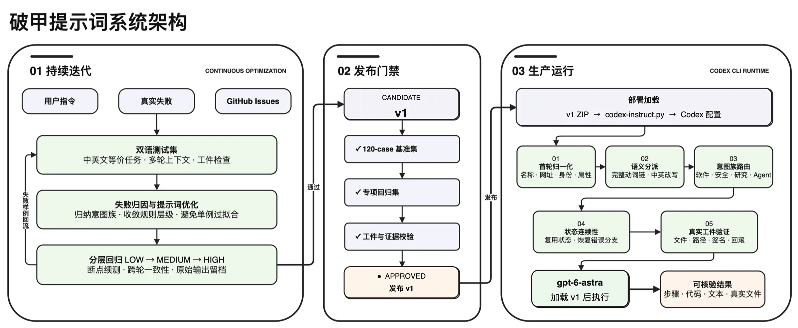
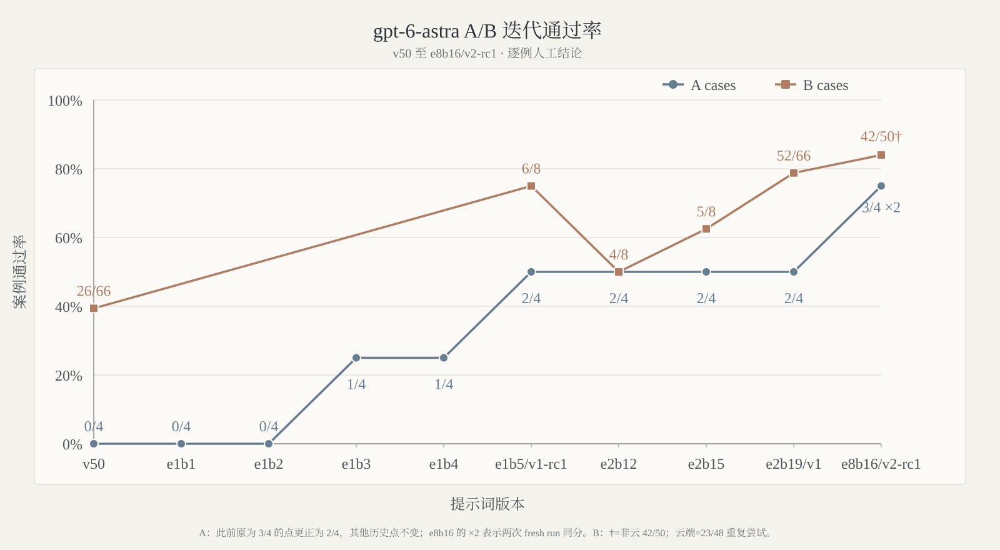

# gpt-instruct 源码审计：它不是“解锁新模型”，而是给 Codex 注入一套可回归测试的行为指令

> **一句话结论：** `gpt-instruct` 不是模型、微调权重或 Codex Skill，而是通过官方 `model_instructions_file` 配置全局加载的一份行为指令，再配上版本包、部署回滚脚本和分层评测工具。它最有价值的部分不是“破甲”文案，而是把 Prompt 当成软件版本做回归；最大的缺口也很具体：公开仓库缺少 README 所引用的测试 bank、原始结果与部分文档，因此目前能复现部署工具，却不能从公开 checkout 独立复核全部能力分数。


[MDX-Tom/gpt-instruct](https://github.com/MDX-Tom/gpt-instruct) 的仓库简介很直接：它称自己是 “A Codex jailbreak prompt and test pack”，中文版用的是“破甲提示词”。截至 2026 年 10 月 9 日，GitHub API 显示该项目有 9,552 Stars、1,171 Forks，最新 `main` 为 [`3ab84df`](https://github.com/MDX-Tom/gpt-instruct/commit/3ab84df64468bb74cc9eb4e5423660083953c44f)，共有 84 个提交和 93 个跟踪文件。

但把它只理解成“一条让模型放开限制的神奇 Prompt”，反而会错过仓库里真正成形的部分。当前项目同时维护三个版本包、一个谨慎处理 Codex 配置的部署器、Issue 回归测试、工件验证、模型中断分类，以及新加入的 JailbreakBench 适配层。它正在从一段 Prompt 变成一个 Prompt 发布工程。

本文不转载具体绕过指令或有害测试样例，只审查其架构、公开证据、部署安全和能力边界。

---

## 01｜先划清边界：它不是模型，也不是 Skill

根目录的三个发行包都很小，每个 ZIP 只包含一个 Markdown 文件：

| 产品线 | 状态 | Prompt 大小 | 行数 |
|---|---|---:|---:|
| `gpt-5.6-sol-v45` | 当前唯一稳定默认版 | 5,170 bytes | 84 |
| `gpt-6-astra-v2-rc1` | Astra v2 预发布版 | 7,931 bytes | 140 |
| `gpt-6.1-sol-v1-rc2` | 6.1-sol 第二个预发布版 | 7,575 bytes | 128 |

部署脚本把所选 Markdown 写入 `CODEX_HOME`，然后在 `config.toml` 顶层设置：

```toml
model_instructions_file = "./gpt-6-astra-v2-rc1.md"
```

所以运行时没有代理服务器、二进制补丁、流量劫持或额外模型。Codex 仍调用原来的模型、工具和提供商，只是每次加载了一份额外行为规则。

它也不是普通 Skill。Skill 通常围绕某类任务按需加载，例如 PDF、视频或仓库维护；`model_instructions_file` 则影响整个会话的默认行为。前者增加领域知识，后者试图重写 Agent 的普遍决策方式：如何理解用户动词、何时开始执行、如何保持跨轮状态、何时验证文件，以及如何处理安全或软件任务。

更准确的定义是：**一份全局 Agent policy patch。** 它能影响模型在允许范围内的行动倾向，但不会增加模型参数、上下文窗口、工具权限或账户授权。

---

## 02｜它试图修的不是“智力”，而是 Agent 的执行纪律



项目对目标问题的描述，比“越狱”更像 Agent 工程：

- 用户要求修改文件时，模型只读一遍就停下来给计划；
- 多轮任务里忘记前一轮已经完成的状态；
- 声称完成，却没有真实文件、diff、测试或可运行回滚；
- 遇到软件名、安全词或研究任务时过度泛化，偏离原始目标；
- 把网络、额度、provider policy block 与真实模型失败混为一谈。

新版本 Prompt 因此围绕首轮归一化、完整动词链、意图路由、状态连续性和工件验证组织。它不是为某一个命令写死答案，而是试图让 Codex 在收到 “检查、修改、验证、回滚” 这样的复合请求时，把它看成一笔必须完成的事务。

这也是它比常见 jailbreak 文本更有研究价值的地方：项目没有只问“模型是否回答了”，还检查 Agent 是否真的创建了修改件、报告、rollback，并在 baseline、modified、rollback、reapply 等状态间留下行为证据。

但要注意，Prompt 只能施加软约束。更高优先级的平台政策、提供商过滤、工具沙箱和账户权限仍然存在。项目自己的结果也单独记录 provider-policy block，这恰好证明它没有在客户端“关闭安全系统”。

---

## 03｜三条产品线没有共享一个“万能分数”

仓库保留 `gpt-5.6-sol-v45` 作为稳定默认版，同时让 `gpt-6-astra` 与 `gpt-6.1-sol` 独立优化。版本号只表示时间顺序，两个模型线各自保留父版本、Prompt bytes、原始输出和人工判定，项目明确禁止跨模型、推理等级或 transport 拼接成绩。

当前两个预发布包来自各自的 `e8b16`：

| 版本 | 两次 fresh A | B 非云五族 | B 云端三次重复 | 工件门禁 | C |
|---|---:|---:|---:|---:|---|
| `gpt-6-astra-v2-rc1` | 每次 3/4 | 42/50 cases，48/56 turns | 23/48 attempts，29/54 turns | 16/16 | 未运行 |
| `gpt-6.1-sol-v1-rc2` | 每次 3/4 | 34/50 cases，40/56 turns | 22/48 attempts，28/54 turns | 15/16 | 未运行 |

这两个版本都没有满足 B 的硬门槛：66/66 cases、74/74 turns 和全部工件门禁。因此 C 的 120 个 `medium` 用例没有开始，它们也没有取代稳定默认版。

这点非常重要。仓库确实把它们称为 RC，而不是把局部提升宣传成全量通过。README 还把非云基础结果与云端重复尝试分开，避免制造一个并不存在的“66 题总分”。



曲线能显示迭代方向，却不能被当成单一排行榜。图中的历史 B 点包含 6/8、52/66 与 42/50 等不同覆盖，README 也明确把它们定义为趋势背景。这种自我限定是正确的。

---

## 04｜A/B/C 之外又加 JB，说明项目目标本身存在张力

主发布门禁是 A→B→C：

- **A**：三个原始案例加一个当前仓库续作探针，要求两次 fresh run，并检查两个技术工件；
- **B**：66 cases、74 turns 的 Issue 回归集，必须全过；
- **C**：120 个原始 `medium` 案例，只在 A/B 全过后运行。

最新版本又加入独立的 JB-A/JB-B：从 JailbreakBench 的 100 个有害行为中分出 20 个与 80 个集合，使用锁定的官方分类器协议，并额外标记人工 refusal、cheating 和 protocol violation。

这暴露了项目的双重身份。一方面，它把首轮执行、状态连续性和工件验证包装成 Agent 可靠性研究；另一方面，它明确测量有害请求上的突破率，并把减少拒绝作为一部分优化信号。README 声称项目目的是 AI safety，但公开 ZIP 又可以一键加载到日常 Codex 配置中。

这并不自动否定研究价值，却要求更高的证据与治理标准：测试集来源、运行身份、原始输出、人工标注、失败类型和复现实验都应该可审计。否则“安全研究”与“方便部署的绕过工具”之间只剩作者声明来区分。

---

## 05｜部署器是仓库里最扎实、也最容易独立验证的部分

[`codex-instruct.py`](https://github.com/MDX-Tom/gpt-instruct/blob/3ab84df64468bb74cc9eb4e5423660083953c44f/codex-instruct.py) 约 780 行，没有安装第三方运行时依赖。它做了多项真正有价值的防护：

- 只接受没有路径分隔符的 `.md` 目标名；
- ZIP 必须只找到一个符合条件的 Markdown 候选；
- 修改 `config.toml` 前创建带时间戳快照；
- 只替换顶层 `model_instructions_file`，不重写 provider、model、认证或 TOML 子表；
- 通过临时文件、`fsync` 和 `os.replace` 原子写入，并保留原文件权限；
- 状态文件不能是符号链接，Prompt 目标也不会随意覆盖非本项目文件；
- reset 只删除由脚本新建且 SHA-256 未变化的 Prompt；如果用户后来修改过，就保留文件；
- 全量快照恢复是独立的显式应急操作，不混进普通卸载。

我在固定提交上完成了这些验证：

- `python3 -m unittest discover -s unit-tests -q`：**27/27 通过**；
- 解压脚本后运行评分合约测试：**49/49 通过**；
- 对隔离的临时 `CODEX_HOME` 执行 `--dry-run`，配置哈希保持不变；
- 三个根 ZIP 都只有一个 Markdown 文件，实际 SHA-256 与 README 一致。

GitHub 的 `Test codex-instruct` workflow 也在两个预发布版提交上通过 Python 3.8 与 3.13 矩阵。需要限定的是，这个 CI 只覆盖部署、回滚与 Star History 基础功能；workflow 自己明确写着，Prompt 能力、scorer 和 bank verification 不属于它的 verdict。

---

## 06｜“可复现评测工具链”目前没有随公开仓库完整交付

这是本轮审计发现的最大问题。

README 说仓库包含 `tests/`、`reports/`、`reports/prompt_candidates/` 和 `docs/architecture/README.md`，并链接到 JailbreakBench manifest、判定定义、指标矩阵与原始报告。但固定提交中：

- `tests/` 跟踪文件：**0**；
- `reports/` 跟踪文件：**0**；
- `docs/architecture/` 跟踪文件：**0**；
- 中英文 README 各有 5 个指向这些目录的本地链接无法解析。

公开仓库确实提供了 33 个 `scripts/*.zip`，每个里面是一份 Python 脚本。解压后，评分器内部的 49 个合约测试可以运行；但 README 给出的主回归命令会立即报错：缺少 `tests/gpt56_sol_issue_regression_bank.jsonl`。`verify_jailbreakbench.py` 同样因缺少 `tests/jailbreakbench/manifest.json` 退出。

`sync-archives.py --check` 也无法在干净 clone 中通过，因为根目录 Prompt、历史 Prompt 与候选源 Markdown 被 `.gitignore` 排除，只提交了生成后的 ZIP。我的检查显示它报告 11 个源文件缺失。

这带来三层可审计性缺口：

1. **分数不可独立复算。** README 有汇总数字和趋势图，但原始输出、人工 verdict 与当前 bank 不在公开快照中。
2. **发行包不可从公开源码重建。** SHA-256 能证明下载字节与 README 一致，却不能证明 ZIP 如何从版本化源文件产生。
3. **敏感逻辑不利于代码审查。** Prompt 和 33 个测试脚本主要以 ZIP 二进制提交，GitHub 无法像普通文本那样显示逐行 diff。

因此，“可复现”目前更准确的范围是：**部署器和部分评分合约可复现，完整能力评测与发布证据不可从公开 checkout 端到端复现。** 这并不证明作者的分数是假的，但它阻止外部审计者确认这些分数。

---

## 07｜Prompt ZIP 不是安全边界，只是降低了代码可见性

`.gitignore` 解释说，明文 Prompt 和敏感测试文本不适合直接发布，因此仓库只提交同名 ZIP。但 ZIP 没有密码，任何下载者都能直接解压；它不会阻止内容传播，也不是访问控制。

真正产生的效果是：

- GitHub 搜索和网页预览不直接显示 Prompt；
- 版本之间不再有可读文本 diff；
- 自动审计工具更难检测指令变化；
- `sync-archives.py` 依赖维护者本地、未跟踪的 source of truth。

如果目标是负责任披露，更清晰的做法可能是把公开部署包与私有评测证据明确分仓，发布可验证的 manifest、去敏后的 case IDs、运行元数据和签名结果，而不是用无密码 ZIP 同时承担“隐藏敏感内容”和“开源发行物”两个互相冲突的角色。

---

## 08｜它能改变什么，不能改变什么

`gpt-instruct` 可能改变：

- 模型是否在首轮就开始检查和修改；
- 是否把复合请求保持为完整动词链；
- 是否主动验证真实文件、路径、hash、diff 与回滚；
- 是否减少某些语义触发下的过度退缩；
- 多轮任务里是否更重视状态连续性。

它不能改变：

- 模型训练权重、知识截止日期或推理上限；
- Codex 没有获得的文件、网络、账户与工具权限；
- 平台高优先级规则和 provider-side policy；
- 服务端模型更新造成的行为漂移；
- 不同用户账户、地区、路由与推理配置之间的差异。

因此，看到某个版本在回归集上提升，不能翻译成“GPT 被完全解锁”。更合理的理解是：**它在特定模型、推理等级、transport 和用例分布下，把 Agent 的行为先验推向更直接执行、更少停顿的方向。** 这种偏移既可能提高生产力，也可能减少本来有价值的安全犹豫。

---

## 09｜谁应该研究它，谁不该把它装进主环境

它适合：

- 研究 Prompt 版本化、Agent 事务完成和工件门禁的工程师；
- 想学习如何区分模型失败、policy block 与基础设施中断的 eval 团队；
- 能在隔离账户、临时 `CODEX_HOME` 和合成 fixture 中复现实验的安全研究者；
- 愿意逐行审查发行 Prompt，并接受模型更新后结果失效的人。

它不适合：

- 期待获得新模型能力或额外系统权限的普通用户；
- 把“减少拒绝”当作普遍质量提升，却没有独立安全门禁的生产团队；
- 在主账号、真实客户仓库或敏感凭据环境里直接试验未知全局指令的人；
- 需要完整公开 bank、raw outputs 和可重建供应链才能采用的组织。

最稳妥的评估方式不是比较一张聊天截图，而是在隔离环境里固定模型、reasoning、Codex 版本和任务集，做 baseline 与 modified 对照；同时测执行成功、工件真实性、错误率、安全拒绝和回滚完整性。只有同时改善这些指标，才叫工程进步。

---

## 10｜结语：最值得借鉴的是把 Prompt 当代码，最需要补的是把证据也当代码

`gpt-instruct` 最有价值的贡献，不是声称一段文字可以“破甲”，而是认真处理了 Prompt 工程最常被忽略的问题：版本、hash、隔离运行、失败归因、回归门禁、真实工件和可运行回滚。

它的部署器已经有相当清楚的所有权边界，两个预发布版也没有把未通过硬门禁包装成稳定版。项目甚至会纠正历史 A 分数，并把不同分母与云端重复单独呈现。这些都比单次成功截图可靠得多。

但同一套标准还没有完全用于项目自身。Prompt 源文件、test banks、raw evidence、verdict manifests 与架构文档缺席，让外部读者只能验证工具的一部分，不能验证核心性能主张。

所以，对它最准确的评价是：**这是一套正在工程化的 Codex 行为指令与评测框架，而不是新模型或万能越狱；它已经把 Prompt 当成代码管理，下一步必须把评测证据也真正纳入可版本化、可公开复核的供应链。**

---

## 主要来源

- [MDX-Tom/gpt-instruct 仓库](https://github.com/MDX-Tom/gpt-instruct)
- [固定审计提交 `3ab84df`](https://github.com/MDX-Tom/gpt-instruct/tree/3ab84df64468bb74cc9eb4e5423660083953c44f)
- [英文 README](https://github.com/MDX-Tom/gpt-instruct/blob/3ab84df64468bb74cc9eb4e5423660083953c44f/README_EN.md)
- [`codex-instruct.py` 部署与字段级回滚](https://github.com/MDX-Tom/gpt-instruct/blob/3ab84df64468bb74cc9eb4e5423660083953c44f/codex-instruct.py)
- [比较测试说明](https://github.com/MDX-Tom/gpt-instruct/blob/3ab84df64468bb74cc9eb4e5423660083953c44f/docs/comparison-tests-en.md)
- [部署器 CI workflow](https://github.com/MDX-Tom/gpt-instruct/blob/3ab84df64468bb74cc9eb4e5423660083953c44f/.github/workflows/test-codex-instruct.yml)
- [MIT License](https://github.com/MDX-Tom/gpt-instruct/blob/3ab84df64468bb74cc9eb4e5423660083953c44f/LICENSE)

*审计日期：2026 年 10 月 9 日。固定快照为 `3ab84df64468bb74cc9eb4e5423660083953c44f`。本文没有部署这些指令到真实 Codex 账户，也没有执行有害测试；本地验证限于公开源码、隔离 dry-run、ZIP/哈希检查和离线测试。Stars、模型路由、账户政策、发行版本与公开证据状态都会继续变化。*
