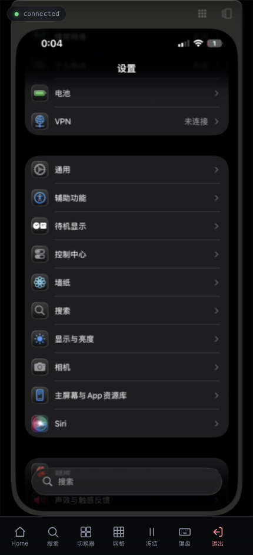
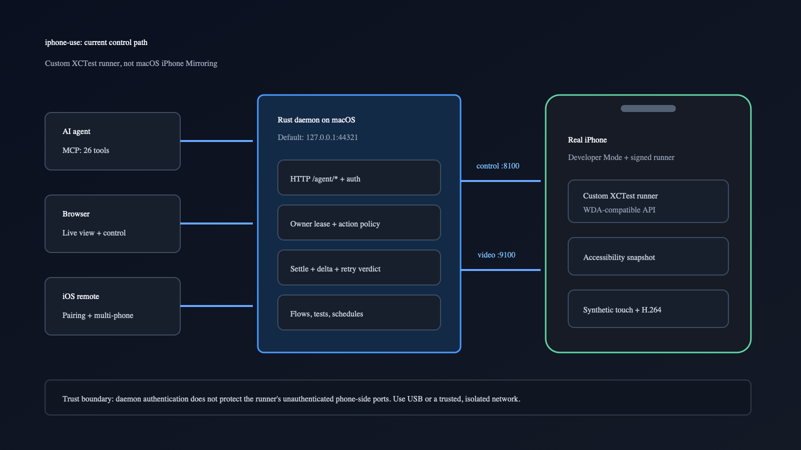
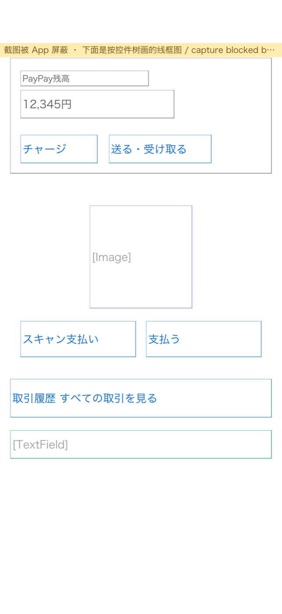

# iphone-use Source Audit: Not an iPhone Mirroring Script, but a Real-Device Agent Stack That Knows When Not to Retry

> **Bottom line:** `iphone-use` does not make a model click the macOS iPhone Mirroring window, and it is more than a Skill that teaches an agent how to operate a phone. It installs a custom XCTest runner on a real iPhone, while a Rust daemon on the Mac exposes HTTP APIs, 26 MCP tools, a browser control surface, and a native iOS remote. Its strongest idea is not tapping or swiping. It turns accessibility elements, settled post-action state, batching, ownership, and retry safety into a protocol. The costs are equally concrete: a Mac, full Xcode, Apple signing, Developer Mode, and an unlocked iPhone are required; the runner ports are unauthenticated, and protected apps can still blank every visual capture.

The user-provided [`donghaozhang/iphone-use`](https://github.com/donghaozhang/iphone-use) repository is a fork created on October 9, 2026. Its upstream is [`leeguooooo/iphone-use`](https://github.com/leeguooooo/iphone-use). This article pins the audit to the fork's [`9aa2fb9`](https://github.com/donghaozhang/iphone-use/tree/9aa2fb94dffcb37b15f69cc142108c3b722d6fec) snapshot. That commit includes PR #233, which keeps a driven phone awake and attempts to unlock a passcode-less device before an action, while its crate version remains `0.17.11`. During the audit, upstream published [`v0.17.12`](https://github.com/leeguooooo/iphone-use/releases/tag/v0.17.12) and continued adding a legacy launch path for iOS 15 and 16. Source conclusions below therefore refer to the fixed commit; release status is called out separately.

---

## 01 | What It Is: The Skill Is Only the Entry Point to a Four-Layer System

Calling the whole project an “iPhone Computer Use Skill” hides most of its implementation. The source contains at least four distinct layers:

| Layer | Responsibility | What it does not do |
|---|---|---|
| Agent Skill | Defines observation, confirmation, login, recovery, and flow-reuse behavior | Does not control the phone itself |
| MCP / HTTP API | Turns elements, actions, batches, flows, tests, and status into structured contracts | Does not replace real-device execution |
| Rust daemon | Manages authentication, runner lifecycle, ownership, settling, video, and clients | Does not relay clicks through the Mac desktop |
| iPhone XCTest runner | Reads accessibility, synthesizes touches, types text, and encodes video on the device | Cannot bypass Face ID, a passcode, or iOS security policy |

Since `v0.14.0`, the current backend has been the project's own XCTest runner. It replaces WebDriverAgent while preserving a WDA-compatible API. The earlier iPhone Mirroring backend was removed in `v0.9`. The system therefore does not need to take over the Mac cursor, keyboard focus, or foreground window: agent actions go directly to the device runner.

The setup requirement is substantial: macOS 15 or later, full Xcode.app, an Apple ID usable for development signing, an iPhone in Developer Mode, and USB for initial installation. The phone must remain unlocked while the runner is built, launched, and used. A free Personal Team works, but its profile needs periodic renewal. This is a self-hosted developer automation stack, not a zero-maintenance consumer remote.

---

## 02 | “Seeing” Primarily Means Reading Accessibility, Not Guessing Coordinates from Pixels

`GET /agent/elements` asks XCTest for one accessibility snapshot with a fixed attribute set, then flattens it into rows suitable for an agent. The model receives labels, identifiers, kinds, values, enabled/visible/focused state, and bounds instead of relying entirely on a screenshot.

That has three immediate benefits:

1. Controls can be selected by a unique label, identifier, and kind rather than persistent coordinates.
2. The foreground app and focused field can be checked before typing, reducing the risk of text landing in the wrong conversation.
3. The same tree supports assertions, flow compatibility checks, and failure evidence, rather than serving only one click.

Element indexes must carry the matching snapshot token. If the interface changes and a caller tries to reuse an old index, the daemon returns `409 stale_element_snapshot` without sending the action. That constraint prevents “element 7” from silently becoming a different target after the screen changes.

Screenshots still exist, but as supporting evidence. MCP attaches one automatically only when the tree is insufficient. Action calls can also return the settled post-action delta in the same response, so the agent does not need another blind round trip merely to learn whether a page opened.

---

## 03 | The Most Mature Design Is Failure Semantics, Not Tapping

The dangerous mobile-automation failure is often not “the button was missed.” It is “the button was pressed, the response was lost, and the system pressed it again.” For sending, ordering, deleting, or paying, that retry can create a real side effect.

`iphone-use` gives actions explicit outcome semantics:

| Outcome | Meaning | Required behavior |
|---|---|---|
| `not_sent` | The action was refused before reaching the phone | Retry only when `retry_safe:true`, after fixing the cause |
| `applied` / `no_effect` | The runner acted and observed a change or no visible effect | Decide from the target state |
| `outcome_unknown` | The action was dispatched, but timeout or transport loss hid the result | `retry_safe:false`; read the screen before doing anything else |

`/agent/actions` accepts batches of up to 24 steps. It validates the batch first, executes in order, stops at the first failure, and preserves completed steps, applied actions, the failed step, batch outcome, and final screen. MCP's compact text deliberately keeps `retry_safe` instead of dropping the most important safety field to save tokens.

Even `ok:true` is not a business postcondition. It means the request followed a confirmed execution path; the caller must still inspect settle, delta, or an explicit expectation. That separation keeps API success distinct from user-goal success.

---

## 04 | Agent Exploration Can Be Compiled into Flows, Tests, and Schedules

After an agent completes a multi-step task, the project can express it as a per-app JSON flow. Later runs use the deterministic runner in one call, without asking a model to observe and decide at every step. The separate official flow registry ships SHA-256-verified content, and compatibility verdicts include app version, risk, and verification age.

Flows are not unconditional automation. The bundled Skill requires that:

- sending, publishing, paying, deleting, and other irreversible actions receive confirmation for the exact target and inputs;
- `outcome_unknown` and `retry_safe:false` are never automatically replayed;
- credentials use the dedicated login/vault path and are never requested, repeated, or persisted by the model;
- saving a private flow and publishing it to the registry remain separate decisions;
- one owner controls each phone at a time, with the lease treated as coordination rather than authentication.

Flows can also become YAML or JSON test suites that produce exit codes, JSON/JUnit reports, and failure evidence: screenshot, elements, steps, and error. The scheduler runs flows or suites on cron rules. It postpones a run when the phone is occupied, waits for unlock, and records a missed run when its window expires. The project is therefore moving from “an agent can use a phone” toward repeatable real-device task automation.

---

## 05 | Protected Screens Are Not Bypassed; They Degrade to an Accessibility Wireframe

Banking, wallet, and payment apps can ask iOS to hide their content from capture. `iphone-use` does not bypass that protection: every visual path can still receive a blank region. When the daemon finds a nearly flat content band while the accessibility tree contains labelled elements there, it returns a wireframe drawn from element bounds, kinds, and labels, together with `X-Capture-Redacted: 1`.

“Works with banking and payment apps” therefore needs a precise interpretation: **the visual stream may remain hidden, but navigation can continue when the app exposes sufficient accessibility semantics.** If an app hides both useful pixels and useful accessibility, the agent has no reliable basis for control. The project's own Skill also prohibits unattended payment and 2FA operation, so technical element access is not authorization to automate a financial decision.

---

## 06 | The Same Daemon Serves Agents and People

The Mac daemon listens on `127.0.0.1:44321` by default and exposes three major surfaces:

- the `/agent/*` HTTP API for scripts and agents;
- 26 MCP tools covering status, observation, actions, batching, login, flows, and metrics;
- a browser UI and native iOS Remote App for live viewing, input, and human takeover.

The SwiftUI Remote App requires iOS 17 or later. It can pair by QR code, stores credentials in Keychain, and receives H.264 video. It also supports a multi-device grid and synchronized gestures across several daemons. Each controlled phone still has its own daemon and runner; this is not a shared pool of virtual devices.

For human-agent coexistence, `X-Phone-Owner` provides a 300-second control lease by default. Human viewing or takeover also affects scheduled work. The lease prevents cooperating clients from colliding, but it is not a security boundary against a hostile client with network access.

---

## 07 | The Largest Security Boundary: Port 44321 Is Authenticated; Device Ports 8100/9100 Are Not

The daemon's password, cookie, or bearer protects port `44321`. State-changing requests additionally require `X-Phone-Control: 1`, and the browser uses an `HttpOnly`, `SameSite=Lax` cookie. Those are useful control-plane protections.

The device runner's control port `8100` and video port `9100`, however, have no authentication. A USB relay keeps the Mac-side listeners on loopback, but it does not stop another host on the iPhone's Wi-Fi from reaching the phone-side ports. The official guide therefore requires a trusted, isolated network, or disabling iPhone Wi-Fi while using USB.

Binding the daemon to `0.0.0.0` requires a password and dedicated agent token, but still exposes the authenticated surface to the LAN. Remote access should terminate at the daemon through a trusted VPN, tunnel, or authenticated HTTPS reverse proxy. The runner ports should never be exposed directly.

The native Remote App's privacy policy says the developer runs no relay service and collects no accounts, analytics, crashes, or advertising data; screen and input traffic stays between the configured Mac and the app. That is the present implementation and policy boundary, not an end-to-end guarantee for the user's network, model provider, or self-hosted proxy.

---

## 08 | More Engineering Depth Than a Typical MCP Demo, with Limited Real-Device Proof

The fixed fork snapshot contains about 111 Rust, Swift, Objective-C, Python, or shell source files across its core product directories and roughly 93,000 lines. Eighty-six files contain Rust test, XCTest, pytest, or unittest markers. The Rust workspace separates `core`, `server`, `mcp`, and `legacy-launch`, alongside the XCTest runner, SwiftUI remote, web UI, example flows, and a substantial installer.

PR checks on `macos-14` run Rust 1.96 clippy, server/MCP/legacy-launch tests, binary builds, 26-tool discovery, offline flow validation, an unsigned runner build, and helper-script tests. PR #233 passed its test and MCP-discovery job. Release `v0.17.12` provides a universal macOS MCP archive, a runner archive, and `iPhoneUse.app.zip`, each accompanied by a SHA-256 file.

CI deliberately connects to no physical device. It points the daemon at a port that must fail so a test cannot accidentally operate a developer's phone. CI can therefore prove protocol, build, and simulated boundaries, but not that a given iOS release, app, signing profile, and physical phone work end to end.

Project-reported performance includes `0.08–0.135s` for a tree read and about `1.0s` for tap-plus-settle on the same iPhone 13 over USB. Through the full agent API, a label tap with settled change is reported at about `1.9s` on an iPhone 17 Pro Max, with live video at `27–28 fps`. These are the project's October 2026 measurements, not independent results from this audit, and they should not be generalized to Wi-Fi, complex screens, or every iPhone.

For local verification, I ran the fixed fork's Rust test suites for `server`, `iphone-use-mcp`, and `legacy-launch`; all passed, with one unused-import warning while compiling the MCP tests. I did not install the runner on a real iPhone or perform device acceptance for login, payment, scheduling, or multi-device synchronization. This article verifies source architecture, protocol design, published CI, and local build tests, not end-to-end product acceptance.

---

## 09 | Who It Fits, and Who It Does Not

It is a strong fit for:

- agents that must operate owned iOS apps or internal tools with no public API;
- teams turning real-phone manual workflows into regression tests or controlled flows;
- developers willing to manage Xcode signing, Developer Mode, trusted networking, and dedicated test devices;
- labs that need human handoff between browser/iOS Remote and an agent.

It is a poor fit for:

- people expecting direct iPhone control from Windows or Linux, or no Mac/Xcode maintenance;
- anyone expecting to bypass a passcode, Face ID, protected capture, or app permissions;
- workflows that confuse element visibility with permission to automate payment, sending, or deletion;
- teams requiring App Store-level stability while rejecting signing renewal and iOS/Xcode/accessibility drift.

---

## 10 | Conclusion: The Product Is Not a Mouse for the Phone, but an Action Protocol with Judgment

The easiest tagline is “Computer Use, but for the iPhone.” The source supports a more exact description: **a real-device automation stack with a custom XCTest runner as its execution layer, a Rust daemon as its control plane, accessibility snapshots as its primary observation, and MCP/HTTP/flows as its agent interface.**

It is well beyond a Remotion-style Skill or a handful of Appium scripts. The runner, video, snapshot binding, owner coordination, batching, flow registry, test suites, and Remote App are real implementations. It remains constrained by Apple's development chain, device unlock state, accessibility quality, and unauthenticated runner ports.

The most reusable lesson for other agent tools may not be how it synthesizes a tap. It is the willingness to tell the model: **this action may already have happened, so do not retry it.** In real-world automation, that is more valuable than one more `tap` tool.

---

## Primary Sources

- [User-provided fork: donghaozhang/iphone-use](https://github.com/donghaozhang/iphone-use)
- [Upstream project: leeguooooo/iphone-use](https://github.com/leeguooooo/iphone-use)
- [Pinned audit commit `9aa2fb9`](https://github.com/donghaozhang/iphone-use/tree/9aa2fb94dffcb37b15f69cc142108c3b722d6fec)
- [Upstream v0.17.12 release](https://github.com/leeguooooo/iphone-use/releases/tag/v0.17.12)
- [PR #233: keep awake and passcode-less unlock](https://github.com/leeguooooo/iphone-use/pull/233)
- [Product guide](https://github.com/donghaozhang/iphone-use/blob/9aa2fb94dffcb37b15f69cc142108c3b722d6fec/docs/guide.md)
- [Agent API](https://github.com/donghaozhang/iphone-use/blob/9aa2fb94dffcb37b15f69cc142108c3b722d6fec/docs/agent-api.html)
- [Agent and flow reference](https://github.com/donghaozhang/iphone-use/blob/9aa2fb94dffcb37b15f69cc142108c3b722d6fec/docs/agent-reference.md)
- [Testing and scheduling](https://github.com/donghaozhang/iphone-use/blob/9aa2fb94dffcb37b15f69cc142108c3b722d6fec/docs/testing.md)
- [Privacy policy](https://github.com/donghaozhang/iphone-use/blob/9aa2fb94dffcb37b15f69cc142108c3b722d6fec/docs/privacy.md)
- [MIT License](https://github.com/donghaozhang/iphone-use/blob/9aa2fb94dffcb37b15f69cc142108c3b722d6fec/LICENSE)

*Audited October 9, 2026. Repository, release, CI, and device-compatibility state will continue to change. I did not install or run the project on a physical iPhone; performance figures are project-reported. The browser-control and accessibility-wireframe images come from the upstream repository and are preserved locally with the article. The current architecture diagram was redrawn from the pinned source.*
