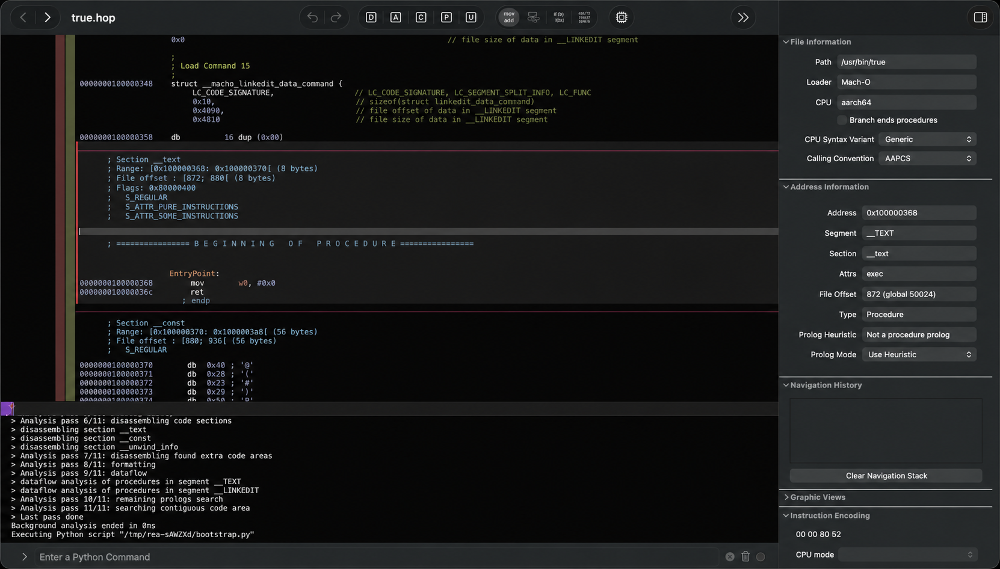
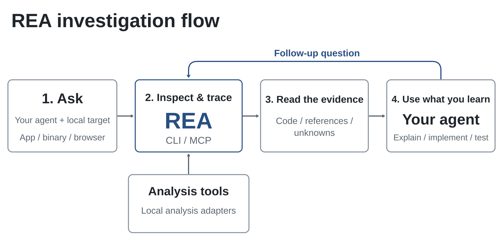

# REA 源码审计：它不是“AI 自动克隆 App”，而是给逆向工程加上证据账本的 Agent 运行时

> **一句话结论：** REA 不是一个会自动还原任意软件的模型，也不只是一份教 Agent 操作反编译器的 Skill。它是一套 TypeScript 控制面，通过 CLI 与 MCP 把 Hopper、Ghidra、IDA、Chrome、JADX、静态解析器和运行时观察工具接到 Agent，并把每次发现封装成带目标哈希、来源、置信度、限制和关联关系的 Evidence。它真正的价值是让“反编译结果”逐步变成可追踪的调查记录；它最大的边界则是，分析在本地运行不等于数据全程不离机，也不等于不可信二进制被放进了沙箱。

用户给出的 [`donghaozhang/rea`](https://github.com/donghaozhang/rea) 是 2026 年 10 月 9 日创建的 fork。GitHub API 将其上游与 source 都标为 [`morluto/rea`](https://github.com/morluto/rea)，npm 包 [`rea-agents`](https://www.npmjs.com/package/rea-agents) 的 repository 字段也指向后者。因此，本文以用户链接为入口，实际审计对象是 fork 的固定提交 [`863674b`](https://github.com/donghaozhang/rea/tree/863674b2e92dd7c699768db82d521ccc88b7ebe4)，对应 `rea-agents@6.1.0`；项目归属、Stars 与发行信息均以上游为准。

截至审计时，上游有约 30,900 Stars、3,700 Forks，`v6.1.0` 于当天发布。仓库仍在高频变化，所以下面的结论绑定到固定快照，不把后续 `main` 自动视为同一实现。

---

## 01｜先拆清楚：Skill、MCP、分析引擎和写代码是四件事

REA 的一句安装命令容易让人把它理解成“逆向工程 Skill”。但源码里实际有四层：

| 层 | 负责什么 | 不负责什么 |
|---|---|---|
| Skill / workflow instructions | 教 Agent 按“取证、追踪、验证、保留未知项”的顺序工作 | 不读取二进制，不运行反编译器 |
| CLI 与 MCP server | 暴露工具契约、管理 session、选择 provider、返回结构化结果 | 不替代 Hopper、Ghidra、IDA 的分析能力 |
| Provider adapters | 调用本地反编译器、浏览器、静态解析器和运行时观察工具 | 不替 Agent 判断产品意图 |
| Host agent | 决定下一步调查、解释行为，并在用户项目中写和测试实现 | 生成代码不自动等于与原产品等价 |

`rea setup` 会同时注册 MCP server 和安装配套 Skill，二者相互配合，但不是同一层。只拿到 Skill，Agent 只知道调查方法；只有 MCP/CLI 和可用 provider 接通后，它才能获得真实反汇编、伪代码、模块关系或运行时观察。

同样，REA 自己并不“吐出原始源码”。README 对这条边界写得很清楚：Native 路径返回伪代码与汇编，JavaScript/Electron 路径恢复模块及关系，最终的解释、重写和测试由 Agent 完成。

---

## 02｜一次调查实际怎样流动

源码中的主链路可以概括为：

1. Agent 根据用户问题选择一个 MCP workflow 或底层工具；
2. session 固定目标文件、SHA-256、分析 provider 和配置；
3. provider adapter 启动或连接本地工具，对目标做静态或运行时观察；
4. REA 规范化结果，附上 authority、confidence、limitations 和位置；
5. Evidence 进入当前 session 的账本，可被后续比较、追踪、导出或引用；
6. Agent 根据现有证据继续缩小问题，最后在目标项目中实现候选功能并验证。

这条链路的重要设计是：provider 一旦选定，就不会在运行失败后静默换成另一个引擎。Hopper、Ghidra 与 IDA 对同一个二进制可能给出不同函数边界、类型推断和伪代码；自动切换却不显式记录，会让两轮结果看似连续，实际证据来源已经变化。REA 选择返回类型化错误和修复建议，把 provider 变化留给用户或 Agent 明确决定。

---

## 03｜它已经不是“给 Hopper 加一个 MCP”

构建生成的 `product-catalog.json` 在这个快照中列出 **139 个 MCP tools、95 个 CLI commands、6 个 MCP prompts、27 个 provider 条目和 14 个 setup clients**。能力覆盖大致分为：

| 目标 | 主要路径 | 能观察什么 |
|---|---|---|
| Native binaries | Hopper、Ghidra、IDA | 伪代码、汇编、字符串、符号、调用与引用 |
| JavaScript / Electron | AST、ASAR、source map、CDP | 模块、import、route、IPC、preload 与 native add-on 关系 |
| Websites | Chrome-family browser、Playwright/CDP | DOM、脚本、请求、响应、截图与运行时事件 |
| .NET | 自带静态 metadata/CIL reader | 类型、成员、CIL、native dependency 与版本比较 |
| Android | Headless JADX | manifest、class、method 与 reference tracing |
| Firmware | Binwalk / Unblob | 区域、提取结果和 native-analysis handoff |
| ELF / crash / process | pwntools、GDB/pwndbg、PTY capture | layout、mitigation 候选、core、终端与文件系统行为 |
| EVM | EVMole adapter | selector、byte offset、参数与 mutability 推断 |
| Apple artifacts | Mach-O、plist、NIB、asset catalog readers | bundle 结构、签名、资源和动态库关系 |

这并不表示每台机器天然拥有全部能力。Hopper 是独立商业软件；Ghidra、IDA、JDK、JADX、Binwalk、Unblob、Chrome 和平台工具都有各自安装、版本与主机限制。`tools/list` 可以列出完整目录，真正能不能调用要看 `binary_session.tool_availability`，而不是看 README 的功能表。

---

## 04｜最有价值的抽象是 Evidence，不是工具数量

`src/domain/evidence.ts` 定义的 Evidence 至少包含：

- 目标名称、本地路径、格式、架构与 SHA-256；
- provider ID、名称、版本和可选 analysis profile；
- operation、parameters、raw result 与 normalized result；
- `observed`、`derived` 或 `inferred` 置信度；
- `shipped-artifact`、`controlled-replay`、`historical-reference`、`external-service` 或 `analyst-inference` 权威来源；
- execution environment、limitations、地址/文件偏移/路径位置；
- 指向其他 Evidence 的链接。

`evidence_id` 不是自增编号，而是对语义内容做 canonical digest 后生成。导入时，账本会重新解析并校验 ID；同一个 ID 如果内容冲突会被拒绝。记录在写入后被深度冻结，bundle 导入先完整校验，再原子合并。

更少见的是，它还维护 residual unknown。某个调用目标没有解析、运行时路径没有覆盖、比较缺少足够 authority 时，系统可以把“尚未知道什么、需要哪种证据、当前状态如何”保留下来，而不是让 Agent 用一段听起来顺畅的解释填空。

这让 REA 更像一套调查记录协议，而不是把反编译器按钮翻译成自然语言。它不能保证结论正确，但能让读者追问：这个判断来自原始字节、一次受控运行、历史参考，还是分析者推断？

---

## 05｜“本地分析”是真的，但不能被扩写成“完全离线、完全私密”

README 的精确说法是：REA 在本地分析目标，Agent 会收到工具结果，而模型提供商有自己的数据政策。这个限定非常重要。

可以确认的本地边界包括：

- Hopper、Ghidra、IDA 和静态解析器在本机处理目标；
- Ghidra 使用隔离临时 project、私有 home/cache/runtime，并在 session 结束时删除临时 project；
- 本地 provider bridge 用随机 capability token 和当前用户 Unix socket 认证；
- token 通过私有 session descriptor 传递，不放在进程参数或环境变量中；
- setup 先生成变更计划，展示配置目标和外部操作，获批后才写入，并为现有 client config 保留 backup。

但它不等于完整隐私边界：

- MCP 返回给 Agent 的伪代码、字符串、文件路径和观察结果，可能进入云端模型上下文；
- 浏览器和运行时工作流会运行目标或访问目标页面，网络行为取决于所选任务；
- setup、update 和可选 provider 安装可能访问 npm、GitHub 或 Hopper 官方下载源；
- 同一操作系统用户下的恶意进程不在 capability token 的防护范围内。

所以更准确的表述是：**原始目标默认由本地工具分析，REA 本身不把整个 App 上传到自有分析服务；但被挑选出来的证据会交给宿主 Agent，后续数据路径由 Agent 与模型提供商共同决定。**

---

## 06｜它做了隔离控制，但明确不是 sandbox

`SECURITY.md` 没有把临时目录包装成安全沙箱。它直接说明：打开不可信二进制，会把解析与分析交给具有当前用户权限的本地 provider。

现有控制值得肯定：

- Ghidra 只导入请求的目标，限制启动、协议消息、CPU 与 heap，并清理私有 project；
- REA 只清理能证明归自己所有的进程与资源，不会为了恢复而随意杀掉同名进程；
- Hopper 下载限制在官方 HTTPS origin，限制包大小并检查官方公布的校验值；
- setup 对 Ghidra 与 Java 只保存用户现有安装路径，不自行下载或升级；
- 大结果受 MCP response budget 控制，完整证据可原子导出到文件，而不是构造失控的大字符串。

仍然存在的攻击面也很现实：反编译器、压缩包、调试信息、浏览器协议、JADX、Binwalk 和各种文件解析器都可能接触攻击者控制的输入。隔离临时 project 能减少污染和残留，不能把 provider 的解析漏洞变成无害事件。

处理未知来源样本时，合理做法仍是专用虚拟机或隔离主机、低权限账户、无生产凭据、受控网络和可丢弃工作区。REA 的 session 边界不能替代操作系统级隔离。

---

## 07｜“重建成功”必须绑定原始 authority，而不是看生成代码像不像

REA 的产品叙事是 Decompile → Understand → Recreate。前两步来自调查工具，第三步通常由宿主 Agent 在用户项目里完成。

因此至少有三种不同的“成功”：

1. **观察成功**：工具确实从固定目标返回了可验证结果；
2. **理解成功**：Agent 的解释与现有 Evidence 一致，并明确保留未知项；
3. **重建成功**：候选实现通过了绑定原始行为的测试、回放、字节或输出比较。

只拿到漂亮的伪代码属于第一层。根据伪代码写出能编译的函数，也不自动进入第三层。编译器优化、未覆盖分支、平台 ABI、时序、文件系统副作用和网络响应都可能让“看起来一样”的实现偏离原产品。

项目为此加入 reconstruction obligation ledger、authority comparison 和 residual unknown 检查，这是正确方向。但这些机制仍然依赖调查者设计足够强的 fixture 和 verifier。证据账本可以阻止“没有证据却写成已证明”，不能替用户发明完整验收标准。

---

## 08｜工程成熟度很高，发布速度也带来了可见裂缝

这个快照有 1,728 个 TypeScript 文件、663 个测试文件、50 个文档文件和 17 个 GitHub Actions workflows。npm `rea-agents@6.1.0` 解包后约 6.36 MB、1,027 个文件，锁定 32 个运行时依赖；本地 `npm ci` 报告 0 个已知 vulnerability。数量本身不等于质量，但它说明这已经不是一个周末 MCP wrapper。

我在固定提交上做了以下验证：

- `npm ci`：成功；
- `npm run build`：成功，并生成 139-tool 产品目录与 completion ledger；
- `npm run test:fast`：3,507 通过、7 跳过、1 失败，共 3,515 项。

唯一失败来自 `MachOSliceArtifactReader.test.ts`。测试把本机 `/bin/ls` 的两个 universal Mach-O slice 长度写成固定期望；当前系统实际区间与仓库期望相差少量字节。它没有推翻 Mach-O reader，但暴露了一个典型问题：把宿主系统文件当稳定 fixture，会让 OS 更新造成非产品回归。

项目的测试分层比大多数 MCP 仓库严谨。module、composition、boundary、MCP boundary、acceptance、conformance 和 evaluation 被分开；真实 Hopper、Ghidra、IDA、Chrome、Apple artifact 与 package 路径有独立 verifier。文档还明确说，录制 fixture、注入 provider 或 package test 不能替代真实引擎证明。

本轮没有在本机安装或启动 Hopper、Ghidra、IDA、JADX、Binwalk，也没有运行真实浏览器、Android、firmware 或 Windows provider E2E。因此本文能确认的是源码架构、构建、快速测试和公开 CI 设计，不能把它扩写为全部 provider 在当前机器上通过。

---

## 09｜它适合谁，怎样用才不把证据链弄丢

REA 适合：

- 对自己拥有或获授权的软件做兼容性、迁移、故障分析与安全研究的团队；
- 需要跨 Hopper/Ghidra/IDA 和 JavaScript/runtime 证据统一记录的分析者；
- 想让 Coding Agent 基于具体地址、调用、模块与运行时观察写候选实现的人；
- 愿意固定 target hash、provider version、analysis profile 和验收 fixture 的工程团队。

不适合：

- 期待“一句话自动克隆任意 App”的人；
- 把伪代码当原始源码、把编译通过当行为等价的人；
- 在带生产凭据的日常桌面上直接打开不可信样本的人；
- 无法确认目标授权、许可证与适用法律，却准备分发重建实现的团队。

一个可审计的采用流程应该至少保留：目标文件哈希、REA/package 版本、provider 与版本、完整 Evidence bundle、未解决 unknown、候选实现提交、原始与重建行为的比较报告。没有这些记录，Agent 的长对话很容易重新退化成不可复核的“我看过了，应该是这样”。

---

## 10｜结语：REA 的突破不是让 AI 会逆向，而是让逆向 Agent 必须交代证据

REA 的表面卖点是“一套 MCP 逆向任何东西”，源码里更重要的成果却是统一调查语义。它把多个本地工具接到同一个 session，将每次观察与固定目标、provider、参数、authority、限制和前序 Evidence 绑定，再让 Agent 基于这些记录迭代。

这使它明显超过“反编译器 MCP wrapper”，也超过单纯的 Agent Skill。Skill 负责教方法，MCP 负责传递工具调用，provider 负责观察真实目标，Evidence ledger 负责防止结论失去来源，而最终重建仍必须由独立测试证明。

所以最准确的定位是：**REA 是一个面向 Agent 的逆向工程控制面与证据协议。它能把调查做得更快、更连续、更可审计；它不能自动恢复原始源码，不能替代授权与隔离，也不能把模型生成的相似实现自动升级成等价实现。**

---

## 主要来源

- [用户提供的 fork：donghaozhang/rea](https://github.com/donghaozhang/rea)
- [上游项目：morluto/rea](https://github.com/morluto/rea)
- [固定审计提交 `863674b`](https://github.com/donghaozhang/rea/tree/863674b2e92dd7c699768db82d521ccc88b7ebe4)
- [REA 官方网站](https://rea.tools/)
- [npm：rea-agents 6.1.0](https://www.npmjs.com/package/rea-agents/v/6.1.0)
- [MCP runtime contracts](https://github.com/donghaozhang/rea/blob/863674b2e92dd7c699768db82d521ccc88b7ebe4/docs/mcp-contracts.md)
- [Architecture map](https://github.com/donghaozhang/rea/blob/863674b2e92dd7c699768db82d521ccc88b7ebe4/docs/architecture.mermaid)
- [Testing strategy](https://github.com/donghaozhang/rea/blob/863674b2e92dd7c699768db82d521ccc88b7ebe4/docs/testing.md)
- [Security policy](https://github.com/donghaozhang/rea/blob/863674b2e92dd7c699768db82d521ccc88b7ebe4/SECURITY.md)
- [MIT License](https://github.com/donghaozhang/rea/blob/863674b2e92dd7c699768db82d521ccc88b7ebe4/LICENSE)

*审计日期：2026 年 10 月 9 日。仓库指标、npm 版本、provider 支持和 CI 状态会继续变化。本文只讨论合法、获授权的兼容性研究、产品理解与安全分析，不提供针对未授权目标的操作指导。源图来自 REA 仓库并随本文本地保存。*
